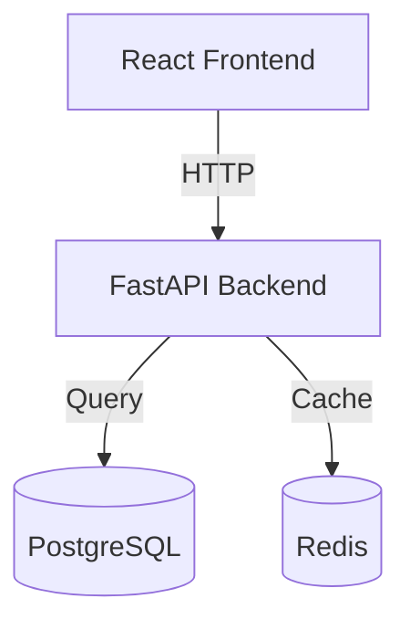
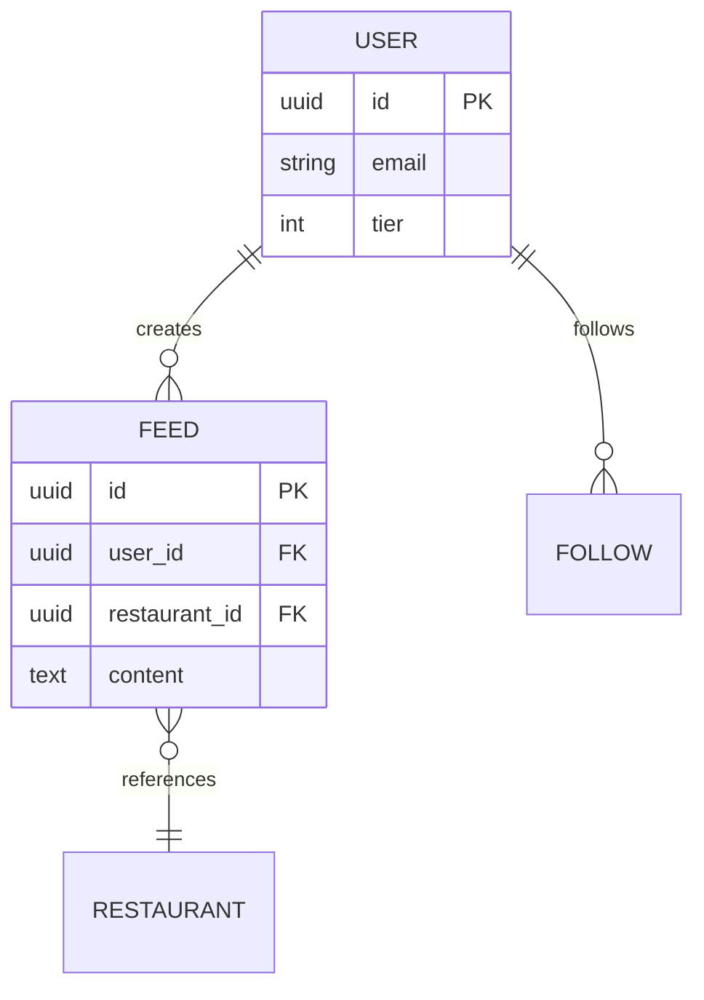
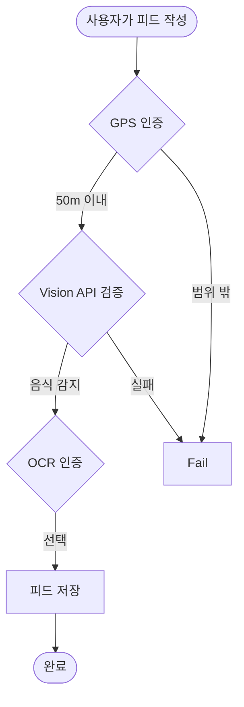
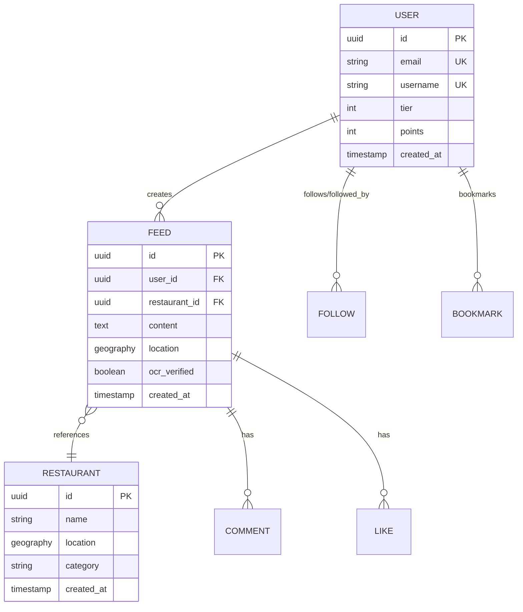

# /vide.diagram

다이어그램을 생성합니다 (아키텍처, ERD, 플로우차트).

## Usage

```
/vide.diagram
/vide.diagram --er
/vide.diagram --flow
```

## Process

### 1. 다이어그램 타입 결정

- **기본** (`/vide.diagram`): 아키텍처 다이어그램
- **--er**: ERD (Entity-Relationship Diagram)
- **--flow**: 플로우차트 (주요 프로세스)

### 2. 프로젝트 분석

#### 아키텍처 다이어그램
- 프로젝트 구조 파악 (폴더 구조)
- 주요 모듈 및 레이어 식별
- 의존성 관계 분석

#### ERD
- 데이터베이스 스키마 파일 찾기
  - `backend/models/`
  - `migrations/`
  - `schema.sql`
- 테이블 간 관계 파악

#### 플로우차트
- 주요 비즈니스 로직 흐름
- 사용자 액션 → 시스템 응답

### 3. Mermaid 코드 생성

ASCII 아트 또는 Mermaid 코드로 다이어그램 생성:

#### 아키텍처 다이어그램 (Mermaid)



#### ERD (Mermaid)



#### 플로우차트 (Mermaid)



### 4. 렌더링 안내

생성된 Mermaid 코드를 렌더링하는 방법 안내:

- **GitHub**: `.md` 파일에 붙여넣기 (자동 렌더링)
- **VSCode**: Mermaid 확장 프로그램 설치
- **온라인**: https://mermaid.live/

## Example

```
User: /vide.diagram --er

Claude: ERD를 생성합니다...

프로젝트 분석 중...
- 데이터베이스 스키마 발견: backend/models/
- 테이블 수: 15개
- 주요 관계: USER, FEED, RESTAURANT

✅ ERD 생성 완료!



**다이어그램 저장 위치:**
  .vide/diagrams/erd-2025-11-17.md

**렌더링 방법:**
  1. GitHub에 푸시 (자동 렌더링)
  2. VSCode에서 Mermaid 확장 프로그램 사용
  3. https://mermaid.live/ 에서 확인
```

## Notes

- Mermaid는 GitHub, GitLab, VSCode 등에서 지원됩니다
- 복잡한 다이어그램은 수동 조정이 필요할 수 있습니다
- 생성된 다이어그램은 `.vide/diagrams/` 폴더에 저장됩니다
