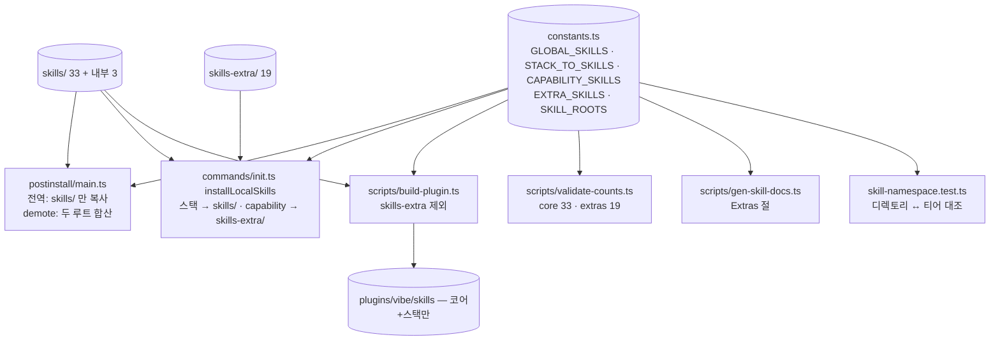

# SPEC: Skill Tier Boundary

- **Created**: 2026-09-03
- **Status**: VERIFIED (2026-09-03 — verify-ledger verifyPassed=true; 이 브랜치는 #106 병합 전이라 구 CLI 의 results 기반 기록)
- **Class**: architecture
- **Stakes**: production — 배포 트리·npm 패키지·설치 경로·README 개수 주장을 바꾸는 기존 프로젝트 변경 (SSOT: vibe/rules/loop-contract.md)
- **Tech Stack**: TypeScript ESM CLI (`src/cli/**`), tsx scripts (`scripts/**`), vitest, Markdown skills

---

## 1. Overview / Goal

코딩 루프와 무관한 스킬 19개를 `skills-extra/` 로 옮겨 **저장소 트리에서 코어가 보이게** 한다. 설치 게이팅은 이미 4단(전역·스택·capability·optional)으로 갈려 있으므로 이 SPEC 은 그 티어를 **디렉토리 경계·플러그인 트리·개수 주장·테스트 불변식**까지 끌어올리는 작업이다. 패키지는 하나로 유지한다 — 경계가 서면 나중에 패키지를 가르는 비용이 싸진다.

### Context Sources

- [확인] `src/cli/postinstall/constants.ts:27-70` — `GLOBAL_SKILLS_ENTRY`(19) · `GLOBAL_SKILLS_STANDARD`(7, `vibe.educational-content` 포함) · `GLOBAL_SKILLS_OPTIONAL`(7) · `GLOBAL_SKILLS = ENTRY+STANDARD`. `STACK_TO_SKILLS`(UI 스택 9종) · `CAPABILITY_SKILLS`(commerce 2 · video 1 · event-automation 4 · pm 3 · devlog 1) · `AVAILABLE_CAPABILITIES`(6, `mcp` 는 외부 스킬 전용).
- [확인] `constants.ts:91 resolveDemotedGlobalSkills(shippedSkillNames)` — 배송본 디렉토리 이름 중 `GLOBAL_SKILLS` 에 없는 것을 돌려주고, `postinstall/main.ts:160-171` 이 그것을 `cleanupOptionalSkills(sklsDir, demoted, skillsSource)` 로 넘겨 `~/.claude/skills` 에서 vibe 소유·미수정일 때만 지운다. `isUserModified` 는 `shippedSkillsDir/<name>/SKILL.md` 와 비교하며 **배송본이 없으면 수정됨으로 간주해 보존**한다 (`fs-utils.ts:283-296`).
- [확인] `postinstall/main.ts:131` `skillsSource = packageRoot/skills` 단일 루트. `copySkillsFiltered(skillsSource, sklsDir, GLOBAL_SKILLS)` 로 전역 복사.
- [확인] `commands/init.ts:55-73 installLocalSkills` — `resolveLocalSkills(stack, capabilities)` 결과를 `packageRoot/skills` 단일 루트에서 `copySkillsFiltered` 로 프로젝트 로컬에 복사. 스택 스킬과 capability 스킬이 **같은 호출**로 들어온다.
- [확인] `commands/info.ts:143 formatSkillStatus(globalSkillsDir, shippedSkillsDir)` — 설치본 중 배송 목록에 있는 것을 vibe 소유로 센다. 단일 루트.
- [확인] `commands/plugin.ts:20 PLUGIN_ENTRIES` — `'skills'` 포함, `skills-extra` 없음. `scripts/build-plugin.ts:27 resolveEntries(pkg.files)` — package.json `files` 를 include/exclude 로 해석해 `plugins/vibe` 를 조립. `!` 접두 항목이 exclude.
- [확인] `package.json files` — `"skills/"` 포함. `npm pack --dry-run`: 1,355 파일 / 5.5MB, 그중 skills 265 파일.
- [확인] `scripts/gen-skill-docs.ts:20 SKILLS_DIR` 단일 루트, `:151` Total 줄 `Total: N skills | Global | Optional | Stack-local | Capability`. `scripts/validate-counts.ts:32 SKILLS_DIR` 단일 루트, `:182 buildClaims` 가 README(`**N개 스킬**`)·README.en(`**N skills**`)·package.json description(`N skills`) 을 검사. `scripts/validate-skill-invocation.ts:23`·`scripts/add-skill-invocation.ts:23` 도 단일 루트.
- [확인] `src/__tests__/skill-namespace.test.ts` — `resolve('skills')` 단일 루트에서 이름·frontmatter 일치·namespace 를 단언. `src/__tests__/wiring-integrity.test.ts:21,66,119,193` — F2(훅 스크립트 참조)·F3(에이전트 참조) 가 `skills/*/SKILL.md`·`*/references/*.md` 를 훑는다. `src/cli/postinstall/fs-utils.test.ts:83-383` — `cleanupOptionalSkills(dir, list, shippedDir)` 3인자 호출 5곳.
- [확인] README.md:176 `**52개 스킬**`, :207 `# Skills 52 · Agents 11 · Hooks 6`, :249 `| skills (52) |`; README.en.md:105,240; package.json description `52 skills`.
- [확인] `.codex-plugin/plugin.json:20 "skills": "./skills/"` — 플러그인 트리의 `skills/` 만 가리킨다. `.claude-plugin/plugin.json` 은 skills 경로를 갖지 않는다(디렉토리 규약).
- [확인] `vibe/rules/prefix-cache-surface.md:80-90` skills 표면은 **집계만** 하고 나열하지 않는다 — 이동으로 게이트가 깨지지 않는다.
- [확인] `hooks/scripts/**` 는 `skills/` 를 읽지 않는다. `.md/.ts/.js/.json` 어디에도 `skills/<extras 이름>/` 경로 직접 참조가 없다 (grep 0건).
- [확인] 사용자 설치본 `~/.claude/skills` 30개 = 전역 26 + 스택 3 + 외부 1. 즉 상시 로드 표면은 이미 코어에 가깝다 — 이 SPEC 이 바꾸는 것은 저장소·패키지·플러그인·문서 표면이다.
- [확인] `skills/create-educational-content/` 는 git 미추적 빈 로컬 디렉토리 (`git log` 0건). 이 SPEC 의 대상이 아니다.
- [해석] `vibe.educational-content` 는 STANDARD(전역 상시 로드)에 있지만 강의·튜토리얼 제작 스킬이라 코딩 루프와 무관하다 — 사용자 3-b 결정으로 extras 로 내리고 capability `education` 으로 옵트인한다.
- [모름] extras 스킬을 실제로 켠 사용자 수 — 측정 수단 없음. 그래서 어떤 스킬도 삭제하지 않고 위치만 옮긴다.

### Assumptions

- extras 디렉토리 이름은 `skills-extra/` (형제 디렉토리라 트리에서 코어 옆에 보인다). 내부 구조는 `skills/` 와 동일(`<name>/SKILL.md` + `references/`).
- extras = `GLOBAL_SKILLS_OPTIONAL`(7) + `CAPABILITY_SKILLS` 전개(11) + `vibe.educational-content` = 19. 코어 = `GLOBAL_SKILLS`(25, educational-content 제외) + 스택 전용 스킬 8(`STACK_TO_SKILLS` 전개 9 중 `vibe.design` 은 ENTRY 와 겹침) = 33. 내부 번들 디렉토리(`vibe.arch-guard`·`vibe.exec-plan`·`vibe.restraint`, SKILL.md 없음)는 `skills/` 에 남는다.
- 배치 SSOT 는 상수다: `EXTRA_SKILLS`(위 합집합, 정렬)와 `SKILL_ROOTS = ['skills', 'skills-extra']` 를 `constants.ts` 에 두고, **디렉토리 위치는 테스트가 상수와 대조**한다 — 손으로 유지하는 두 번째 목록을 만들지 않는다.
- 새 capability `education` 을 `CAPABILITY_SKILLS` 와 `AVAILABLE_CAPABILITIES` 에 추가한다 (label `Educational Content`, hint `강의·튜토리얼·워크숍 제작`). `GLOBAL_SKILLS_STANDARD` 에서 `vibe.educational-content` 를 뺀다.
- 스킬 소스 탐색은 헬퍼 하나로 모은다: `resolveSkillRoots(packageRoot) → string[]` 와 `findSkillDir(packageRoot, name) → string|null`. `copySkillsFiltered` 는 시그니처를 유지하고 호출부가 루트별로 부른다(허용 목록에 없는 디렉토리는 원래 건너뛰므로 두 루트에 같은 목록을 넘겨도 안전).
- `cleanupOptionalSkills` 의 `shippedSkillsDir` 인자는 `string | string[]` 로 넓힌다. 기존 3인자 호출은 그대로 동작한다.
- `resolveDemotedGlobalSkills` 에 넘기는 배송 이름은 두 루트를 합친다 — 기존 설치본의 `vibe.educational-content` 가 upgrade 때 (미수정이면) 제거된다.
- 플러그인 트리(`plugins/vibe`, `vibe plugin install` 조립본)에는 `skills-extra/` 를 넣지 않는다 (사용자 3-b 결정). `build-plugin.ts` 는 package.json `files` 에서 include 를 읽되 `PLUGIN_EXCLUDED_ENTRIES = ['skills-extra']` 를 추가로 뺀다. `PLUGIN_ENTRIES` 는 그대로(이미 `skills` 만).
- npm 패키지에는 `skills-extra/` 가 실린다 (`files` 에 추가) — capability 옵트인 설치가 npm 설치본에서 복사하기 때문이다.
- README 개수 주장은 코어를 앞세운다: `**33개 코어 스킬**` (+ `extras 19개` capability·명시 호출). validate-counts 가 `skills/` 와 `skills-extra/` 를 따로 세어 두 값을 검사하고, `# Skills N` 플러그인 상세 줄과 `| skills (N) |` 표 줄도 검사 대상에 넣는다(지금은 검사하지 않아 드리프트가 가능했다).
- SKILL-CATALOG 에 `## Extras (skills-extra/)` 절을 추가하고 Total 줄을 `Core: 33 · Extras: 19` 로 바꾼다. 기존 Optional/Capability 라우팅 절은 유지한다.
- wiring-integrity·validate-skill-invocation·add-skill-invocation·gen-skill-docs·skill-namespace 테스트는 두 루트를 읽는다.
- 언어·표기: 코드 주석과 문서는 기존 파일 관례(한국어 본문, 영문 식별자)를 따른다.

### Constraints

- 스킬을 하나도 삭제하지 않는다 — 위치와 티어만 바뀐다. 스킬 이름·frontmatter·본문은 손대지 않는다.
- 설치 결과는 이동 전과 같아야 한다: 전역 설치본은 `GLOBAL_SKILLS`(25), 스택 프로젝트는 스택 스킬, capability 프로젝트는 capability 스킬. 유일한 의도된 차이는 `vibe.educational-content` 가 전역에서 빠지고 `education` capability 로 옮겨간 것이다.
- `copySkillsFiltered`·`cleanupOptionalSkills` 의 기존 호출·테스트가 깨지지 않는다(추가만).
- 배치 규칙은 테스트가 상수와 대조한다 — 손으로 유지하는 이름 목록을 테스트에 박지 않는다 (CLAUDE.md "테스트는 불변식을 고정하고 선택은 고정하지 않는다").
- 복잡도 한계(함수 ≤50줄·중첩 ≤3·파라미터 ≤5·순환 ≤10)와 `.oxlint-baseline.json` 라쳇을 넘기지 않는다.
- CLAUDE.md 는 content SSOT — AGENTS.md 는 `gen:agents-md`, SKILL-CATALOG.md 는 `gen:skill-docs`, `plugins/vibe` 는 `build:plugin` 으로 재생성한다.

### Structure



근거: `PI`·`IN`·`BP`·`VC`·`GD`·`T` 의 단일 루트 참조 위치는 위 Context Sources 의 행 번호. `X` 와 `EXTRA_SKILLS`·`SKILL_ROOTS` 는 신규.

### Rejected Alternatives (Traps)

- **별도 npm 패키지 `@su-record/vibe-extras`** — 릴리스 스크립트·CI·마켓플레이스 매니페스트가 둘로 갈라지고 패키지 이름은 공개되면 못 되돌린다. 경계가 코드로 검증된 뒤에 가르면 같은 결과를 더 싸게 얻는다 (사용자 3-b 결정).
- **문서·상수만 바꾸고 파일은 두기** — 트리·tarball·플러그인이 그대로라 "핵심이 보이게" 라는 목표를 달성하지 못한다. 마켓플레이스 사용자는 계속 265 파일을 받는다.
- **`copySkillsFiltered` 가 내부에서 여러 루트를 순회하게 바꾸기** — 시그니처가 바뀌어 기존 테스트 5곳과 호출부 3곳을 함께 고쳐야 하고, 허용 목록에 없는 디렉토리는 어차피 건너뛰므로 호출부가 루트별로 부르는 편이 변경이 작다.
- **README 의 `52` 를 `53` 처럼 총합으로 유지** — 총합은 "무엇을 받는가" 를 말하지 않는다. 코어 수를 앞세워야 설치 시 무엇을 얻는지 읽힌다.
- **`vibe.educational-content` 를 OPTIONAL 로 내리기** — optional 은 "표준 도구 래퍼라 직접 프롬프트가 낫다" 는 사유 그룹이다. 이 스킬은 도메인 스킬이라 capability 가 맞다.

---

## 2. Requirements

| ID | Requirement | Done Criteria |
|----|-------------|---------------|
| REQ-skill-tier-boundary-001 | extras 19개가 `skills-extra/` 에, 코어 33개(+내부 3)가 `skills/` 에 있고, 배치가 상수 SSOT(`EXTRA_SKILLS`)와 일치함을 테스트가 대조한다 | D1, D2 |
| REQ-skill-tier-boundary-002 | `vibe.educational-content` 가 전역 STANDARD 에서 빠지고 capability `education` 으로 옵트인된다 | D3 |
| REQ-skill-tier-boundary-003 | 설치 경로(postinstall 전역 · init/update 로컬 · info 상태 · upgrade demotion)가 두 루트를 읽어 이동 전과 같은 결과를 낸다 | D4, D5, D6 |
| REQ-skill-tier-boundary-004 | 플러그인 트리(`plugins/vibe`, `vibe plugin install`)에 `skills-extra/` 가 없고 npm 패키지에는 있다 | D7, D8 |
| REQ-skill-tier-boundary-005 | README·README.en·package.json·SKILL-CATALOG 가 코어 33 / extras 19 를 말하고 validate-counts 가 그 주장을 검사한다 | D9, D10 |
| REQ-skill-tier-boundary-006 | 스킬 루트를 읽는 검증 스크립트·테스트가 두 루트를 훑고 릴리스 게이트 전부가 통과한다 | D11, D12 |

---

## 3. Done Criteria (deterministic gates)

| # | Criterion | Verified by |
|---|-----------|-------------|
| D1 | `skills-extra/` 의 SKILL.md 디렉토리 집합 == `EXTRA_SKILLS` 집합, `skills/` 의 SKILL.md 디렉토리 집합 == `GLOBAL_SKILLS ∪ STACK_TO_SKILLS 전개` 집합, 두 집합 교집합 없음 | `npx vitest run src/__tests__/skill-namespace.test.ts` exit 0 (새 테스트 `REQ-skill-tier-boundary-001`) |
| D2 | `EXTRA_SKILLS` 가 `GLOBAL_SKILLS_OPTIONAL ∪ CAPABILITY_SKILLS 전개` 와 같다 (손으로 쓴 별도 목록이 아니다) | 같은 테스트 파일 exit 0 |
| D3 | `GLOBAL_SKILLS_STANDARD` 에 `vibe.educational-content` 가 없고 `CAPABILITY_SKILLS.education` 이 `['vibe.educational-content']`, `AVAILABLE_CAPABILITIES` 에 `education` 항목 존재 | 같은 테스트 파일 exit 0 |
| D4 | `installLocalSkills(root, ['typescript-react'], ['education'])` 이 `.claude/skills/` 에 `vibe.figma`(코어 루트)와 `vibe.educational-content`(extras 루트)를 둘 다 복사한다 | `npx vitest run src/cli/commands/init.skill-roots.test.ts` exit 0 |
| D5 | `cleanupOptionalSkills(dir, ['vibe.educational-content'], ['skills', 'skills-extra'])` 가 extras 루트의 SKILL.md 와 비교해 미수정 설치본을 제거한다 (단일 문자열 인자 호출은 기존 테스트 그대로 통과) | `npx vitest run src/cli/postinstall/fs-utils.test.ts` exit 0 |
| D6 | `resolveDemotedGlobalSkills(두 루트 배송 이름)` 결과에 `vibe.educational-content` 와 extras 전부가 포함되고 `GLOBAL_SKILLS` 는 하나도 없다 | `npx vitest run src/__tests__/skill-namespace.test.ts` exit 0 |
| D7 | `npm run build:plugin` 후 `plugins/vibe/skills-extra` 가 없고 `plugins/vibe/skills` 의 디렉토리 수가 `skills/` 와 같다 | `test ! -e plugins/vibe/skills-extra && [ "$(ls plugins/vibe/skills \| wc -l)" = "$(ls skills \| wc -l)" ]` exit 0 |
| D8 | `npm pack --dry-run` 출력에 `skills-extra/` 파일이 포함된다 | `npm pack --dry-run 2>&1 \| grep -c 'skills-extra/'` > 0 |
| D9 | README.md 에 `**33개 코어 스킬**`, README.en.md 에 `**33 core skills**`, package.json description 에 `33 core skills`, 두 README 의 플러그인 상세 줄이 `Skills 33`, 하네스 표가 `skills (33)` | `npm run validate:counts` exit 0 (새 claim 5종 포함) |
| D10 | SKILL-CATALOG.md 에 `## Extras (skills-extra/)` 절이 있고 Total 줄에 `Core: 33` 와 `Extras: 19` 가 있다 | `npm run gen:skill-docs:check` exit 0 ∧ `grep -c 'Extras: 19' SKILL-CATALOG.md` = 1 |
| D11 | wiring-integrity F2/F3 · validate-skill-invocation · add-skill-invocation 이 두 루트를 훑는다 — F2 가 `skills/`·`skills-extra/` 각각에서 SKILL.md 를 최소 1개 읽는다는 단언이 통과한다 (참조 삭제로 실패를 유도하는 방식은 다른 훅 스크립트가 같은 이름을 참조해 성립하지 않았다) | `npx vitest run src/__tests__/wiring-integrity.test.ts` exit 0 (`REQ-skill-tier-boundary-006 reads SKILL.md from every skill root`) ∧ `npm run validate:skill-invocation` exit 0 |
| D12 | 릴리스 게이트 전부 통과 | `npm run build && npx vitest run` ∧ `lint`·`lint:ratchet`·`gen:skill-docs:check`·`validate:counts`·`validate:skill-invocation`·`sync:agent-models:check`·`gen:plugin-hooks:check`·`validate:mermaid`·`validate:plugin-tree`·`gen:agents-md:check`·`validate:spec-lifecycle`·`validate:cache-surface` 전부 exit 0 |

### Evidence Required

- D1 → `skill-namespace.test.ts` 실행 출력 (배치 대조 테스트 통과)
- D2 → `skill-namespace.test.ts` 실행 출력 (EXTRA_SKILLS 도출 단언)
- D3 → `skill-namespace.test.ts` 실행 출력 (education capability 단언)
- D4 → `init.skill-roots.test.ts` 실행 출력
- D5 → `fs-utils.test.ts` 실행 출력 (배열 루트 케이스 추가)
- D6 → `skill-namespace.test.ts` 실행 출력 (demotion 단언)
- D7 → 셸 판정 명령의 exit code
- D8 → `npm pack --dry-run | grep -c skills-extra/` 출력
- D9 → `validate:counts` 출력의 Derived counts 와 claims 결과
- D10 → `gen:skill-docs:check` exit code + grep 출력
- D11 → `wiring-integrity.test.ts` 실행 출력 + validate:skill-invocation exit code
- D12 → 게이트 명령별 exit code 목록

### Human Taste (Non-Blocking)

- README 첫 화면에서 "코어 33 = 코딩 루프" 가 한 줄로 읽히는가
- SKILL-CATALOG 의 Extras 절이 "왜 밖인가" 를 한 문장으로 말하는가

---

## 4. Scenarios

> Mirrored to `.vibe/features/skill-tier-boundary.feature` (gherkin). Every scenario maps to a Done criterion.

```gherkin
Scenario: 디렉토리 배치가 티어 상수와 일치한다                     # → D1, D2
  Given skills/ 와 skills-extra/ 에 SKILL.md 디렉토리가 있다
  When 두 디렉토리 집합을 GLOBAL_SKILLS ∪ STACK 전개 · EXTRA_SKILLS 와 비교한다
  Then 각각 정확히 일치하고 교집합이 없다

Scenario: educational-content 가 education capability 로 옮겨간다     # → D3
  Given constants.ts 를 읽는다
  When GLOBAL_SKILLS_STANDARD · CAPABILITY_SKILLS · AVAILABLE_CAPABILITIES 를 확인한다
  Then STANDARD 에는 없고 CAPABILITY_SKILLS.education 과 AVAILABLE_CAPABILITIES 에 있다

Scenario: 로컬 설치가 두 루트에서 복사한다                          # → D4
  Given 임시 프로젝트와 스택 typescript-react, capability education 이다
  When installLocalSkills 를 호출한다
  Then .claude/skills 에 vibe.figma 와 vibe.educational-content 가 둘 다 있다

Scenario: upgrade 가 extras 루트와 비교해 내려온 전역 스킬을 정리한다   # → D5, D6
  Given ~/.claude/skills 에 미수정 vibe.educational-content 가 설치돼 있다
  When 두 루트의 배송 이름으로 demotion 을 구하고 cleanupOptionalSkills 를 부른다
  Then vibe.educational-content 가 removed 로 기록된다

Scenario: 플러그인 트리에는 코어만 굽는다                           # → D7
  Given package.json files 에 skills-extra/ 가 있다
  When npm run build:plugin 을 실행한다
  Then plugins/vibe/skills-extra 가 없고 plugins/vibe/skills 는 skills/ 와 개수가 같다

Scenario: npm 패키지에는 extras 가 실린다                            # → D8
  Given package.json files 에 skills-extra/ 가 있다
  When npm pack --dry-run 을 실행한다
  Then skills-extra/ 파일이 목록에 있다

Scenario: 개수 주장이 코어를 앞세우고 검사된다                        # → D9
  Given README.md · README.en.md · package.json 이 갱신됐다
  When npm run validate:counts 를 실행한다
  Then 코어 33 / extras 19 주장 5종이 전부 일치해 exit 0 이다

Scenario: 카탈로그가 Extras 절을 낸다                               # → D10
  Given gen-skill-docs 가 두 루트를 읽는다
  When npm run gen:skill-docs 를 실행한다
  Then SKILL-CATALOG.md 에 Extras 절과 Core: 33 · Extras: 19 가 있다

Scenario: 무결성 검사가 extras 를 놓치지 않는다                      # → D11
  Given wiring-integrity 가 두 루트를 훑는다
  When F2 가 읽은 SKILL.md 경로 집합을 본다
  Then skills/ 와 skills-extra/ 각각에서 최소 1개가 있다

Scenario: 릴리스 게이트가 전부 통과한다                              # → D12
  Given 모든 변경이 커밋 가능한 상태다
  When 빌드·vitest·게이트 12종을 실행한다
  Then 전부 exit 0 이다
```

---

## 5. Out of Scope

- 별도 npm 패키지 발행 (`@su-record/vibe-extras`)
- 스킬 삭제·개명·본문 수정
- `vibe.image`·`vibe.design-teach`·`vibe.parallel-research` 의 티어 변경
- 에이전트(`agents/ui`, `agents/event`) 트리 재배치 — 이미 조건부 그룹으로 분리돼 있다
- 외부 스킬(skills.sh) 매핑 변경
- 설치본 `~/.claude/skills` 의 강제 정리 — 기존 demotion 규칙(vibe 소유·미수정만) 그대로

---

## 6. API Contract

해당 없음 — 외부 엔드포인트 없음. 내부 계약:

- `constants.ts`: `SKILL_ROOTS: ReadonlyArray<string>` (= `['skills', 'skills-extra']`), `EXTRA_SKILLS` (= sorted(OPTIONAL ∪ CAPABILITY 전개)), `CORE_SKILLS` (= sorted(GLOBAL ∪ STACK 전개)) — 순수 상수 파일이라 fs 를 쓰지 않는다
- `fs-utils.ts`: `resolveSkillRoots(packageRoot: string): string[]` (존재하는 루트만, 코어 먼저), `findSkillDir(packageRoot: string, name: string): string | null` — 배럴 `src/cli/postinstall.ts` 로 재수출
- `fs-utils.ts`: `cleanupOptionalSkills(globalSkillsDir, optionalSkills, shippedSkillsDir: string | string[], dryRun?)`
- `scripts/build-plugin.ts`: `PLUGIN_EXCLUDED_ENTRIES = ['skills-extra']`

---

## 7. Verification

- D1–D3, D6: `npx vitest run src/__tests__/skill-namespace.test.ts` — 11 tests exit 0 (boundary describe 4건 포함).
- D4: `npx vitest run src/cli/commands/init.skill-roots.test.ts` — 2 tests exit 0.
- D5: `npx vitest run src/cli/postinstall/fs-utils.test.ts` — 배열 루트 케이스 추가, exit 0.
- D7: `test ! -e plugins/vibe/skills-extra && [ "$(ls plugins/vibe/skills | wc -l)" = "$(ls skills | wc -l)" ]` → ok (36 dirs, 내부 3 포함).
- D8: `npm pack --dry-run | grep -c 'skills-extra/'` → 68.
- D9: `npm run validate:counts` exit 0 — core 33 · extras 19, claim 8종(README 4 · README.en 3 · package.json 1) 일치.
- D10: `npm run gen:skill-docs:check` exit 0, `grep -c 'Extras: 19' SKILL-CATALOG.md` → 1.
- D11: `npx vitest run src/__tests__/wiring-integrity.test.ts` — 88 tests exit 0 (루트별 SKILL.md 읽기 단언 포함), `npm run validate:skill-invocation` exit 0.
- D12: `npm run build` exit 0, `npx vitest run` 137 files / 2341 tests 통과, 게이트 12종 exit 0 (`validate:plugin-tree` 는 커밋 후 HEAD 대비로 통과).
- 이동한 19개 스킬은 `git mv` 라 이력이 보존된다. 스킬 본문·frontmatter 무변경.

## Anchors

- `src/cli/postinstall/constants.ts`
- `src/cli/postinstall/fs-utils.ts`
- `src/cli/postinstall/main.ts`
- `src/cli/commands/init.ts`
- `src/cli/commands/info.ts`
- `scripts/build-plugin.ts`
- `scripts/validate-counts.ts`
- `scripts/gen-skill-docs.ts`
- `scripts/validate-skill-invocation.ts`
- `skills-extra/vibe.educational-content/SKILL.md`
