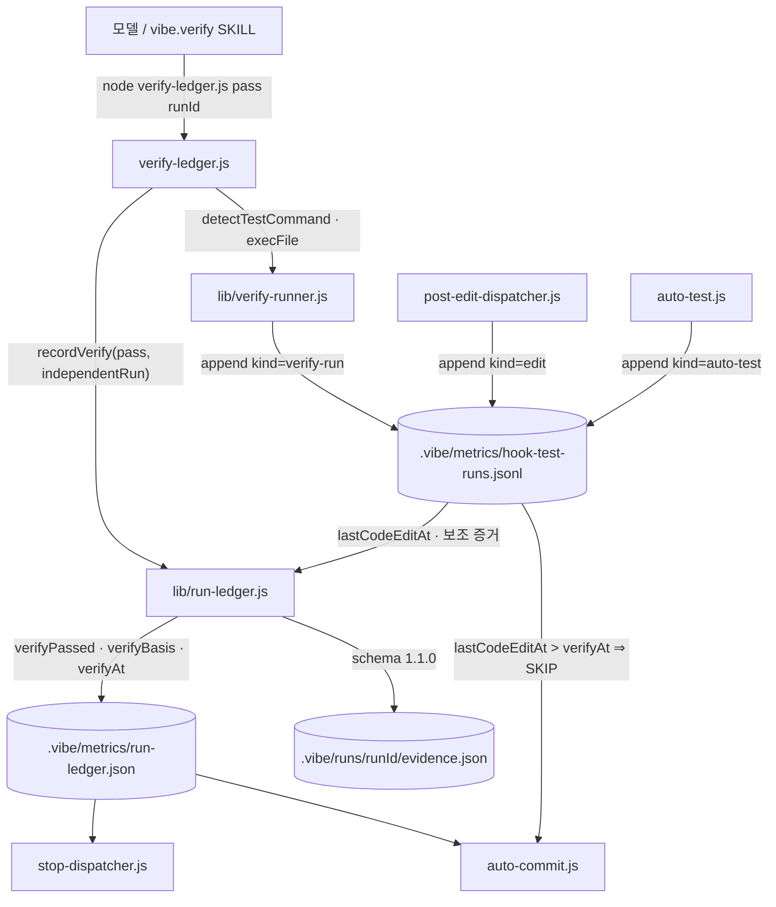

# SPEC: Verify Gate Independence

- **Created**: 2026-09-03
- **Status**: VERIFIED (2026-09-03 — verify-ledger verifyPassed=true, verifyBasis=independent, runId f46cddb8)
- **Class**: architecture
- **Stakes**: production — 루프 계약의 JUDGE 축(완료 판정 근거)을 바꾸는 기존 프로젝트 코드 변경 (SSOT: vibe/rules/loop-contract.md)
- **Tech Stack**: Node ESM hooks (`hooks/scripts/**`, vitest), TypeScript src, Markdown rules/skills

---

## 1. Overview / Goal

`verifyPassed` 가 모델의 자기보고가 아니라 **훅 프로세스가 스스로 실행한 테스트의 exit code** 로만 세워지게 한다. 테스트 명령을 찾을 수 없는 프로젝트에서는 조용히 통과하지 않고 `verifyBasis: 'self-report'` 등급을 ledger 에 남겨 하류(stop 훅·auto-commit)가 경고한다. 문서의 "self-report 로는 절대 아니다" 서술을 실제 동작(두 등급)과 일치시킨다.

### Context Sources

- [확인] `hooks/scripts/verify-ledger.js` — `pass|fail <runId> <results.json>` CLI. 모델이 실행하며 `recordVerify` 를 호출한다. 항상 exit 0.
- [확인] `hooks/scripts/lib/run-ledger.js:recordVerify` — pass 시 `verificationResults` 가 비어 있거나 exitCode≠0 인 항목이 있으면 false 반환. results 의 출처는 검사하지 않는다. `writeEvidence` 가 `.vibe/runs/<runId>/evidence.json` 에 `judges.deterministic.verificationResults` 로 같은 배열을 기록한다 (`EVIDENCE_SCHEMA_VERSION = '1.0.0'`).
- [확인] `hooks/scripts/lib/run-ledger.js:recordRunStart` — runId 재발급, `verifyPassed=false`, `verificationResults`·`verificationCommands` 제거.
- [확인] `hooks/scripts/auto-test.js:run` — PostToolUse 에서 편집 파일의 **관련 테스트 파일 하나**를 `npx vitest run <file>` / `npx jest <file>` 로 execFile 실행 (`TEST_TIMEOUT_MS = 60000`, Windows 는 `shell: true`). 결과는 findings 문자열로만 반환되고 ledger 와 대조되지 않는다. 테스트 파일이 없거나 `autoTest.mode=off` 면 아무것도 돌리지 않는다.
- [확인] `hooks/scripts/post-edit-dispatcher.js` — `auto-format`·`code-check`·`auto-test` 를 병렬 실행. `readProjectConfig()?.hooks[name].enabled === false` 로 단계 비활성화.
- [확인] `hooks/scripts/auto-commit.js:23-38` — `verifyPassed === true && verifyAt > runStarted` 아니면 커밋 SKIP.
- [확인] `hooks/scripts/stop-dispatcher.js:25-46` — `runStarted && !verifyPassed && !stopWarned` 일 때 `verifyGate.mode` 에 따라 block 또는 stderr 경고. `verifyPassed=true` 이면 등급과 무관하게 침묵.
- [확인] `skills/vibe.verify/SKILL.md` — 모델에게 `.vibe/metrics/verification-results.json` 을 직접 쓰고 `verify-ledger.js pass` 를 호출하라고 지시한다.
- [확인] `skills/vibe.run/SKILL.md:149` — "verify-ledger.js step must record verifyPassed … Stop/auto-commit hooks … are acceleration only and never the correctness basis."
- [확인] `vibe/rules/loop-contract.md:20,40,88,174,200,224` — JUDGE 는 "run-ledger verifyPassed │ 테스트 exit code"; "자기보고는 이 문서가 처음부터 배제"; 200행이 run-ledger 스키마 필드를 열거한다.
- [확인] `CLAUDE.md:202` — "Completion is judged by deterministic gates (run-ledger `verifyPassed`, test exit codes), never by self-report."
- [확인] `.gitignore:40,45` — `.vibe/metrics/`·`.vibe/runs/` 는 커밋되지 않는다 (로컬 상태).
- [확인] `hooks/scripts/__tests__/{run-ledger,run-ledger-verify-required,stop-dispatcher-sequential,auto-test-debounce}.test.js` — 기존 테스트. 임시 projectDir(package.json 없음)에서 `recordVerify(pass)` 를 호출한다.
- [해석] 모델이 파일을 쓸 수 있는 한 어떤 로컬 기록도 위조 불가능하지는 않다. 이 SPEC 의 "독립"은 **기본 경로에서 모델이 판정 근거를 쓰는 단계가 없다** 는 뜻이지 암호학적 봉인이 아니다 (Constraints 참조).
- [모름] 사용자 프로젝트 중 `package.json` 없이 vitest/jest 를 쓰는 비율 — 측정 수단 없음. 감지 순서를 config → scripts.test → 바이너리 존재로 두어 어느 쪽이든 잡히게 한다.

### Assumptions

- 독립 실행 명령 감지 순서: `.vibe/config.json` `verifyGate.command`(문자열) → `package.json` `scripts.test` 존재 시 `npm test` → `node_modules/.bin/vitest` 존재 시 `npx vitest run` → `node_modules/.bin/jest` 존재 시 `npx jest` → 없음.
- 독립 실행 타임아웃 기본 600000ms (`verifyGate.timeoutMs` 로 조정). auto-test 의 60000ms 는 파일 단위라 전체 스위트에 부족하다는 판단이며 실측 아님.
- 독립 실행은 `execFile('npx'|'npm', …, { cwd: projectDir, shell: win32 })` 로 auto-test 와 같은 방식. `verifyGate.command` 는 `shell: true` 로 실행한다(사용자 명령 문자열).
- 훅이 남기는 기록 파일은 `.vibe/metrics/hook-test-runs.jsonl` (append-only). `recordRunStart` 가 비운다. 한 줄 = `{ kind: 'auto-test'|'verify-run'|'edit', at, filePath?, command?, exitCode?, runId? }`.
- auto-test 기록(`kind: 'auto-test'`)은 보조 증거다 — 게이트를 여는 근거는 verify 시점의 `verify-run` 이다. 요구사항 1 의 "auto-test 결과 기록"은 이렇게 충족하고, 요구사항 2 의 "마지막 편집 이후 실행"은 verify-run 이 정의상 편집 뒤에 돌므로 충족되며, verify **이후** 편집은 하류 소비자가 판정한다(REQ-004).
- `verifyBasis` 값은 `'independent' | 'self-report'` 둘뿐. `recordVerify(pass)` 는 `independentRun` 옵션이 주어지면 independent, 없고 감지된 명령도 없으면 self-report, 없는데 감지된 명령이 있으면 **거부**(모델이 독립 실행을 건너뛴 것).
- `fail` 기록은 등급을 묻지 않는다 — 실패는 어느 근거로든 실패다.
- evidence.json 스키마는 `1.1.0` 으로 올린다 (필드 추가만). `.vibe/runs/` 는 gitignore 라 마이그레이션 없음.
- stop 훅의 self-report 경고는 `stopWarned` 와 별개 플래그 `basisWarned` 로 1회만 낸다. `verifyGate.mode=block` 에서도 self-report 는 **경고**지 차단이 아니다(명령이 없는 프로젝트를 막지 않는다는 3-b 결정).
- auto-commit 은 `lastCodeEditAt > verifyAt` 이면 SKIP 하고 이유에 편집 파일을 적는다. self-report 등급이면 커밋은 허용하되 stderr 에 등급을 한 줄 남긴다.
- 모델 results.json 은 계속 받되 `reportedResults` 로 이름을 바꿔 evidence 에 넣는다. 파일이 없어도 independent 등급에서는 pass 가능.
- 레거시 ledger(새 필드 없음)를 읽는 소비자는 필드 부재를 "없음"으로 취급하고 기존 동작을 유지한다.
- Codex 하네스: 같은 스크립트를 `codex-hook-adapter.js` 가 부르므로 별도 분기 없음. 하네스별 문서 갱신은 `gen:agents-md` 가 CLAUDE.md 에서 생성한다.
- 언어·표기: 코드 주석과 문서는 기존 파일 관례(한국어 본문, 영문 식별자)를 따른다.

### Constraints

- 모델이 판정 근거를 쓰는 단계가 **기본 경로에 없어야 한다**: SKILL.md 가 지시하는 유일한 호출은 `verify-ledger.js pass|fail <runId>` 이고, 테스트 실행과 기록은 그 프로세스가 한다.
- 위조 불가능을 주장하지 않는다. `hook-test-runs.jsonl` 과 `verifyGate.command` 를 모델이 조작할 수 있음을 문서에 명시한다. 이 경계 밖(서명·외부 저장)은 Out of Scope.
- 모든 훅 함수는 fail-open 유지: 기록 실패는 편집·테스트 실행을 막지 않는다. 단 `recordVerify(pass)` 의 거부는 fail-open 이 아니라 **판정**이다 — 거부 사유를 stdout 한 줄로 낸다.
- 기존 ledger 필드와 의미를 바꾸지 않는다(추가만). `recordRunStart` 가 새 필드도 리셋한다.
- Windows 에서 auto-test 와 같은 `shell: process.platform === 'win32'` 규약을 지킨다.
- CLAUDE.md 는 content SSOT — AGENTS.md 는 `npm run gen:agents-md` 로 생성. `plugins/vibe/` 는 `npm run build:plugin` 으로 재생성.
- 복잡도 한계(함수 ≤50줄·중첩 ≤3·파라미터 ≤5·순환 ≤10)와 `.oxlint-baseline.json` 라쳇을 넘기지 않는다.

### Structure



근거: `M→VL` 은 `skills/vibe.verify/SKILL.md` 의 호출 블록, `PE`·`AT` 는 `hooks/scripts/post-edit-dispatcher.js` 의 steps, `SD`·`AC` 는 위 Context Sources 의 readLedger 호출부. `VR`·`J` 는 신규.

### Rejected Alternatives (Traps)

- **auto-test 기록만 대조하고 verify 시점 실행은 하지 않는다** — auto-test 는 편집 파일의 관련 테스트 파일 하나만 돌리고, 테스트 파일이 없는 편집(설정·문서·훅 스크립트 상당수)에서는 아무것도 돌리지 않는다. "마지막 편집 이후 전부 0" 이 구조적으로 성립하지 않아 게이트가 열리지 않거나, 열리면 커버리지가 파일 하나뿐이다.
- **기록을 run-ledger.json 안의 배열로 둔다** — `withLedgerLock` 이 `wx` 잠금 실패 시 false 를 반환한다. post-edit 의 세 단계가 병렬이라 auto-test 기록이 잠금 경합으로 조용히 유실된다. append-only jsonl 은 한 줄 append 가 원자적이다.
- **HMAC 서명으로 위조를 막는다** — 키를 모델이 읽을 수 없는 곳에 둘 수단이 훅 프로세스에는 없다(같은 사용자 권한). 서명 있는 기록도 같은 프로세스가 만들 수 있어 보안 이득이 없고 복잡도만 는다.
- **명령이 없으면 verifyPassed=false 로 차단한다** — 사용자 3-b 결정으로 기각. 비 JS 프로젝트와 설정 없는 프로젝트가 즉시 막힌다.
- **verify 이후 편집 시 post-edit 이 ledger 의 verifyPassed 를 즉시 false 로 되돌린다** — 훅이 ledger 를 쓰면 verify 판정 기록이 훅에 의해 덮여 evidence 와 ledger 가 어긋난다. 판정 기록은 보존하고 **신선도 판정은 소비자**(auto-commit)가 `lastCodeEditAt` 과 비교하는 편이 기록 원본을 지킨다.

---

## 2. Requirements

| ID | Requirement | Done Criteria |
|----|-------------|---------------|
| REQ-verify-gate-independence-001 | 훅 프로세스만 쓰는 기록 파일 `.vibe/metrics/hook-test-runs.jsonl` 에 auto-test 실행 결과(명령·대상·exitCode·시각)와 코드 편집 이벤트(파일·시각)가 남고, `recordRunStart` 가 비운다 | D1, D2 |
| REQ-verify-gate-independence-002 | `verify-ledger.js pass` 는 프로젝트 테스트 명령을 스스로 감지·실행하고, 그 exitCode 가 0 일 때만 `verifyPassed=true`, `verifyBasis='independent'` 를 기록한다. 모델이 넘긴 results.json 은 근거가 아니다 | D3, D4, D5 |
| REQ-verify-gate-independence-003 | 테스트 명령을 찾지 못하면 `verifyBasis='self-report'` 로 기록하고, 감지된 명령이 있는데 독립 실행 없이 pass 를 요청하면 거부하며 사유를 stdout 에 낸다 | D6, D7 |
| REQ-verify-gate-independence-004 | 하류 소비자가 등급과 신선도를 판정한다: stop 훅은 self-report 를 1회 경고하고, auto-commit 은 `lastCodeEditAt > verifyAt` 이면 SKIP 한다 | D8, D9 |
| REQ-verify-gate-independence-005 | evidence.json 이 `verifyBasis`·`independentRun`·`reportedResults`·`hookTestRuns` 를 담고 schemaVersion 1.1.0 이다 | D10 |
| REQ-verify-gate-independence-006 | loop-contract.md · CLAUDE.md(→AGENTS.md) · vibe.verify/vibe.run SKILL.md 가 두 등급과 위조 경계를 실제 동작대로 서술한다 | D11, D12 |

---

## 3. Done Criteria (deterministic gates)

| # | Criterion | Verified by |
|---|-----------|-------------|
| D1 | auto-test 가 테스트를 실행하면 jsonl 에 `kind:'auto-test'` 줄(command·filePath·exitCode·at)이 추가되고, post-edit 가 코드 파일 편집을 받으면 `kind:'edit'` 줄이 추가된다 | `npx vitest run hooks/scripts/__tests__/hook-test-runs.test.js` exit 0 |
| D2 | `recordRunStart` 후 jsonl 이 비어 있다 | 같은 테스트 파일 exit 0 |
| D3 | `recordVerify(pass, { independentRun: { exitCode: 0 } })` → `verifyPassed=true`, `verifyBasis='independent'` | `npx vitest run hooks/scripts/__tests__/run-ledger-verify-basis.test.js` exit 0 |
| D4 | `recordVerify(pass, { independentRun: { exitCode: 1 }, verificationResults: [{exitCode:0}] })` → false, `verifyPassed` 는 false 유지 (모델 results 가 전부 0 이어도) | 같은 테스트 파일 exit 0 |
| D5 | `verify-ledger.js pass` CLI 가 임시 프로젝트(`package.json scripts.test` 가 `exit 1` / `exit 0`)에서 각각 실패/성공을 기록한다 | 같은 테스트 파일 exit 0 (execFile 로 CLI 실행) |
| D6 | 명령 미감지 projectDir + 모델 results 전부 0 → `verifyPassed=true`, `verifyBasis='self-report'` | 같은 테스트 파일 exit 0 |
| D7 | 명령 감지 projectDir(`scripts.test` 존재) + `independentRun` 없음 → false, stdout 사유 문자열에 `independent` 포함 | 같은 테스트 파일 exit 0 |
| D8 | stop-dispatcher: `verifyPassed=true, verifyBasis='self-report', basisWarned≠true` → stderr 에 `self-report` 경고 1회, 이후 `basisWarned=true` 로 재경고 없음 | `npx vitest run hooks/scripts/__tests__/stop-dispatcher-basis.test.js` exit 0 |
| D9 | auto-commit: jsonl 의 마지막 `edit.at` 이 `verifyAt` 보다 뒤면 커밋 SKIP, 사유에 파일 경로 포함 | `npx vitest run hooks/scripts/__tests__/auto-commit-staleness.test.js` exit 0 |
| D10 | pass 기록 후 evidence.json 의 `schemaVersion === '1.1.0'` 이고 `judges.deterministic` 에 `verifyBasis`·`independentRun`·`reportedResults`·`hookTestRuns` 키가 있다 | D3 테스트 파일 exit 0 |
| D11 | `CLAUDE.md`·`vibe/rules/loop-contract.md`·`skills/vibe.verify/SKILL.md`·`skills/vibe.run/SKILL.md` 에 `never by self-report` 또는 `self-report 로는 절대` 문구가 없고, `verifyBasis` 가 등장한다 | `grep -L 'verifyBasis' CLAUDE.md vibe/rules/loop-contract.md skills/vibe.verify/SKILL.md skills/vibe.run/SKILL.md` 출력 없음 ∧ `grep -l 'never by self-report' CLAUDE.md` 출력 없음 |
| D12 | 릴리스 게이트 전부 통과 | `npm run build && npx vitest run` ∧ 게이트 11종(`lint`·`lint:ratchet`·`gen:skill-docs:check`·`validate:counts`·`validate:skill-invocation`·`sync:agent-models:check`·`gen:plugin-hooks:check`·`validate:mermaid`·`validate:plugin-tree`·`gen:agents-md:check`·`validate:spec-lifecycle`·`validate:cache-surface`) 전부 exit 0 |

### Evidence Required

- D1 → `hook-test-runs.test.js` 실행 출력 (edit·auto-test 줄 단언)
- D2 → `hook-test-runs.test.js` 실행 출력 (recordRunStart 후 빈 파일 단언)
- D3 → `run-ledger-verify-basis.test.js` 실행 출력 (independent 통과 단언)
- D4 → `run-ledger-verify-basis.test.js` 실행 출력 (독립 실행 실패 시 거부 단언)
- D5 → `run-ledger-verify-basis.test.js` 실행 출력 (CLI execFile 결과 단언)
- D6 → `run-ledger-verify-basis.test.js` 실행 출력 (self-report 등급 단언)
- D7 → `run-ledger-verify-basis.test.js` 실행 출력 (거부 사유 문자열 단언)
- D8 → `stop-dispatcher-basis.test.js` 실행 출력
- D9 → `auto-commit-staleness.test.js` 실행 출력
- D10 → `run-ledger-verify-basis.test.js` 가 생성한 evidence.json 의 키·schemaVersion 단언
- D11 → 위 grep 두 줄의 출력
- D12 → 게이트 명령별 exit code 목록

### Human Taste (Non-Blocking)

- 거부 사유 문구가 모델이 다음 행동(테스트 명령 설정·재실행)을 바로 알 만큼 구체적인가
- loop-contract.md 의 새 절이 기존 문체(선언 → 실측 근거 → 규칙)와 이어지는가

---

## 4. Scenarios

> Mirrored to `.vibe/features/verify-gate-independence.feature` (gherkin). Every scenario maps to a Done criterion.

```gherkin
Scenario: 훅이 auto-test 결과와 편집 이벤트를 기록한다          # → D1
  Given vitest 가 있는 프로젝트에서 vibe.run 이 시작됐다
  When 모델이 테스트 파일이 있는 코드 파일을 편집한다
  Then hook-test-runs.jsonl 에 kind=edit 줄과 kind=auto-test 줄이 순서대로 추가된다

Scenario: run 시작이 기록을 비운다                              # → D2
  Given hook-test-runs.jsonl 에 이전 run 의 줄이 있다
  When recordRunStart 가 호출된다
  Then 파일이 비어 있다

Scenario: 독립 실행이 성공하면 independent 등급으로 통과한다      # → D3, D10
  Given scripts.test 가 exit 0 인 프로젝트다
  When verify-ledger.js pass <runId> 를 실행한다
  Then verifyPassed=true, verifyBasis=independent 가 기록되고 evidence.json 이 1.1.0 스키마다

Scenario: 모델 results 가 전부 0 이어도 독립 실행이 실패하면 거부된다  # → D4, D5
  Given scripts.test 가 exit 1 인 프로젝트이고 results.json 이 [{"command":"npm test","exitCode":0}] 이다
  When verify-ledger.js pass <runId> results.json 을 실행한다
  Then verifyPassed 는 false 이고 stdout 에 독립 실행 실패 사유가 있다

Scenario: 테스트 명령이 없는 프로젝트는 self-report 등급으로 통과한다  # → D6
  Given package.json 도 vitest/jest 도 verifyGate.command 도 없는 프로젝트다
  When results.json 이 전부 0 인 상태로 pass 를 요청한다
  Then verifyPassed=true, verifyBasis=self-report 가 기록된다

Scenario: 명령이 있는데 독립 실행을 건너뛰면 거부된다             # → D7
  Given scripts.test 가 있는 프로젝트다
  When recordVerify(pass) 를 independentRun 없이 호출한다
  Then false 를 반환하고 사유에 independent 가 포함된다

Scenario: stop 훅이 self-report 등급을 1회 경고한다              # → D8
  Given verifyPassed=true, verifyBasis=self-report 인 ledger 다
  When Stop 훅이 두 번 실행된다
  Then 첫 번째만 stderr 에 self-report 경고가 나고 basisWarned=true 가 기록된다

Scenario: verify 이후 편집이 있으면 auto-commit 이 막힌다         # → D9
  Given verifyPassed=true 이고 verifyAt 이후에 kind=edit 줄이 추가됐다
  When auto-commit 이 실행된다
  Then 커밋 없이 SKIP 하고 사유에 편집된 파일 경로가 있다

Scenario: 문서가 두 등급을 서술한다                              # → D11
  Given 변경된 CLAUDE.md, loop-contract.md, vibe.verify/vibe.run SKILL.md
  When 문구를 grep 한다
  Then "never by self-report" 는 없고 verifyBasis 는 네 파일 모두에 있다

Scenario: 릴리스 게이트가 전부 통과한다                          # → D12
  Given 모든 변경이 커밋 가능한 상태다
  When 빌드·vitest·게이트 11종을 실행한다
  Then 전부 exit 0 이다
```

---

## 5. Out of Scope

- 새 테스트 러너 지원(pytest·go test 등) — `verifyGate.command` 로 사용자가 지정한다
- 기록의 암호학적 봉인·외부 저장(서명, 원격 감사 로그)
- stuck·max_iterations·automationLevel 축 변경
- 패키지 분리, `vibe.loop bench` 와의 연동
- auto-test 의 실행 범위 확장(관련 파일 하나 → 전체)
- `verifyGate.mode=block` 이 self-report 등급까지 차단하도록 확장

---

## 6. API Contract

해당 없음 — 외부 엔드포인트 없음. 내부 계약은 아래 두 가지다.

- `hooks/scripts/lib/verify-runner.js`: `detectTestCommand(projectDir) → { command: string, args: string[], shell: boolean, source: 'config'|'npm-test'|'vitest'|'jest' } | null`, `runIndependentTests(projectDir, { timeoutMs }) → Promise<{ command, exitCode, at, durationMs, outputTail } | null>`
- `hooks/scripts/lib/run-ledger.js:recordVerify(projectDir, passed, { runId, verificationResults, independentRun }) → boolean`; 거부 시 `lastRejectReason(projectDir)` 또는 반환 객체로 사유 노출(구현 시 하나로 확정, 테스트가 고정)

---

## 7. Verification

- D1–D10: `npx vitest run hooks/scripts/__tests__/{hook-test-runs,run-ledger-verify-basis,stop-dispatcher-basis,auto-commit-staleness}.test.js` — 27 tests, exit 0.
- D11: `grep -L 'verifyBasis' CLAUDE.md vibe/rules/loop-contract.md skills/vibe.verify/SKILL.md skills/vibe.run/SKILL.md` 출력 없음, `grep -l 'never by self-report' CLAUDE.md` 출력 없음.
- D12: `npm run build` exit 0, `npx vitest run` 140 files / 2362 tests 통과, 게이트 12종 exit 0 (`validate:plugin-tree` 는 커밋 후 HEAD 대비로 통과).
- 이 기능으로 이 저장소를 판정했다: `node hooks/scripts/verify-ledger.js pass f46cddb8-…` → `recorded: verifyPassed=true (pass, basis=independent — npm test exit 0)`, 독립 실행 23.7s. 모델이 results.json 을 넘기지 않았다.
- 절제 경고(P2, advisory): 신규 검증 코드 558줄 > 신규 구현 473줄. 게이트 4종을 각각 CLI 로 스폰해 검증하는 비용이며, 게이트 통과 여부와 무관하다.

## Anchors

- `hooks/scripts/lib/verify-runner.js`
- `hooks/scripts/lib/hook-test-runs.js`
- `hooks/scripts/lib/run-ledger.js`
- `hooks/scripts/verify-ledger.js`
- `hooks/scripts/auto-test.js`
- `hooks/scripts/post-edit-dispatcher.js`
- `hooks/scripts/stop-dispatcher.js`
- `hooks/scripts/auto-commit.js`
