# VIBE

SPEC-driven AI Coding Framework (Claude Code Exclusive)

## Code Quality Standards (Mandatory)

Follow these standards when writing code. See `~/.claude/vibe/rules/` (global) for detailed rules.

### Core Principles
- **Modify only requested scope** - Don't touch unrelated code
- **Preserve existing style** - Follow project conventions
- **Keep working code** - No unnecessary refactoring
- **Respect user interrupts** - If user interrupts (Ctrl+C/Escape) and sends a new message, the previous task is CANCELLED. Do NOT resume or continue interrupted work. Respond ONLY to the new message.

### Code Complexity Limits
| Metric | Limit |
|--------|-------|
| Function length | ≤30 lines (recommended), ≤50 lines (allowed) |
| Nesting depth | ≤3 levels |
| Parameters | ≤5 |
| Cyclomatic complexity | ≤10 |

### TypeScript Rules
- No `any` type → Use `unknown` + type guards
- No `as any` casting → Define proper interfaces
- No `@ts-ignore` → Fix type issues at root
- Explicit return types on all functions

### Error Handling Required
- try-catch or error state required
- Loading state handling
- User-friendly error messages

### Forbidden Patterns
- No console.log in commits (remove after debugging)
- No hardcoded strings/numbers → Extract to constants
- No commented-out code in commits
- No incomplete code without TODO

## Workflow

```
/vibe.spec → /new → /vibe.spec.review → /vibe.run → /vibe.trace → (auto) code review → ✅ Done
                                                         ↑
                                                Coverage check (v2.6)
```

**Flow:**

1. `/vibe.spec` - Write SPEC (requirements + research + draft)
2. `/new` - Start new session (clean context)
3. `/vibe.spec.review` - GPT/Gemini review (3-round mandatory)
4. `/vibe.run` - Implementation + Gemini review
5. **(auto)** 13+ agent parallel review
6. **(auto)** P1/P2 issue auto-fix

## Plan Mode vs VIBE (Workflow Selection)

**Offer choice to user on development requests:**

| Task Size | Recommended |
|-----------|-------------|
| Simple changes (1-2 files) | Plan Mode |
| Complex features (3+ files, research/verification needed) | `/vibe.spec` |

| Item | Plan Mode | VIBE |
|------|-----------|------|
| Storage location | `~/.claude/plans/` (global) | `.claude/vibe/specs/` (project) |
| Document format | Free form | PTCF structure (AI-optimized) |
| Research | None | 4 parallel agents |
| Verification | None | `/vibe.verify` against SPEC |
| History | Not trackable | Git version control |

**Rules:**
- After `/vibe.analyze` or `/vibe.review` with dev/modify request → **Ask user for workflow choice**
- User chooses VIBE → Wait for `/vibe.spec`
- User chooses Plan Mode → Proceed with EnterPlanMode

## ULTRAWORK Mode (Recommended)

Include `ultrawork` or `ulw` keyword to activate maximum performance mode:

```bash
/vibe.run "feature-name" ultrawork   # All optimizations auto-enabled
/vibe.run "feature-name" ulw         # Same (shorthand)
```

**Activated Features:**
- Parallel sub-agent exploration (3+ concurrent)
- **Background agents** - Prepare next Phase during implementation
- **Phase pipelining** - Remove wait time between Phases
- Boulder Loop (auto-continue until all Phases complete)
- Auto-retry on error (max 3 times)
- Auto-compress/save at 70%+ context
- Continuous execution without confirmation between Phases

**Speed Comparison:**

| Mode | Per Phase | 5 Phases |
|------|-----------|----------|
| Sequential | ~2min | ~10min |
| Parallel Exploration | ~1.5min | ~7.5min |
| **ULTRAWORK Pipeline** | **~1min** | **~5min** |

## Commands

| Command | Description |
|---------|-------------|
| `/vibe.spec "feature-name"` | Write SPEC (PTCF structure) + parallel research |
| `/vibe.spec.review "feature-name"` | **GPT/Gemini review** (run in new session) |
| `/vibe.run "feature-name"` | Execute implementation |
| `/vibe.run "feature-name" ultrawork` | **Maximum performance mode** |
| `/vibe.verify "feature-name"` | Verification |
| `/vibe.review` | **Parallel code review** (13+ agents) |
| `/vibe.reason "problem"` | Systematic reasoning |
| `/vibe.analyze` | Project analysis |
| `/vibe.utils --e2e` | E2E testing (Playwright) |
| `/vibe.utils --diagram` | Generate diagrams |
| `/vibe.utils --ui "description"` | UI preview |
| `/vibe.utils --continue` | **Session restore** (load previous context) |

## New Features (v2.6.x)

### Structured User Questions (v2.6.1)

Use `askUser` tool for critical requirements that must not be missed:

```typescript
import { askUser, askUserQuick } from '@su-record/vibe/tools';

// Quick helper for login features
const result = await askUserQuick.login('my-login');

// Custom categories
const result = await askUser({
  featureName: 'dashboard',
  categories: ['authentication', 'security', 'session'],
});
```

**Available categories:**
| Category | Questions |
|----------|-----------|
| `authentication` | Auth method, MFA |
| `security` | Password policy, rate limit |
| `session` | Duration, concurrent login |
| `data_model` | Profile fields |
| `performance` | Response time targets |
| `integration` | External services |

**When to use:**
- ✅ Critical: auth, security, session → `askUser`
- ❌ Exploratory: scope, style → Natural conversation
- ⚠️ ultrawork mode: skipped (uses defaults)

### Fire-and-Forget Background Manager

Launch background agents without blocking, with automatic concurrency control:

```typescript
import { launch, poll, cancel, getStats } from '@su-record/vibe/orchestrator';

// Fire-and-forget - returns immediately (<100ms)
const { taskId } = launch({
  prompt: 'Analyze codebase',
  agentName: 'analyzer',
  model: 'claude-sonnet-4-5',
});

// Poll for result later
const result = await poll(taskId);

// Check queue stats
const stats = getStats();
```

**Concurrency limits:**

| Model | Limit |
|-------|-------|
| claude-opus-4 | 3 |
| claude-sonnet-4-5 | 5 |
| claude-haiku-* | 8 |

**Error types:**
- `QueueOverflowError`: Queue at capacity (100 tasks max)
- `TaskTimeoutError`: Task exceeded 3 minutes
- `PipelineTimeoutError`: Pipeline exceeded 10 minutes
- `AgentExecutionError`: Agent execution failed

### Phase Pipelining

Remove wait time between phases with background preparation:

```typescript
import { PhasePipeline, createStage, createUltraworkPipeline } from '@su-record/vibe/orchestrator';

const pipeline = createUltraworkPipeline('my-feature', [
  createStage('Setup', async (ctx) => { /* ... */ }),
  createStage('Core', async (ctx) => { /* ... */ }),
  createStage('Test', async (ctx) => { /* ... */ }),
]);

const result = await pipeline.execute();
// Next phase preparation happens during current phase execution!
```

### PRD-to-SPEC Automation

Generate SPEC documents from PRD (Product Requirements Document):

```typescript
import { parsePRD, generateSpecFromPRD } from '@su-record/vibe/tools';

// Parse PRD document
const prd = parsePRD(prdContent, 'login');

// Generate SPEC
const spec = generateSpecFromPRD(prd, {
  techStack: { frontend: 'React', backend: 'Node.js' },
});
```

**Supported PRD formats:**
- Markdown with `## Requirements` sections
- YAML frontmatter with `requirements:` array
- Mixed format

### Requirements Traceability Matrix (/vibe.trace)

Track requirements coverage across SPEC → Feature → Test:

```bash
/vibe.trace "login"           # Generate RTM
/vibe.trace "login" --html    # HTML output
/vibe.trace "login" --save    # Save to file
```

```typescript
import { generateTraceabilityMatrix, formatMatrixAsMarkdown } from '@su-record/vibe/tools';

const matrix = generateTraceabilityMatrix('login');
const markdown = formatMatrixAsMarkdown(matrix);
```

**Coverage levels:**
| Level | Meaning |
|-------|---------|
| Full (✅) | SPEC + Feature + Test all mapped |
| Partial (⚠️) | Missing one or more mappings |
| None (❌) | Only in SPEC |

### SPEC Versioning

Git-integrated version control for SPEC documents:

```typescript
import { bumpSpecVersion, createGitTag, generateChangelog } from '@su-record/vibe/tools';

// Bump version (major/minor/patch)
const newVersion = bumpSpecVersion(specPath, 'minor', [
  { type: 'added', description: 'New login feature' },
]);

// Create git tag
createGitTag('login', newVersion.version);

// Generate changelog
const changelog = generateChangelog(versionHistory);
```

## Previous Features (v2.5.15)

### Rule Build System

Compile individual rule files into consolidated AGENTS.md:

```typescript
import { buildRulesDocument, extractTestCasesFromDir } from '@su-record/vibe/tools';

// Build rules from directory
await buildRulesDocument('./rules', './AGENTS.md', {
  version: '1.0.0',
  title: 'Code Quality Rules',
  abstract: 'Guidelines for code quality',
});

// Extract test cases for LLM evaluation
await extractTestCasesFromDir('./rules', './test-cases.json');
```

**Rule file structure:**
```markdown
---
title: Rule Title
impact: CRITICAL
tags: security, performance
---

## Rule Title

Explanation of the rule.

**Incorrect:**
\`\`\`typescript
// Bad code
\`\`\`

**Correct:**
\`\`\`typescript
// Good code
\`\`\`
```

### Impact-Based Classification

Rules are classified by impact level:

| Level | Color | Priority |
|-------|-------|----------|
| CRITICAL | 🔴 Red | 0 (highest) |
| HIGH | 🟡 Yellow | 1 |
| MEDIUM-HIGH | 🟡 Yellow | 2 |
| MEDIUM | 🔵 Cyan | 3 |
| LOW-MEDIUM | 🔵 Cyan | 4 |
| LOW | 🟢 Green | 5 |

### Framework Auto-Detection

Automatically detect project framework from package.json:

```typescript
import { detectFramework, getFrameworkRecommendations } from '@su-record/vibe/tools';

const result = await detectFramework('./my-project');
// { framework: { id: 'nextjs', name: 'Next.js', category: 'fullstack' }, ... }

const recs = getFrameworkRecommendations(result.framework);
// { reviewers: ['react-reviewer'], rules: ['react-*'], features: ['ssr'] }
```

**Supported frameworks (40+):**
- Fullstack: Next.js, Remix, Nuxt, SvelteKit, Astro, RedwoodJS
- Frontend: React, Vue, Svelte, Angular, Preact
- Backend: NestJS, Express, Fastify, Hono, Elysia
- Docs: Docusaurus, VitePress, Eleventy

### Test Case Extraction

Extract good/bad examples from rules for LLM evaluation:

```typescript
import { extractTestCases, validateRule } from '@su-record/vibe/tools';

const testCases = extractTestCases(rules);
// [{ ruleId: '1.1', type: 'bad', code: '...', ... }]

const validation = validateRule(rule);
// { valid: true, errors: [] }
```

## Previous Features (v2.5.7-v2.5.11)

### Intelligent Model Routing

Automatic model selection based on task complexity:

| Complexity | Model | When |
|------------|-------|------|
| Low (0-7) | Haiku | Simple fixes, searches |
| Medium (8-19) | Sonnet | Standard features, 3-5 files |
| High (20+) | Opus | Architecture, security, 6+ files |

### Agent Tier System

Cost-optimized agent variants:

| Agent | Low | Medium | High |
|-------|-----|--------|------|
| explorer | explorer-low | explorer-medium | explorer |
| implementer | implementer-low | implementer-medium | implementer |
| architect | architect-low | architect-medium | architect |

### Magic Keywords

| Keyword | Effect |
|---------|--------|
| `ultrawork` / `ulw` | Parallel + auto-continue + Ralph Loop |
| `ralph` | **Ralph Loop**: Iterate until 100% complete (no scope reduction) |
| `ralplan` | Iterative planning + persistence |
| `verify` | Strict verification mode |
| `quick` | Fast mode, minimal verification |

**Combinations supported:** `ralph ultrawork`, `ralph verify`, etc.

**Ralph Loop** (from [ghuntley.com/ralph](https://ghuntley.com/ralph)):

- Compares ORIGINAL request vs current implementation
- Lists ALL missing items explicitly
- Iterates until 100% complete (max 5 iterations)
- **ZERO tolerance for scope reduction** - Never say "basic version" or "simplified"

### Skill Quality Gate

Memory saves are validated for quality:

- Rejects generic/searchable information
- Requires context, specificity, actionability
- Suggests principle format: "When X, do Y because Z"

### HUD Status (Real-time)

```bash
node hooks/scripts/hud-status.js show full
node hooks/scripts/hud-status.js start ultrawork "feature"
node hooks/scripts/hud-status.js phase 2 5 "Implementing core"
```

### Pre/Post Tool Hooks

- **PreToolUse**: Validates dangerous commands before execution
- **PostToolUse**: Provides error recovery hints

### Orchestrate Workflow

Intent Gate → Codebase Assessment → Delegation → Verification pattern:

```typescript
import { checkIntentGate, assessCodebase, createDelegationPlan } from '@su-record/vibe/tools';
```

### UltraQA (5-Cycle Autonomous QA)

```
Test/Build/Lint → Fail → Architect Diagnosis → Executor Fix → Repeat (max 5)
```

Exit conditions: All pass, Max cycles, Same failure 3x

### DeepInit (Hierarchical AGENTS.md)

```
project/
├── AGENTS.md              ← Root
├── src/
│   └── AGENTS.md          ← <!-- Parent: ../AGENTS.md -->
```

### Skill Frontmatter System

```yaml
---
name: my-skill
model: sonnet
triggers: [keyword1, keyword2]
---
```

### Trigger-Based Skill Injection

Skills in `~/.claude/vibe/skills/` or `.claude/vibe/skills/` auto-inject on keyword match.

### Multi-Line HUD

```bash
node hooks/scripts/hud-multiline.js multi    # Tree view
node hooks/scripts/hud-multiline.js compact  # 2-line view
node hooks/scripts/hud-multiline.js single   # 1-line view
```

### Parallel Code Review (/vibe.review)

13+ specialized agents review code simultaneously:

- Security: security-reviewer, data-integrity-reviewer
- Performance: performance-reviewer, complexity-reviewer
- Architecture: architecture-reviewer, simplicity-reviewer
- Language-Specific: python, typescript, rails, react reviewers
- Context: git-history, test-coverage reviewers

**Priority System:**
- 🔴 P1 (Critical): Blocks merge
- 🟡 P2 (Important): Fix recommended
- 🔵 P3 (Nice-to-have): Backlog

### E2E Testing (/vibe.utils --e2e)

Playwright-based automated testing:

```bash
/vibe.utils --e2e "login flow"   # Scenario test
/vibe.utils --e2e --visual       # Visual regression test
/vibe.utils --e2e --record       # Video recording
```

### Enhanced Research Agents

4 parallel research agents run **after requirements confirmed** during `/vibe.spec`:

| Agent | Role |
|-------|------|
| best-practices-agent | Best practices for confirmed feature+stack |
| framework-docs-agent | Latest docs for confirmed stack (context7) |
| codebase-patterns-agent | Analyze existing similar patterns |
| security-advisory-agent | Security advisory for confirmed feature |

## PTCF Structure

SPEC documents are AI-executable prompt format:

```
<role>      AI role definition
<context>   Background, tech stack, related code
<task>      Phase-by-phase task list
<constraints> Constraints
<output_format> Files to create/modify
<acceptance> Verification criteria
```

## Built-in Tools

### Semantic Code Analysis
| Tool | Purpose |
|------|---------|
| `vibe_find_symbol` | Find symbol definitions |
| `vibe_find_references` | Find references |
| `vibe_analyze_complexity` | Analyze complexity |
| `vibe_validate_code_quality` | Validate quality |

### Context Management
| Tool | Purpose |
|------|---------|
| `vibe_start_session` | Start session (restore previous context) |
| `vibe_auto_save_context` | Save current state |
| `vibe_save_memory` | Save important decisions |

## Agents

### Review Agents (12)
```
.claude/agents/review/
├── security-reviewer.md        # Security vulnerabilities
├── performance-reviewer.md     # Performance bottlenecks
├── architecture-reviewer.md    # Architecture violations
├── complexity-reviewer.md      # Complexity exceeded
├── simplicity-reviewer.md      # Over-abstraction
├── data-integrity-reviewer.md  # Data integrity
├── test-coverage-reviewer.md   # Missing tests
├── git-history-reviewer.md     # Risk patterns
├── python-reviewer.md          # Python specialist
├── typescript-reviewer.md      # TypeScript specialist
├── rails-reviewer.md           # Rails specialist
└── react-reviewer.md           # React specialist
```

### Research Agents (4)
```
.claude/agents/research/
├── best-practices-agent.md     # Best practices
├── framework-docs-agent.md     # Framework docs
├── codebase-patterns-agent.md  # Code pattern analysis
└── security-advisory-agent.md  # Security advisory
```

## Skills

### Git Worktree
```bash
# Isolated environment for PR review
git worktree add ../review-123 origin/pr/123
cd ../review-123 && npm test
git worktree remove ../review-123
```

### Priority Todos
```
.claude/vibe/todos/
├── P1-security-sql-injection.md   # 🔴 Blocks merge
├── P2-perf-n1-query.md            # 🟡 Fix recommended
└── P3-style-extract-helper.md     # 🔵 Backlog
```

## Context Management Strategy

### Model Selection
- **Exploration/Search**: Haiku (sub-agent default)
- **Implementation/Debugging**: Sonnet
- **Architecture/Complex logic**: Opus

### At 70%+ Context (⚠️ Important)
```
❌ Don't use /compact (risk of information loss/distortion)
✅ save_memory to store important decisions → /new for new session
```

vibe maintains context across sessions with its own memory system:
1. `save_memory` - Explicitly save important decisions
2. `/new` - Start new session
3. `start_session` - Auto-restore previous session

### Session Restore
To continue previous work in a new session:
```
/vibe.utils --continue
```
This command calls `vibe_start_session` to restore previous context from project memory.

### Other Commands
- `/rewind` - Revert to previous point
- `/context` - Check current usage

### Using context7
Use context7 plugin when you need latest library documentation:
```
"Search React 19 use() hook with context7"
```

## Documentation Guidelines

### Diagrams/Structure Representation
- Avoid ASCII boxes (┌─┐) → Alignment breaks with mixed-width characters
- Use alternatives:
  - Mermaid diagrams (GitHub/Notion supported)
  - Markdown tables
  - Indentation + separators

### Preferred Formats
| Purpose | Recommended |
|---------|-------------|
| Flowcharts | Mermaid flowchart |
| Structure/Hierarchy | Indented lists |
| Comparisons/Lists | Markdown tables |
| Sequences | Mermaid sequenceDiagram |

## Git Commit Rules

**Must include:**
- `.claude/vibe/specs/`, `.claude/vibe/features/`, `.claude/vibe/todos/` (project docs)
- `.claude/vibe/config.json`, `.claude/vibe/constitution.md` (project config)
- `CLAUDE.md`

**Exclude (globally installed):**
- `~/.claude/vibe/rules/`, `~/.claude/vibe/languages/`, `~/.claude/vibe/templates/` (global)
- `~/.claude/commands/`, `~/.claude/agents/`, `~/.claude/skills/` (global)
- `.claude/settings.local.json` (personal settings)

## Getting Started

```bash
vibe init
/vibe.spec "login feature"
```

## Full Workflow

```mermaid
flowchart TD
    A["/vibe.spec"] --> B["(auto) SPEC review"]
    B --> C["SPEC auto-enhancement"]
    C --> D["/vibe.run ultrawork"]
    D --> E["Gemini code review"]
    E --> F["(auto) 13+ Agent Review"]
    F --> G{"P1/P2 issues?"}
    G -->|Yes| H["(auto) Auto-Fix"]
    H --> I["✅ Done"]
    G -->|No| I
```



| Step | Description | Automation |
|------|-------------|------------|
| 1. `/vibe.spec` | Collect requirements + Generate SPEC | Manual start |
| 2. SPEC review | Gemini reviews SPEC + Auto-apply | ✅ Auto |
| 3. `/vibe.run` | Implementation + Gemini review | Manual start |
| 4. Agent Review | 13+ agent parallel review | ✅ Auto |
| 5. Auto-Fix | P1/P2 issue auto-fix | ✅ Auto |
