```mermaid
flowchart TD
    A["/vibe.spec"] --> B["(auto) SPEC review"]
    B --> C["SPEC auto-enhancement"]
    C --> D["/vibe.run ultrawork"]
    D --> E["Gemini code review"]
    E --> F["(auto) 13+ Agent Review"]
    F --> G{"P1/P2 issues?"}
    G -->|Yes| H["(auto) Auto-Fix"]
    H --> I["✅ Done"]
    G -->|No| I
```

# VIBE

SPEC-driven AI Coding Framework (Claude Code Exclusive)

## Response Language

**IMPORTANT: Always respond in English unless the user explicitly requests otherwise.**

## Response Language

**IMPORTANT: Always respond in Korean (한국어) unless the user explicitly requests otherwise.**

## Code Quality Standards (Mandatory)

Follow these standards when writing code. See `~/.claude/vibe/rules/` (global) for detailed rules.

### Core Principles
- **Modify only requested scope** - Don't touch unrelated code
- **Preserve existing style** - Follow project conventions
- **Keep working code** - No unnecessary refactoring
- **Respect user interrupts** - If user interrupts (Ctrl+C/Escape) and sends a new message, the previous task is CANCELLED. Do NOT resume or continue interrupted work. Respond ONLY to the new message.

### Code Complexity Limits
| Metric | Limit |
|--------|-------|
| Function length | ≤30 lines (recommended), ≤50 lines (allowed) |
| Nesting depth | ≤3 levels |
| Parameters | ≤5 |
| Cyclomatic complexity | ≤10 |

### TypeScript Rules
- No `any` type → Use `unknown` + type guards
- No `as any` casting → Define proper interfaces
- No `@ts-ignore` → Fix type issues at root
- Explicit return types on all functions

### TypeScript Rules
- No `any` type → use `unknown` + type guards
- No `as any` casting → define proper interfaces
- No `@ts-ignore` → fix type issues at root
- Explicit return types on all functions

### TypeScript Rules
- No `any` type → use `unknown` + type guards
- No `as any` casting → define proper interfaces
- No `@ts-ignore` → fix type issues at root
- Explicit return types on all functions

### Error Handling Required
- try-catch or error state required
- Loading state handling
- User-friendly error messages

### Forbidden Patterns
- No console.log in commits (remove after debugging)
- No hardcoded strings/numbers → Extract to constants
- No commented-out code in commits
- No incomplete code without TODO

## Workflow

```
/vibe.spec → (auto) SPEC review → /vibe.run → (auto) code review → (auto) fix → ✅ Done
```

**Automated Flow:**
1. `/vibe.spec` - Write SPEC + **(auto)** Gemini review → Auto-apply
2. `/vibe.run` - Implementation + Gemini review
3. **(auto)** 13+ agent parallel review
4. **(auto)** P1/P2 issue auto-fix

## Plan Mode vs VIBE (Workflow Selection)

**Offer choice to user on development requests:**

| Task Size | Recommended |
|-----------|-------------|
| Simple changes (1-2 files) | Plan Mode |
| Complex features (3+ files, research/verification needed) | `/vibe.spec` |

| Item | Plan Mode | VIBE |
|------|-----------|------|
| Storage location | `~/.claude/plans/` (global) | `.claude/vibe/specs/` (project) |
| Document format | Free form | PTCF structure (AI-optimized) |
| Research | None | 4 parallel agents |
| Verification | None | `/vibe.verify` against SPEC |
| History | Not trackable | Git version control |

**Rules:**
- After `/vibe.analyze` or `/vibe.review` with dev/modify request → **Ask user for workflow choice**
- User chooses VIBE → Wait for `/vibe.spec`
- User chooses Plan Mode → Proceed with EnterPlanMode

## ULTRAWORK Mode (Recommended)

Include `ultrawork` or `ulw` keyword to activate maximum performance mode:

```bash
/vibe.run "feature-name" ultrawork   # All optimizations auto-enabled
/vibe.run "feature-name" ulw         # Same (shorthand)
```

**Activated Features:**
- Parallel sub-agent exploration (3+ concurrent)
- **Background agents** - Prepare next Phase during implementation
- **Phase pipelining** - Remove wait time between Phases
- Boulder Loop (auto-continue until all Phases complete)
- Auto-retry on error (max 3 times)
- Auto-compress/save at 70%+ context
- Continuous execution without confirmation between Phases

**Speed Comparison:**

| Mode | Per Phase | 5 Phases |
|------|-----------|----------|
| Sequential | ~2min | ~10min |
| Parallel Exploration | ~1.5min | ~7.5min |
| **ULTRAWORK Pipeline** | **~1min** | **~5min** |

## Commands

| Command | Description |
|---------|-------------|
| `/vibe.spec "feature-name"` | Write SPEC (PTCF structure) + parallel research |
| `/vibe.run "feature-name"` | Execute implementation |
| `/vibe.run "feature-name" ultrawork` | **Maximum performance mode** |
| `/vibe.verify "feature-name"` | Verification |
| `/vibe.review` | **Parallel code review** (13+ agents) |
| `/vibe.reason "problem"` | Systematic reasoning |
| `/vibe.analyze` | Project analysis |
| `/vibe.utils --e2e` | E2E testing (Playwright) |
| `/vibe.utils --diagram` | Generate diagrams |
| `/vibe.utils --ui "description"` | UI preview |
| `/vibe.utils --continue` | **Session restore** (load previous context) |

## New Features (v2.5.7)

### Intelligent Model Routing

Automatic model selection based on task complexity:

| Complexity | Model | When |
|------------|-------|------|
| Low (0-7) | Haiku | Simple fixes, searches |
| Medium (8-19) | Sonnet | Standard features, 3-5 files |
| High (20+) | Opus | Architecture, security, 6+ files |

### Agent Tier System

Cost-optimized agent variants:

| Agent | Low | Medium | High |
|-------|-----|--------|------|
| explorer | explorer-low | explorer-medium | explorer |
| implementer | implementer-low | implementer-medium | implementer |
| architect | architect-low | architect-medium | architect |

### Magic Keywords

| Keyword | Effect |
|---------|--------|
| `ultrawork` / `ulw` | Parallel + auto-continue |
| `ralph` | Persist until verified complete |
| `ralplan` | Iterative planning + persistence |
| `verify` | Strict verification mode |
| `quick` | Fast mode, minimal verification |

**Combinations supported:** `ralph ultrawork`, `ralph verify`, etc.

### Skill Quality Gate

Memory saves are validated for quality:

- Rejects generic/searchable information
- Requires context, specificity, actionability
- Suggests principle format: "When X, do Y because Z"

### HUD Status (Real-time)

```bash
node hooks/scripts/hud-status.js show full
node hooks/scripts/hud-status.js start ultrawork "feature"
node hooks/scripts/hud-status.js phase 2 5 "Implementing core"
```

### Pre/Post Tool Hooks

- **PreToolUse**: Validates dangerous commands before execution
- **PostToolUse**: Provides error recovery hints

### Orchestrate Workflow

Intent Gate → Codebase Assessment → Delegation → Verification pattern:

```typescript
import { checkIntentGate, assessCodebase, createDelegationPlan } from '@su-record/vibe/tools';
```

### UltraQA (5-Cycle Autonomous QA)

```
Test/Build/Lint → Fail → Architect Diagnosis → Executor Fix → Repeat (max 5)
```

Exit conditions: All pass, Max cycles, Same failure 3x

### DeepInit (Hierarchical AGENTS.md)

```
project/
├── AGENTS.md              ← Root
├── src/
│   └── AGENTS.md          ← <!-- Parent: ../AGENTS.md -->
```

### Skill Frontmatter System

```yaml
---
name: my-skill
model: sonnet
triggers: [keyword1, keyword2]
---
```

### Trigger-Based Skill Injection

Skills in `~/.claude/vibe/skills/` or `.claude/vibe/skills/` auto-inject on keyword match.

### Multi-Line HUD

```bash
node hooks/scripts/hud-multiline.js multi    # Tree view
node hooks/scripts/hud-multiline.js compact  # 2-line view
node hooks/scripts/hud-multiline.js single   # 1-line view
```

### Parallel Code Review (/vibe.review)

13+ specialized agents review code simultaneously:

```
┌─────────────────────────────────────────────────────────────────┐
│  🚀 PARALLEL REVIEW AGENTS                                       │
├─────────────────────────────────────────────────────────────────┤
│  Security          │ security-reviewer, data-integrity-reviewer │
│  Performance       │ performance-reviewer, complexity-reviewer  │
│  Architecture      │ architecture-reviewer, simplicity-reviewer │
│  Language-Specific │ python, typescript, rails, react reviewers │
│  Context           │ git-history, test-coverage reviewers       │
└─────────────────────────────────────────────────────────────────┘
```

**Priority System:**
- 🔴 P1 (Critical): Blocks merge
- 🟡 P2 (Important): Fix recommended
- 🔵 P3 (Nice-to-have): Backlog

### E2E Testing (/vibe.utils --e2e)

Playwright-based automated testing:

```bash
/vibe.utils --e2e "login flow"   # Scenario test
/vibe.utils --e2e --visual       # Visual regression test
/vibe.utils --e2e --record       # Video recording
```

### Enhanced Research Agents

4 parallel research agents run **after requirements confirmed** during `/vibe.spec`:

```
Q&A to confirm requirements → Parallel research → SPEC writing
```

| Agent | Role |
|-------|------|
| best-practices-agent | Best practices for confirmed feature+stack |
| framework-docs-agent | Latest docs for confirmed stack (context7) |
| codebase-patterns-agent | Analyze existing similar patterns |
| security-advisory-agent | Security advisory for confirmed feature |

**⚠️ Research runs after requirements confirmed** (VIBE principle: requirements first)

## PTCF Structure

SPEC documents are AI-executable prompt format:

```
<role>      AI role definition
<context>   Background, tech stack, related code
<task>      Phase-by-phase task list
<constraints> Constraints
<output_format> Files to create/modify
<acceptance> Verification criteria
```

## Built-in Tools

### Semantic Code Analysis
| Tool | Purpose |
|------|---------|
| `vibe_find_symbol` | Find symbol definitions |
| `vibe_find_references` | Find references |
| `vibe_analyze_complexity` | Analyze complexity |
| `vibe_validate_code_quality` | Validate quality |

### Context Management
| Tool | Purpose |
|------|---------|
| `vibe_start_session` | Start session (restore previous context) |
| `vibe_auto_save_context` | Save current state |
| `vibe_save_memory` | Save important decisions |

## Agents

### Review Agents (12)
```
.claude/agents/review/
├── security-reviewer.md        # Security vulnerabilities
├── performance-reviewer.md     # Performance bottlenecks
├── architecture-reviewer.md    # Architecture violations
├── complexity-reviewer.md      # Complexity exceeded
├── simplicity-reviewer.md      # Over-abstraction
├── data-integrity-reviewer.md  # Data integrity
├── test-coverage-reviewer.md   # Missing tests
├── git-history-reviewer.md     # Risk patterns
├── python-reviewer.md          # Python specialist
├── typescript-reviewer.md      # TypeScript specialist
├── rails-reviewer.md           # Rails specialist
└── react-reviewer.md           # React specialist
```

### Research Agents (4)
```
.claude/agents/research/
├── best-practices-agent.md     # Best practices
├── framework-docs-agent.md     # Framework docs
├── codebase-patterns-agent.md  # Code pattern analysis
└── security-advisory-agent.md  # Security advisory
```

## Skills

### Git Worktree
```bash
# Isolated environment for PR review
git worktree add ../review-123 origin/pr/123
cd ../review-123 && npm test
git worktree remove ../review-123
```

### Priority Todos
```
.claude/vibe/todos/
├── P1-security-sql-injection.md   # 🔴 Blocks merge
├── P2-perf-n1-query.md            # 🟡 Fix recommended
└── P3-style-extract-helper.md     # 🔵 Backlog
```

## Context Management Strategy

### Model Selection
- **Exploration/Search**: Haiku (sub-agent default)
- **Implementation/Debugging**: Sonnet
- **Architecture/Complex logic**: Opus

### At 70%+ Context (⚠️ Important)
```
❌ Don't use /compact (risk of information loss/distortion)
✅ save_memory to store important decisions → /new for new session
```

vibe maintains context across sessions with its own memory system:
1. `save_memory` - Explicitly save important decisions
2. `/new` - Start new session
3. `start_session` - Auto-restore previous session

### Session Restore
To continue previous work in a new session:
```
/vibe.utils --continue
```
This command calls `vibe_start_session` to restore previous context from project memory.

### Other Commands
- `/rewind` - Revert to previous point
- `/context` - Check current usage

### Using context7
Use context7 plugin when you need latest library documentation:
```
"Search React 19 use() hook with context7"
```

## Documentation Guidelines

### Diagrams/Structure Representation
- Avoid ASCII boxes (┌─┐) → Alignment breaks with mixed-width characters
- Use alternatives:
  - Mermaid diagrams (GitHub/Notion supported)
  - Markdown tables
  - Indentation + separators

### Preferred Formats
| Purpose | Recommended |
|---------|-------------|
| Flowcharts | Mermaid flowchart |
| Structure/Hierarchy | Indented lists |
| Comparisons/Lists | Markdown tables |
| Sequences | Mermaid sequenceDiagram |

## Git Commit Rules

**Must include:**
- `.claude/vibe/specs/`, `.claude/vibe/features/`, `.claude/vibe/todos/` (project docs)
- `.claude/vibe/config.json`, `.claude/vibe/constitution.md` (project config)
- `CLAUDE.md`

**Exclude (globally installed):**
- `~/.claude/vibe/rules/`, `~/.claude/vibe/languages/`, `~/.claude/vibe/templates/` (global)
- `~/.claude/commands/`, `~/.claude/agents/`, `~/.claude/skills/` (global)
- `.claude/settings.local.json` (personal settings)

## Getting Started

```bash
vibe init
/vibe.spec "login feature"
```

## Full Workflow



| Step | Description | Automation |
|------|-------------|------------|
| 1. `/vibe.spec` | Collect requirements + Generate SPEC | Manual start |
| 2. SPEC review | Gemini reviews SPEC + Auto-apply | ✅ Auto |
| 3. `/vibe.run` | Implementation + Gemini review | Manual start |
| 4. Agent Review | 13+ agent parallel review | ✅ Auto |
| 5. Auto-Fix | P1/P2 issue auto-fix | ✅ Auto |

---
name: my-skill
model: sonnet
triggers: [keyword1, keyword2]
---
```

### Trigger-Based Skill Injection

Skills in `~/.claude/vibe/skills/` or `.claude/vibe/skills/` auto-inject on keyword match.

### Multi-Line HUD

```bash
node hooks/scripts/hud-multiline.js multi    # Tree view
node hooks/scripts/hud-multiline.js compact  # 2-line view
node hooks/scripts/hud-multiline.js single   # 1-line view
```

### Parallel Code Review (/vibe.review)

13+ specialized agents review code simultaneously:

```
┌─────────────────────────────────────────────────────────────────┐
│  🚀 PARALLEL REVIEW AGENTS                                       │
├─────────────────────────────────────────────────────────────────┤
│  Security          │ security-reviewer, data-integrity-reviewer │
│  Performance       │ performance-reviewer, complexity-reviewer  │
│  Architecture      │ architecture-reviewer, simplicity-reviewer │
│  Language-Specific │ python, typescript, rails, react reviewers │
│  Context           │ git-history, test-coverage reviewers       │
└─────────────────────────────────────────────────────────────────┘
```

**Priority System:**
- 🔴 P1 (Critical): Blocks merge
- 🟡 P2 (Important): Fix recommended
- 🔵 P3 (Nice-to-have): Backlog

### E2E Testing (/vibe.utils --e2e)

Playwright-based automated testing:

```bash
/vibe.utils --e2e "login flow"   # Scenario test
/vibe.utils --e2e --visual       # Visual regression test
/vibe.utils --e2e --record       # Video recording
```

### Enhanced Research Agents

4 parallel research agents run **after requirements confirmed** during `/vibe.spec`:

```
Q&A to confirm requirements → Parallel research → SPEC writing
```

| Agent | Role |
|-------|------|
| best-practices-agent | Best practices for confirmed feature+stack |
| framework-docs-agent | Latest docs for confirmed stack (context7) |
| codebase-patterns-agent | Analyze existing similar patterns |
| security-advisory-agent | Security advisory for confirmed feature |

**⚠️ Research runs after requirements confirmed** (VIBE principle: requirements first)

## PTCF Structure

SPEC documents are AI-executable prompt format:

```
<role>      AI role definition
<context>   Background, tech stack, related code
<task>      Phase-by-phase task list
<constraints> Constraints
<output_format> Files to create/modify
<acceptance> Verification criteria
```

## Built-in Tools

### Semantic Code Analysis
| Tool | Purpose |
|------|---------|
| `vibe_find_symbol` | Find symbol definitions |
| `vibe_find_references` | Find references |
| `vibe_analyze_complexity` | Analyze complexity |
| `vibe_validate_code_quality` | Validate quality |

### Context Management
| Tool | Purpose |
|------|---------|
| `vibe_start_session` | Start session (restore previous context) |
| `vibe_auto_save_context` | Save current state |
| `vibe_save_memory` | Save important decisions |

## Agents

### Review Agents (12)
```
.claude/agents/review/
├── security-reviewer.md        # Security vulnerabilities
├── performance-reviewer.md     # Performance bottlenecks
├── architecture-reviewer.md    # Architecture violations
├── complexity-reviewer.md      # Complexity exceeded
├── simplicity-reviewer.md      # Over-abstraction
├── data-integrity-reviewer.md  # Data integrity
├── test-coverage-reviewer.md   # Missing tests
├── git-history-reviewer.md     # Risk patterns
├── python-reviewer.md          # Python specialist
├── typescript-reviewer.md      # TypeScript specialist
├── rails-reviewer.md           # Rails specialist
└── react-reviewer.md           # React specialist
```

### Research Agents (4)
```
.claude/agents/research/
├── best-practices-agent.md     # Best practices
├── framework-docs-agent.md     # Framework docs
├── codebase-patterns-agent.md  # Code pattern analysis
└── security-advisory-agent.md  # Security advisory
```

## Skills

### Git Worktree
```bash
# Isolated environment for PR review
git worktree add ../review-123 origin/pr/123
cd ../review-123 && npm test
git worktree remove ../review-123
```

### Priority Todos
```
.claude/vibe/todos/
├── P1-security-sql-injection.md   # 🔴 Blocks merge
├── P2-perf-n1-query.md            # 🟡 Fix recommended
└── P3-style-extract-helper.md     # 🔵 Backlog
```

## Context Management Strategy

### Model Selection
- **Exploration/Search**: Haiku (sub-agent default)
- **Implementation/Debugging**: Sonnet
- **Architecture/Complex logic**: Opus

### At 70%+ Context (⚠️ Important)
```
❌ Don't use /compact (risk of information loss/distortion)
✅ save_memory to store important decisions → /new for new session
```

vibe maintains context across sessions with its own memory system:
1. `save_memory` - Explicitly save important decisions
2. `/new` - Start new session
3. `start_session` - Auto-restore previous session

### Session Restore
To continue previous work in a new session:
```
/vibe.utils --continue
```
This command calls `vibe_start_session` to restore previous context from project memory.

### Other Commands
- `/rewind` - Revert to previous point
- `/context` - Check current usage

### Using context7
Use context7 plugin when you need latest library documentation:
```
"Search React 19 use() hook with context7"
```

## Documentation Guidelines

### Diagrams/Structure Representation
- Avoid ASCII boxes (┌─┐) → Alignment breaks with mixed-width characters
- Use alternatives:
  - Mermaid diagrams (GitHub/Notion supported)
  - Markdown tables
  - Indentation + separators

### Preferred Formats
| Purpose | Recommended |
|---------|-------------|
| Flowcharts | Mermaid flowchart |
| Structure/Hierarchy | Indented lists |
| Comparisons/Lists | Markdown tables |
| Sequences | Mermaid sequenceDiagram |

## Git Commit Rules

**Must include:**
- `.claude/vibe/specs/`, `.claude/vibe/features/`, `.claude/vibe/todos/` (project docs)
- `.claude/vibe/config.json`, `.claude/vibe/constitution.md` (project config)
- `CLAUDE.md`

**Exclude (globally installed):**
- `~/.claude/vibe/rules/`, `~/.claude/vibe/languages/`, `~/.claude/vibe/templates/` (global)
- `~/.claude/commands/`, `~/.claude/agents/`, `~/.claude/skills/` (global)
- `.claude/settings.local.json` (personal settings)

## Getting Started

```bash
vibe init
/vibe.spec "login feature"
```

## Full Workflow


| Step | Description | Automation |
|------|-------------|------------|
| 1. `/vibe.spec` | Collect requirements + Generate SPEC | Manual start |
| 2. SPEC review | Gemini reviews SPEC + Auto-apply | ✅ Auto |
| 3. `/vibe.run` | Implementation + Gemini review | Manual start |
| 4. Agent Review | 13+ agent parallel review | ✅ Auto |
| 5. Auto-Fix | P1/P2 issue auto-fix | ✅ Auto |
