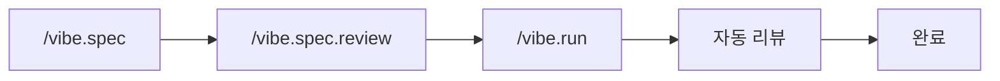

# VIBE

**AI가 코드를 쓴다. Vibe는 그 코드가 좋은지 확인한다.**

[](https://www.npmjs.com/package/@su-record/vibe)
[](https://nodejs.org/)
[](LICENSE)

> 한 번 설치하면 에이전트 56개, 스킬 45개, 멀티 LLM 오케스트레이션, 자동 품질 게이트가 기존 AI 코딩 워크플로우에 추가됩니다.

```bash
npm install -g @su-record/vibe
vibe init
```

**Claude Code**, **Codex**, **Cursor**, **Gemini CLI**에서 동작합니다.

---

## 문제

AI 코딩 도구는 동작하는 코드를 생성하지만:

- 타입은 `any`, 리뷰는 생략, 테스트는 잊혀짐
- 문제를 수동으로 잡아냄 — 이미 피해가 발생한 뒤에
- 세션 간 컨텍스트가 사라짐
- 복잡한 작업은 구조 없이 산으로 감

**Vibe는 하네스입니다.** AI 코딩 도구를 감싸고, 코드 생성 전/중/후에 품질을 자동으로 강제합니다.

---

## 작동 원리

```
Agent = Model + Harness
```

| | 역할 | 구성 요소 |
|---|------|----------|
| **Guides** (피드포워드) | 행동 **전에** 방향 설정 | CLAUDE.md, 에이전트 56개, 스킬 45개, 코딩 규칙 |
| **Sensors** (피드백) | 행동 **후에** 관찰·교정 | 훅 21개, 품질 게이트, 이볼루션 엔진 |

### 워크플로우



1. **정의** — `/vibe.spec`이 GPT + Gemini 병렬 리서치로 요구사항 작성
2. **검증** — `/vibe.spec.review`가 3중 교차 검증 실행 (Claude + GPT + Gemini)
3. **구현** — `/vibe.run`이 SPEC 기반 구현 + 병렬 코드 리뷰
4. **리뷰** — 12개 에이전트가 병렬 리뷰, P1/P2 이슈 자동 수정

`ultrawork`를 추가하면 전체 파이프라인이 자동화됩니다:

```bash
/vibe.run "사용자 인증 추가" ultrawork
```

---

## 핵심 기능

**품질 게이트** — `any` 타입, `@ts-ignore`, 50줄 초과 함수를 차단합니다. 3계층 방어: 센티넬 가드 → 프리툴 가드 → 코드 체크.

**56개 전문 에이전트** — 탐색, 구현, 아키텍처, 12개 병렬 리뷰어, 8개 UI/UX 에이전트, QA 코디네이터. 각 에이전트는 범용 래퍼가 아닌 목적 특화 설계.

**멀티 LLM 오케스트레이션** — Claude로 오케스트레이션, GPT로 추론, Gemini로 리서치. 가용 모델에 따라 자동 라우팅. 기본값은 Claude 단독 운영.

**Session RAG** — SQLite + FTS5 하이브리드 검색으로 결정, 제약, 목표를 세션 간 지속. 세션 시작 시 컨텍스트 자동 복원.

**24개 프레임워크 감지** — 스택 자동 감지 (Next.js, React, Django, Spring Boot, Rails, Go, Rust 외 17종) 후 프레임워크별 규칙 적용. 모노레포 인식.

**자기 개선** — 이볼루션 엔진이 훅 실행 패턴을 분석하고, 스킬 갭을 감지하고, 새 규칙을 생성. 회귀 발생 시 서킷 브레이커가 롤백.

---

## 포함 내용

| 분류 | 수량 | 예시 |
|------|------|------|
| **에이전트** | 56 | Explorer, Implementer, Architect (각 3단계), 리뷰 전문가 12개, UI/UX 8개, QA 코디네이터 |
| **스킬** | 45 | 3티어 시스템 (core/standard/optional) — 컨텍스트 과부하 방지 |
| **훅** | 21 | 세션 복원, 파괴적 명령 차단, 자동 포맷, 품질 체크, 컨텍스트 자동 저장 |
| **프레임워크** | 24 | TypeScript (12), Python (2), Java/Kotlin (2), Rails, Go, Rust, Swift, Flutter, Unity, Godot |
| **슬래시 커맨드** | 11 | `/vibe.spec`, `/vibe.run`, `/vibe.review`, `/vibe.trace`, `/vibe.figma` 등 |

---

## 멀티 CLI 지원

| CLI | 에이전트 | 스킬 | 지침 파일 |
|-----|---------|------|----------|
| Claude Code | `~/.claude/agents/` | `~/.claude/skills/` | `CLAUDE.md` |
| Codex | `~/.codex/plugins/vibe/` | 플러그인 내장 | `AGENTS.md` |
| Cursor | `~/.cursor/agents/` | `~/.cursor/skills/` | `.cursorrules` |
| Gemini CLI | `~/.gemini/agents/` | `~/.gemini/skills/` | `GEMINI.md` |

---

## 멀티 LLM 라우팅

| 프로바이더 | 역할 | 필수 여부 |
|-----------|------|----------|
| **Claude** | 오케스트레이션, SPEC, 리뷰 | 필수 (Claude Code) |
| **GPT** | 추론, 아키텍처, 엣지 케이스 | 선택 (Codex CLI 또는 API Key) |
| **Gemini** | 리서치, 교차 검증, UI/UX | 선택 (gemini-cli 또는 API Key) |

가용 모델에 따라 자동 전환. 기본값은 Claude 단독 — GPT와 Gemini는 강화 옵션.

Codex CLI나 gemini-cli가 설치되어 있으면 자동 감지됩니다. 직접 API Key를 설정하려면:

```bash
vibe gpt key <your-api-key>
vibe gemini key <your-api-key>
```

---

## Figma → 코드

트리 기반 구조적 매핑으로 디자인을 코드로 변환 (스크린샷 추정이 아님).

```bash
/vibe.figma              # 모든 URL 한번에 입력 (스토리보드 + 모바일 + 데스크탑)
/vibe.figma --new        # 새 피처 모드 (독립 스타일 생성)
/vibe.figma --refine     # 보완 모드 (기존 코드 + Figma 재비교 → 수정)
```

스토리보드·모바일·데스크탑 Figma URL을 한번에 전달. Figma REST API로 트리 + 노드 이미지 추출 → 브레이크포인트 간 리매핑 → 스택 인식 코드 생성 (React/Vue/Svelte/SCSS/Tailwind) → 시각 검증 루프.

---

## CLI 레퍼런스

```bash
vibe init                      # 프로젝트 초기화 (스택 감지, 하네스 설치)
vibe update                    # 스택 재감지, 설정 새로고침
vibe upgrade                   # 최신 버전 업그레이드
vibe status                    # 현재 상태 확인
vibe config show               # 통합 설정 보기
vibe stats [--week|--quality]  # 사용량 텔레메트리

vibe gpt key|status            # GPT API Key 설정
vibe gemini key|status         # Gemini API Key 설정
vibe figma breakpoints         # 반응형 브레이크포인트
vibe skills add <owner/repo>   # skills.sh에서 스킬 설치
```

---

## 설정

| 파일 | 용도 |
|------|------|
| `~/.vibe/config.json` | 글로벌 — 인증, 채널, 모델 (0o600) |
| `.claude/vibe/config.json` | 프로젝트 — 스택, 기능, 품질 설정 |

---

## 매직 키워드

| 키워드 | 효과 |
|--------|------|
| `ultrawork` | 전체 자동화 — 병렬 에이전트 + 자동 계속 + 품질 루프 |
| `ralph` | 100% 완료까지 반복 (스코프 축소 없음) |
| `quick` | 빠른 모드, 최소 검증 |

---

## 요구사항

- Node.js >= 18.0.0
- Claude Code (필수)
- GPT, Gemini (선택 — 멀티 LLM 기능용)

## 문서

- [README (English)](README.md)
- [릴리스 노트](RELEASE_NOTES.md)

## 라이선스

MIT — Copyright (c) 2025 Su
