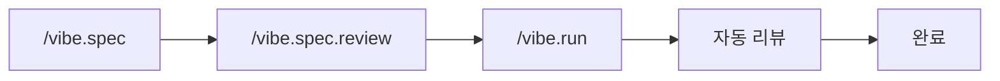
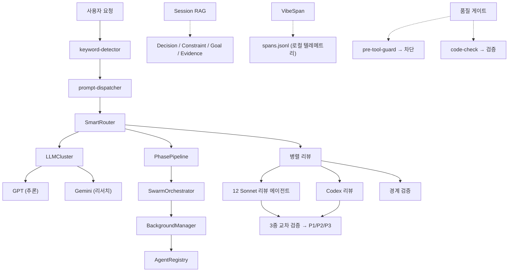

# VIBE — AI 코딩 프레임워크

[](https://www.npmjs.com/package/@su-record/vibe)
[](https://www.npmjs.com/package/@su-record/vibe)
[](https://nodejs.org/)
[](https://www.typescriptlang.org/)
[](https://opensource.org/licenses/MIT)

**한 번 설치하면 에이전트 56개, 스킬 45개, 멀티 LLM 오케스트레이션, 자동 품질 게이트가 AI 코딩 워크플로우에 추가됩니다.**

Claude Code, Codex, Cursor, Gemini CLI에서 동작합니다.

```bash
npm install -g @su-record/vibe
vibe init
```

---

## 왜 Vibe인가

AI가 동작하는 코드를 생성하지만, 품질은 운에 맡기게 됩니다.
Vibe는 이 문제를 구조적으로 해결합니다.

| 문제 | 해결 |
|------|------|
| AI가 `any` 타입을 남발 | 품질 게이트가 `any` / `@ts-ignore` 차단 |
| 원샷 완벽을 기대 | SPEC → 구현 → 검증 단계적 워크플로우 |
| 리뷰 없이 머지 | 12개 에이전트가 병렬 코드 리뷰 |
| AI 출력을 그대로 수용 | GPT + Gemini 교차 검증 |
| 세션 간 컨텍스트 유실 | Session RAG가 자동 저장 및 복원 |
| 복잡한 작업에서 길을 잃음 | SwarmOrchestrator가 자동 분해 + 병렬화 |

### 설계 철학

| 원칙 | 설명 |
|------|------|
| **Easy Vibe Coding** | 빠른 흐름 — AI와 협업하며 사고 |
| **Minimum Quality Guaranteed** | 타입 안전성, 코드 품질, 보안 — 자동 베이스라인 |
| **Iterative Reasoning** | 문제를 분해하고, 질문하고, 함께 추론 |

---

## 워크플로우



1. **`/vibe.spec`** — 요구사항을 SPEC 문서로 정의 (GPT + Gemini 병렬 리서치)
2. **`/vibe.spec.review`** — SPEC 품질 리뷰 + Codex 적대적 리뷰 (3중 교차 검증)
3. **`/vibe.run`** — SPEC 기반 구현 (Codex 구출 병렬 위임) + 3중 코드 리뷰
4. **자동 리뷰** — 12개 전문 에이전트가 병렬 리뷰 + 경계 검증, P1/P2 자동 수정

`ultrawork`를 추가하면 전체 파이프라인이 자동화됩니다:

```bash
/vibe.run "기능명" ultrawork
```

---

## 멀티 CLI 지원

| CLI | 설치 위치 | 에이전트 | 스킬 | 지침 파일 |
|-----|----------|---------|------|----------|
| **Claude Code** | `~/.claude/agents/` | 56 | `~/.claude/skills/` | `CLAUDE.md` |
| **Codex** | `~/.codex/plugins/vibe/` | 56 | 플러그인 내장 | `AGENTS.md` |
| **Cursor** | `~/.cursor/agents/` | 56 | `~/.cursor/skills/` | `.cursorrules` |
| **Gemini CLI** | `~/.gemini/agents/` | 56 | `~/.gemini/skills/` | `GEMINI.md` |

### Codex 플러그인 연동

Codex Claude Code 플러그인(`codex-plugin-cc`)이 설치되어 있으면, Vibe가 모든 워크플로우 단계에서 자동으로 통합합니다:

| 워크플로우 | Codex 활용 | 커맨드 |
|-----------|-----------|--------|
| **spec review** | 적대적 SPEC 도전 | `/codex:adversarial-review` |
| **run** | 병렬 구현 위임 | `/codex:rescue --background` |
| **run / review** | 3중 코드 리뷰 (GPT + Gemini + Codex) | `/codex:review` |
| **run / review** | 자동 수정 실패 시 폴백 | `/codex:rescue` |
| **verify** | 최종 리뷰 게이트 | `/codex:review` |
| **Stop 훅** | 코드 변경 시 자동 리뷰 | `codex-review-gate.js` |

Codex 미설치 시 자동 스킵 — 기존 워크플로우가 그대로 동작합니다.

---

## 에이전트 (56개)

### 코어 에이전트 (19개)

| 분류 | 에이전트 |
|------|---------|
| **탐색** | Explorer (High / Medium / Low) |
| **구현** | Implementer (High / Medium / Low) |
| **아키텍처** | Architect (High / Medium / Low) |
| **유틸리티** | Searcher, Tester, Simplifier, Refactor Cleaner, Build Error Resolver, Compounder, Diagrammer, E2E Tester, UI Previewer, Junior Mentor |

### 리뷰 에이전트 (12개)

Security, Performance, Architecture, Complexity, Simplicity, Data Integrity, Test Coverage, Git History, TypeScript, Python, Rails, React

### UI/UX 에이전트 (8개)

48개 CSV 데이터셋 기반 디자인 인텔리전스. 산업 분석 → 디자인 시스템 생성 → 구현 가이드 → 접근성 감사.

| 단계 | 에이전트 |
|------|---------|
| SPEC | ui-industry-analyzer, ui-design-system-gen, ui-layout-architect |
| RUN | ui-stack-implementer, ui-dataviz-advisor |
| REVIEW | ux-compliance-reviewer, ui-a11y-auditor, ui-antipattern-detector |

### QA & 리서치 (11개)

| 분류 | 에이전트 |
|------|---------|
| **QA** | QA Coordinator, Edge Case Finder, Acceptance Tester |
| **리서치** | Best Practices, Framework Docs, Codebase Patterns, Security Advisory |
| **분석** | Requirements Analyst, UX Advisor, API Documenter, Changelog Writer |

QA Coordinator가 변경된 코드를 분석하고 적절한 QA 에이전트를 병렬로 디스패치한 뒤, 통합 QA 리포트를 생성합니다.

### 이벤트 에이전트 (6개)

Event Content, Event Image, Event Speaker, Event Ops, Event Comms, Event Scheduler

---

## 스킬 (45개)

스택에 따라 자동 설치되는 도메인 특화 스킬 모듈. 컨텍스트 과부하 방지를 위해 3티어로 분류합니다.

**Core (4개):** Tech Debt, Characterization Test, Arch Guard, Exec Plan

**Standard (11개):** Parallel Research, Handoff, Priority Todos, Agents MD, Claude MD Guide, Capability Loop, Design Teach, Vibe Figma, Vibe Figma Extract, Vibe Figma Convert, Vibe Docs

**Optional (5개):** Commit Push PR, Git Worktree, Tool Fallback, Context7, Chub Usage

**Design (8개):** UI/UX Pro Max, Design Audit, Design Critique, Design Polish, Design Normalize, Design Distill, Brand Assets, SEO Checklist

**Domain (3개):** Commerce Patterns, E2E Commerce, Video Production

**PM (3개):** Create PRD, Prioritization Frameworks, User Personas

**Event (3개):** Event Planning, Event Comms, Event Ops

**Stack-Specific (2개):** TypeScript Advanced Types, Vercel React Best Practices

**Figma Pipeline (7개):** Figma Rules, Figma Pipeline, Figma Frame, Figma Style, Figma Analyze, Figma Consolidate, Figma Codegen

### Context Hub (chub-usage)

외부 API/SDK 코드 작성 시 training data 대신 검수된 최신 문서를 기반으로 정확한 코드를 작성합니다.

| 문제 | 해결 |
|------|------|
| Training data 의존 → deprecated API 사용 | `chub get` → 검수된 최신 문서 기반 코드 |
| 웹 검색 → 노이즈 섞인 결과 | `chub search` → 큐레이션된 문서만 |
| 세션마다 같은 실수 반복 | `chub annotate` → 학습 누적 |

```bash
# 사전 설치
npm install -g @aisuite/chub

# 문서 검색 → fetch → 코드 작성
chub search "stripe"
chub get stripe/api --lang ts
chub annotate stripe/api "한국 결제는 pg 파라미터 필수"
```

OpenAI, Anthropic, Stripe, Firebase, Supabase, Vercel, AWS S3 등 1,000개 이상 API 지원.
chub 미설치 시 Context7 또는 Web Search로 자동 폴백.

### 외부 스킬 (skills.sh)

[skills.sh](https://skills.sh) 생태계에서 커뮤니티 스킬을 설치할 수 있습니다:

```bash
vibe skills add vercel-labs/next-skills
```

`vibe init` / `vibe update` 시 스택에 따라 자동 설치:

| 스택 | 자동 설치 패키지 |
|------|----------------|
| `typescript-react` | `vercel-labs/agent-skills` |
| `typescript-nextjs` | `vercel-labs/agent-skills`, `vercel-labs/next-skills` |

---

## 멀티 LLM 오케스트레이션

| 프로바이더 | 역할 | 인증 |
|-----------|------|------|
| **Claude** (Opus / Sonnet / Haiku) | SPEC 작성, 코드 리뷰, 오케스트레이션 | 내장 (Claude Code) |
| **GPT** | 추론, 아키텍처, 엣지 케이스 분석 | Codex CLI / API Key |
| **Gemini** | 리서치, 교차 검증, UI/UX | gemini-cli / API Key |

### 동적 모델 라우팅

활성 LLM 가용성에 따라 자동 전환. 기본값은 Claude 단독 운영.

| 상태 | 동작 |
|------|------|
| **Claude만** | Opus (설계/판단) + Sonnet (리뷰/구현) + Haiku (탐색) |
| **+ GPT** | 구현 → GPT, 리뷰 → GPT, 추론 → GPT |
| **+ Gemini** | 리서치/리뷰에 Gemini 병렬 투입 |
| **+ GPT + Gemini** | 전체 모델 풀 오케스트레이션 |

---

## 24개 프레임워크 감지

프로젝트 스택을 자동 감지하고 프레임워크별 코딩 규칙을 적용합니다.
모노레포(pnpm-workspace, npm workspaces, Lerna, Nx, Turborepo) 지원.

- **TypeScript (12개)** — Next.js, React, Angular, Vue, Svelte, Nuxt, NestJS, Node, Electron, Tauri, React Native, Astro
- **Python (2개)** — Django, FastAPI
- **Java/Kotlin (2개)** — Spring Boot, Android
- **기타** — Rails, Go, Rust, Swift (iOS), Unity (C#), Flutter (Dart), Godot (GDScript)

데이터베이스(PostgreSQL, MySQL, MongoDB, Redis, Prisma, Drizzle 등), 상태 관리(Redux, Zustand, Jotai, Pinia 등), CI/CD, 호스팅 플랫폼도 감지합니다.

---

## 오케스트레이터

### SwarmOrchestrator

복잡도 점수 >= 15인 작업을 자동으로 병렬 하위 작업으로 분해합니다.
최대 깊이 2, 동시 실행 제한 5, 기본 타임아웃 5분.

### PhasePipeline

`prepare()` → `execute()` → `cleanup()` 라이프사이클.
ULTRAWORK 모드에서는 다음 페이즈의 `prepare()`가 병렬로 실행됩니다.

### BackgroundManager

모델/프로바이더별 동시성 제한. 타임아웃 재시도 (최대 3회, 지수 백오프). 24시간 TTL 자동 정리.

---

## 인프라스트럭처

### Session RAG

SQLite + FTS5 하이브리드 검색으로 세션 간 컨텍스트를 지속합니다.

**4가지 엔티티 타입:** Decision, Constraint, Goal, Evidence

```
Score = BM25 x 0.4 + Recency x 0.3 + Priority x 0.3
```

세션 시작 시 활성 Goal, 핵심 Constraint, 최근 Decision이 자동 주입됩니다.

### 구조화된 텔레메트리

8종 스팬으로 모든 작업을 추적:

`skill_run` / `agent_run` / `edit` / `build` / `review` / `hook` / `llm_call` / `decision`

`parent_id`를 통한 부모-자식 계층 구조. 모든 데이터는 로컬 JSONL에 저장.

### 이볼루션 시스템

벤치마킹 기반 자기 개선 에이전트/스킬/규칙 생성:

- 사용량 추적 및 인사이트 추출
- 스킬 갭 감지
- 평가 러너를 통한 자동 생성
- 서킷 브레이커 및 롤백 안전장치

### 컴포넌트 레지스트리

메타데이터 기반 런타임 컴포넌트 등록/해석:

```typescript
import { ComponentRegistry } from '@su-record/vibe/tools';

const skills = new ComponentRegistry<SkillRunner>();
skills.register('review', () => new ReviewRunner(), { version: '2.0' });
const runner = skills.resolve('review');
```

---

## 훅 (21개 스크립트)

| 이벤트 | 스크립트 | 역할 |
|-------|---------|------|
| SessionStart | `session-start.js` | 세션 컨텍스트 복원, 메모리 로드 |
| PreToolUse | `pre-tool-guard.js` | 파괴적 명령 차단, 스코프 보호 |
| PostToolUse | `code-check.js` | 타입 안전성 / 복잡도 검증 |
| PostToolUse | `post-edit.js` | Git 인덱스 업데이트 |
| UserPromptSubmit | `prompt-dispatcher.js` | 커맨드 라우팅 |
| UserPromptSubmit | `keyword-detector.js` | 매직 키워드 감지 |
| UserPromptSubmit | `llm-orchestrate.js` | 멀티 LLM 디스패치 |
| Notification | `context-save.js` | 80/90/95% 컨텍스트에서 자동 저장 |
| Notification | `stop-notify.js` | 세션 종료 알림 |

추가: `codex-review-gate.js`, `codex-detect.js`, `sentinel-guard.js`, `skill-injector.js`, `evolution-engine.js`, `hud-status.js`, `auto-commit.js`, `auto-format.js`, `auto-test.js`, `command-log.js`, `pr-test-gate.js`, `figma-extract.js`

---

## Figma → 코드 파이프라인

반응형 지원과 디자인 스킬 연동을 포함한 디자인 투 코드.

```bash
# 설정: vibe figma setup <token>
/vibe.figma "https://figma.com/design/ABC/Project?node-id=1-2"

# 반응형 (모바일 + 데스크탑)
/vibe.figma "mobile-url" "desktop-url"
```

### 처리 과정

| 단계 | 설명 |
|------|------|
| **Extract** | Figma REST API → 노드 트리 + CSS + 이미지 (토큰 필요) |
| **Analyze** | 이미지 우선 분석 → 뷰포트 차이 테이블 (반응형 모드) |
| **Generate** | 스택 인식 코드 생성 (React/Vue/Svelte/SCSS/Tailwind) + 디자인 토큰 |
| **Integrate** | 프로젝트 기존 디자인 시스템 매핑 (MASTER.md, design-context.json) |

### 반응형 디자인

2개 이상 URL 입력 시 자동 감지. 타이포그래피/간격은 `clamp()`로 유동 스케일링, 레이아웃 구조 변경만 `@media` 사용.

| 설정 | 기본값 | 설명 |
|------|-------|------|
| `breakpoint` | 1024px | PC-모바일 경계 |
| `pcTarget` | 1920px | PC 메인 타겟 해상도 |
| `mobileMinimum` | 360px | 최소 모바일 뷰포트 |
| `designPc` | 2560px | Figma PC 아트보드 (2x) |
| `designMobile` | 720px | Figma 모바일 아트보드 (2x) |

커스터마이즈: `vibe figma breakpoints --set breakpoint=768`

### 디자인 스킬 파이프라인

코드 생성 후 디자인 스킬을 체이닝하여 품질 보증:

```
/vibe.figma → /design-normalize → /design-audit → /design-polish
```

---

## 하네스 시스템

> **Agent = Model + Harness**

하네스는 AI 에이전트에서 **모델을 제외한 모든 것** — AI가 일하는 환경 전체입니다.
`vibe init` 한 번으로 가이드(Guides)와 센서(Sensors)가 설치되어, AI가 올바른 방향으로 일하고 스스로 교정하는 구조를 만듭니다.

| 축 | 역할 | 구성 요소 |
|---|------|----------|
| **Guides** (피드포워드) | 행동 **전에** 방향 설정 | CLAUDE.md, 규칙, 에이전트 56개, 스킬 45개, 커맨드 |
| **Sensors** (피드백) | 행동 **후에** 관찰/교정 | 훅 21개 (품질 게이트, 자동 테스트), 이볼루션 엔진 |

### 3계층 품질 게이트

| 계층 | 스크립트 | 검증 내용 |
|------|---------|----------|
| **1. 센티넬 가드** | `sentinel-guard.js` | `rm -rf /`, `git reset --hard`, DB drop, fork bomb 등 치명적 명령 원천 차단 |
| **2. 프리툴 가드** | `pre-tool-guard.js` | 위험 패턴 경고 — force push, .env 수정, 시스템 디렉토리 쓰기 |
| **3. 코드 체크** | `code-check.js` | `any` 타입 차단, `@ts-ignore` 차단, 함수 <= 50줄, 중첩 <= 3, 파라미터 <= 5, 순환복잡도 <= 10 |

### 훅 실행 흐름

```
사용자 액션 (Bash / Edit / Write / Prompt)
    |
SessionStart --- session-start.js
    세션 메모리 복원, 컨텍스트 로드, 하네스 버전 체크
    |
PreToolUse ---- sentinel-guard.js → pre-tool-guard.js
    파괴적 명령 차단
    |
[도구 실행]
    |
PostToolUse --- auto-format.js → code-check.js → auto-test.js
    자동 포맷 → 타입 안전성/복잡도 검증 → 테스트 실행
    |
UserPromptSubmit -- prompt-dispatcher.js → keyword-detector.js → llm-orchestrate.js
    커맨드 라우팅 → 매직 키워드 감지 → 외부 LLM 디스패치
    |
Notification --- context-save.js
    컨텍스트 80/90/95%에서 자동 저장
    |
Stop --------- codex-review-gate.js → stop-notify.js → auto-commit.js
    리뷰 게이트 → 세션 종료 알림 → 자동 커밋 + 롤백 체크포인트
```

### LLM 비용 추적

외부 LLM(GPT, Gemini) 호출마다 토큰, 비용, 지연 시간을 `~/.vibe/llm-costs.jsonl`에 기록합니다.

```jsonl
{"ts":"...","provider":"gpt","model":"gpt-5.4","inputTokens":150,"outputTokens":420,"cost":0.0069,"durationMs":2340,"cached":false}
```

`vibe stats --quality`로 누적 비용 확인 가능.

### 롤백 체크포인트

에이전트 자동 커밋마다 `vibe-checkpoint-N` git 태그를 생성합니다.
문제 발생 시 한 줄로 롤백:

```bash
git reset --hard vibe-checkpoint-3
```

최근 5개만 유지, 오래된 체크포인트는 자동 정리.

### 에스컬레이션 (Human-in-the-loop)

동일 파일에서 P1/P2 이슈가 3회 반복되면 자동 수정을 멈추고 사용자에게 개입을 요청합니다.

### 이볼루션 엔진 (자기 개선)

```
훅 실행 추적 (spans.jsonl)
    |
패턴 분석 — 반복 차단 패턴 클러스터링 (7일 히스토리)
    |
인사이트 생성 — 최적화/경고/갭 분류 + 신뢰도 점수
    |
규칙/스킬 자동 생성 (suggest 또는 auto 모드)
    |
서킷 브레이커 — 회귀 발생 시 롤백
```

---

## 품질 게이트

| 가드 | 메커니즘 |
|------|---------|
| **타입 안전성** | 품질 게이트 — `any`, `@ts-ignore` 차단 |
| **코드 리뷰** | 12개 Sonnet 에이전트 병렬 리뷰 + Codex 3중 교차 검증 |
| **경계 검사** | API - Frontend 타입/라우팅/상태 일관성 검증 |
| **완전성** | Ralph Loop — 100% 완료까지 반복 (스코프 축소 없음) |
| **수렴** | P1=0이면 완료; 반복 라운드마다 스코프 축소 |
| **스코프 보호** | pre-tool-guard — 범위 밖 수정 방지 |
| **컨텍스트 보호** | context-save — 80/90/95%에서 자동 저장 |
| **증거 게이트** | 증거 없는 완료 선언 불가 |

**복잡도 제한:** 함수 <= 50줄 | 중첩 <= 3 | 파라미터 <= 5 | 순환복잡도 <= 10

---

## 슬래시 커맨드

| 커맨드 | 설명 |
|--------|------|
| `/vibe.spec "기능"` | SPEC 작성 + GPT/Gemini 병렬 리서치 |
| `/vibe.spec.review` | SPEC 품질 리뷰 |
| `/vibe.run "기능"` | SPEC 기반 구현 + 병렬 코드 리뷰 |
| `/vibe.verify "기능"` | SPEC 대비 BDD 검증 |
| `/vibe.review` | 12 에이전트 병렬 코드 리뷰 |
| `/vibe.trace "기능"` | 요구사항 추적 매트릭스 |
| `/vibe.reason "문제"` | 체계적 추론 프레임워크 |
| `/vibe.analyze` | 프로젝트 분석 |
| `/vibe.event` | 이벤트 자동화 |
| `/vibe.figma "url"` | Figma 디자인 → 프로덕션 코드 (반응형, 멀티 URL) |
| `/vibe.utils` | 유틸리티 (E2E, 다이어그램, UI, 세션 복원) |
| `/vibe.docs` | 프로젝트 문서 생성 (README, 가이드, 아키텍처, 릴리스 노트) |

---

## 매직 키워드

| 키워드 | 효과 |
|--------|------|
| `ultrawork` / `ulw` | 병렬 처리 + 페이즈 파이프라이닝 + 자동 계속 + Ralph Loop |
| `ralph` | 100% 완료까지 반복 (스코프 축소 없음) |
| `ralplan` | 반복적 플래닝 + 영속성 |
| `verify` | 엄격 검증 모드 |
| `quick` | 빠른 모드, 최소 검증 |

---

## CLI

```bash
# 프로젝트
vibe init [project]       # 프로젝트 초기화
vibe update               # 설정 업데이트 (스택 재감지)
vibe upgrade              # 최신 버전 업그레이드
vibe setup                # 대화형 설정 마법사
vibe status               # 상태 확인
vibe remove               # 제거

# LLM 인증
vibe gpt auth|key|status|logout
vibe gemini auth|key|status|logout
vibe claude key|status|logout

# 외부 스킬
vibe skills add <owner/repo>   # skills.sh에서 스킬 설치

# Figma
vibe figma breakpoints                # 반응형 브레이크포인트 확인/설정
vibe figma status|logout              # 토큰 관리

# 채널
vibe telegram setup|chat|status
vibe slack setup|channel|status

# 진단
vibe config show          # 통합 설정 보기 (글로벌 + 프로젝트)
vibe stats [--week|--quality]  # 사용량 텔레메트리 요약

# 기타
vibe env import [path]    # .env → config.json 마이그레이션
vibe help / version
```

### 인증 우선순위

| 프로바이더 | 우선순위 |
|-----------|---------|
| **GPT** | Codex CLI → API Key |
| **Gemini** | gemini-cli 자동 감지 → API Key |

---

## Subpath Exports

```typescript
import { MemoryStorage, SessionRAGStore } from '@su-record/vibe/memory';
import { SwarmOrchestrator, PhasePipeline } from '@su-record/vibe/orchestrator';
import { findSymbol, validateCodeQuality } from '@su-record/vibe/tools';
import { InMemoryStorage, ComponentRegistry, createSpan } from '@su-record/vibe/tools';
```

| Subpath | 주요 Exports |
|---------|-------------|
| `@su-record/vibe/memory` | `MemoryStorage`, `IMemoryStorage`, `InMemoryStorage`, `KnowledgeGraph`, `SessionRAGStore` |
| `@su-record/vibe/orchestrator` | `SwarmOrchestrator`, `PhasePipeline`, `BackgroundManager` |
| `@su-record/vibe/tools` | `findSymbol`, `validateCodeQuality`, `createSpan`, `ComponentRegistry` 등 |
| `@su-record/vibe/tools/memory` | 메모리 도구 |
| `@su-record/vibe/tools/convention` | 코드 품질 도구 |
| `@su-record/vibe/tools/semantic` | 시맨틱 분석 (심볼 검색, AST, LSP) |
| `@su-record/vibe/tools/ui` | UI/UX 도구 |
| `@su-record/vibe/tools/interaction` | 사용자 인터랙션 도구 |
| `@su-record/vibe/tools/time` | 시간 유틸리티 |

---

## 설정

### 글로벌: `~/.vibe/config.json`

인증, 채널, 모델 설정 (파일 권한 `0o600`).

```json
{
  "credentials": {
    "gpt": { "apiKey": "..." },
    "gemini": { "apiKey": "..." }
  },
  "channels": {
    "telegram": { "botToken": "...", "allowedChatIds": ["..."] },
    "slack": { "botToken": "...", "appToken": "...", "allowedChannelIds": ["..."] }
  },
  "models": { "gpt": "gpt-5.4", "gemini": "gemini-3.1-pro-preview" }
}
```

### 프로젝트: `.claude/vibe/config.json`

프로젝트별 설정 — 언어, 품질, 스택, 세부사항, 참조, installedExternalSkills.

---

## 프로젝트 구조

```
your-project/
├── .claude/
│   ├── vibe/
│   │   ├── config.json        # 프로젝트 설정
│   │   ├── constitution.md    # 프로젝트 원칙
│   │   ├── specs/             # SPEC 문서
│   │   ├── features/          # 기능 추적
│   │   ├── todos/             # P1/P2/P3 이슈
│   │   └── reports/           # 리뷰 리포트
│   └── skills/                # 로컬 + 외부 스킬
├── CLAUDE.md                  # 프로젝트 가이드 (자동 생성)
├── AGENTS.md                  # Codex CLI 가이드 (자동 생성)
└── ...

~/.vibe/config.json            # 글로벌 설정 (인증, 채널, 모델)
~/.vibe/analytics/             # 텔레메트리 (로컬 JSONL)
│   ├── skill-usage.jsonl
│   ├── spans.jsonl
│   └── decisions.jsonl
~/.claude/
├── vibe/
│   ├── rules/                 # 코딩 규칙
│   ├── skills/                # 글로벌 스킬
│   └── ui-ux-data/            # UI/UX CSV 데이터셋 (48개 파일)
├── commands/                  # 슬래시 커맨드
└── agents/                    # 에이전트 정의 (56개)
~/.codex/
└── plugins/vibe/              # Codex 플러그인
    ├── .codex-plugin/plugin.json
    ├── agents/
    ├── skills/
    └── AGENTS.md
```

---

## 아키텍처



---

## 요구사항

- **Node.js** >= 18.0.0
- **Claude Code** (필수)
- GPT, Gemini (선택 — 멀티 LLM 기능용)

## 라이선스

MIT License - Copyright (c) 2025 Su
