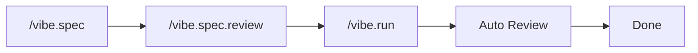
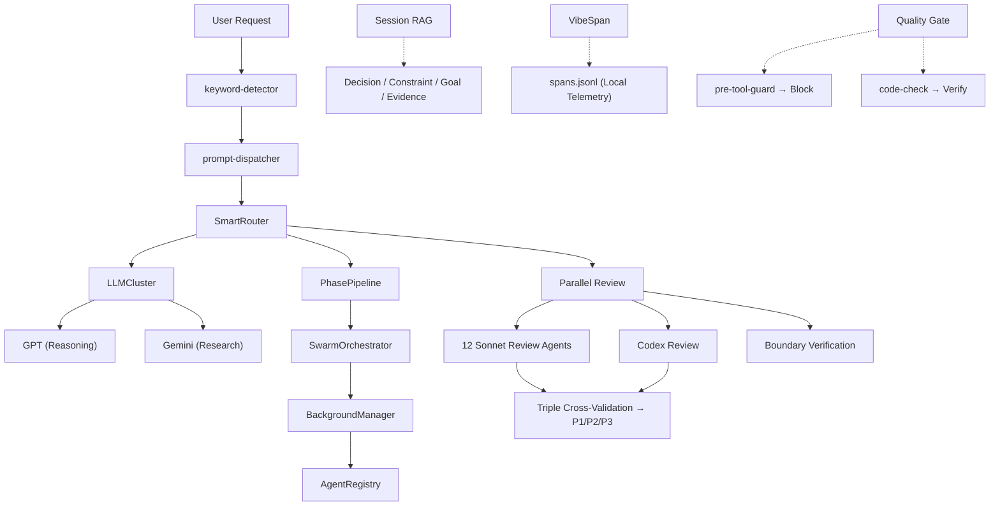

# VIBE — AI Coding Framework

[](https://www.npmjs.com/package/@su-record/vibe)
[](https://www.npmjs.com/package/@su-record/vibe)
[](https://nodejs.org/)
[](https://www.typescriptlang.org/)
[](https://opensource.org/licenses/MIT)

**One install adds 56 agents, 36 skills, multi-LLM orchestration, and automated quality gates to your AI coding workflow.**

Works with Claude Code, Codex, Cursor, and Gemini CLI.

```bash
npm install -g @su-record/vibe
vibe init
```

---

## Why Vibe

AI generates working code, but quality is left to chance.
Vibe solves this structurally.

| Problem | Solution |
|---------|----------|
| AI scatters `any` types | Quality Gate blocks `any` / `@ts-ignore` |
| Expecting one-shot perfection | SPEC → Implement → Verify staged workflow |
| Merging without review | 12 agents run parallel code review |
| Accepting AI output blindly | GPT + Gemini cross-validation |
| Losing context between sessions | Session RAG auto-saves and restores |
| Getting lost on complex tasks | SwarmOrchestrator auto-decomposes + parallelizes |

### Design Philosophy

| Principle | Description |
|-----------|-------------|
| **Easy Vibe Coding** | Fast flow — think collaboratively with AI |
| **Minimum Quality Guaranteed** | Type safety, code quality, security — automatic baseline |
| **Iterative Reasoning** | Break down problems, ask questions, reason together |

---

## Workflow



1. **`/vibe.spec`** — Define requirements as a SPEC document (GPT + Gemini parallel research)
2. **`/vibe.spec.review`** — SPEC quality review + Codex adversarial review (triple cross-validation)
3. **`/vibe.run`** — Implement from SPEC (Codex rescue parallel delegation) + triple code review
4. **Auto Review** — 12 specialized agents review in parallel + boundary verification, P1/P2 auto-fix

Add `ultrawork` to automate the entire pipeline:

```bash
/vibe.run "feature" ultrawork
```

---

## Multi-CLI Support

| CLI | Install Location | Agents | Skills | Instructions |
|-----|-----------------|--------|--------|-------------|
| **Claude Code** | `~/.claude/agents/` | 56 | `~/.claude/skills/` | `CLAUDE.md` |
| **Codex** | `~/.codex/plugins/vibe/` | 56 | Plugin built-in | `AGENTS.md` |
| **Cursor** | `~/.cursor/agents/` | 56 | `~/.cursor/skills/` | `.cursorrules` |
| **Gemini CLI** | `~/.gemini/agents/` | 56 | `~/.gemini/skills/` | `GEMINI.md` |

### Codex Plugin Integration

When the Codex Claude Code plugin (`codex-plugin-cc`) is installed, Vibe automatically integrates it across every workflow stage:

| Workflow | Codex Usage | Command |
|----------|------------|---------|
| **spec review** | Adversarial SPEC challenge | `/codex:adversarial-review` |
| **run** | Parallel implementation delegation | `/codex:rescue --background` |
| **run / review** | Triple code review (GPT + Gemini + Codex) | `/codex:review` |
| **run / review** | Fallback on auto-fix failure | `/codex:rescue` |
| **verify** | Final review gate | `/codex:review` |
| **Stop hook** | Auto-review on code changes | `codex-review-gate.js` |

Auto-skips when Codex is not installed — existing workflow continues as-is.

---

## Agents (56)

### Core Agents (19)

| Category | Agents |
|----------|--------|
| **Exploration** | Explorer (High / Medium / Low) |
| **Implementation** | Implementer (High / Medium / Low) |
| **Architecture** | Architect (High / Medium / Low) |
| **Utility** | Searcher, Tester, Simplifier, Refactor Cleaner, Build Error Resolver, Compounder, Diagrammer, E2E Tester, UI Previewer, Junior Mentor |

### Review Agents (12)

Security, Performance, Architecture, Complexity, Simplicity, Data Integrity, Test Coverage, Git History, TypeScript, Python, Rails, React

### UI/UX Agents (8)

Design intelligence backed by 48 CSV datasets. Industry analysis → Design system generation → Implementation guide → Accessibility audit.

| Phase | Agents |
|-------|--------|
| SPEC | ui-industry-analyzer, ui-design-system-gen, ui-layout-architect |
| RUN | ui-stack-implementer, ui-dataviz-advisor |
| REVIEW | ux-compliance-reviewer, ui-a11y-auditor, ui-antipattern-detector |

### QA & Research (11)

| Category | Agents |
|----------|--------|
| **QA** | QA Coordinator, Edge Case Finder, Acceptance Tester |
| **Research** | Best Practices, Framework Docs, Codebase Patterns, Security Advisory |
| **Analysis** | Requirements Analyst, UX Advisor, API Documenter, Changelog Writer |

QA Coordinator analyzes changed code and dispatches appropriate QA agents in parallel, then produces a unified QA report.

### Event Agents (6)

Event Content, Event Image, Event Speaker, Event Ops, Event Comms, Event Scheduler

---

## Skills (36)

Domain-specific skill modules auto-installed based on detected stack.

**Core (15):** Core Capabilities, Parallel Research, Commit Push PR, Git Worktree, Handoff, Priority Todos, Tool Fallback, Context7, Tech Debt, Characterization Test, Agents MD, Claude MD Guide, Exec Plan, Arch Guard, Capability Loop

**Design (7):** Frontend Design, UI/UX Pro Max, Design Teach, Design Audit, Design Critique, Design Polish, Design Normalize

**Domain (3):** Commerce Patterns, E2E Commerce, Video Production

**PM (3):** Create PRD, Prioritization Frameworks, User Personas

**Event (3):** Event Planning, Event Comms, Event Ops

**Stack-Specific (5):** TypeScript Advanced Types, Vercel React Best Practices, SEO Checklist, Brand Assets, Design Distill

### External Skills (skills.sh)

Install community skills from the [skills.sh](https://skills.sh) ecosystem:

```bash
vibe skills add vercel-labs/next-skills
```

Auto-installed by stack during `vibe init` / `vibe update`:

| Stack | Auto-installed Package |
|-------|----------------------|
| `typescript-react` | `vercel-labs/agent-skills` |
| `typescript-nextjs` | `vercel-labs/agent-skills`, `vercel-labs/next-skills` |

---

## Multi-LLM Orchestration

| Provider | Role | Auth |
|----------|------|------|
| **Claude** (Opus / Sonnet / Haiku) | SPEC writing, code review, orchestration | Built-in (Claude Code) |
| **GPT** | Reasoning, architecture, edge-case analysis | Codex CLI / API Key |
| **Gemini** | Research, cross-validation, UI/UX | gemini-cli / API Key |

### Dynamic Model Routing

Auto-switches based on active LLM availability. Defaults to Claude-only operation.

| State | Behavior |
|-------|----------|
| **Claude only** | Opus (design/judgment) + Sonnet (review/implementation) + Haiku (exploration) |
| **+ GPT** | Implementation → GPT, review → GPT, reasoning → GPT |
| **+ Gemini** | Research/review gets parallel Gemini |
| **+ GPT + Gemini** | Full orchestration across all models |

---

## 24 Framework Detection

Auto-detects project stack and applies framework-specific coding rules.
Supports monorepos (pnpm-workspace, npm workspaces, Lerna, Nx, Turborepo).

- **TypeScript (12)** — Next.js, React, Angular, Vue, Svelte, Nuxt, NestJS, Node, Electron, Tauri, React Native, Astro
- **Python (2)** — Django, FastAPI
- **Java/Kotlin (2)** — Spring Boot, Android
- **Other** — Rails, Go, Rust, Swift (iOS), Unity (C#), Flutter (Dart), Godot (GDScript)

Also detects: databases (PostgreSQL, MySQL, MongoDB, Redis, Prisma, Drizzle, etc.), state management (Redux, Zustand, Jotai, Pinia, etc.), CI/CD, and hosting platforms.

---

## Orchestrators

### SwarmOrchestrator

Auto-decomposes tasks with complexity score ≥ 15 into parallel subtasks.
Max depth 2, concurrent limit 5, default timeout 5 min.

### PhasePipeline

`prepare()` → `execute()` → `cleanup()` lifecycle.
In ULTRAWORK mode, the next phase's `prepare()` runs in parallel.

### BackgroundManager

Per-model/provider concurrency limits. Timeout retry (max 3, exponential backoff). 24-hour TTL auto-cleanup.

---

## Infrastructure

### Session RAG

SQLite + FTS5 hybrid search for cross-session context persistence.

**4 entity types:** Decision, Constraint, Goal, Evidence

```
Score = BM25 × 0.4 + Recency × 0.3 + Priority × 0.3
```

On session start, active Goals, critical Constraints, and recent Decisions are auto-injected.

### Structured Telemetry

8 typed span kinds track all operations:

`skill_run` · `agent_run` · `edit` · `build` · `review` · `hook` · `llm_call` · `decision`

Parent-child hierarchy via `parent_id`. All data stays in local JSONL.

### Evolution System

Self-improving agent/skill/rule generation with benchmarking:

- Usage tracking and insight extraction
- Skill gap detection
- Auto-generation with evaluation runners
- Circuit breaker and rollback safety

### Component Registry

Runtime component registration/resolution with metadata:

```typescript
import { ComponentRegistry } from '@su-record/vibe/tools';

const skills = new ComponentRegistry<SkillRunner>();
skills.register('review', () => new ReviewRunner(), { version: '2.0' });
const runner = skills.resolve('review');
```

---

## Hooks (16 scripts)

| Event | Script | Role |
|-------|--------|------|
| SessionStart | `session-start.js` | Restore session context, load memory |
| PreToolUse | `pre-tool-guard.js` | Block destructive commands, scope protection |
| PostToolUse | `code-check.js` | Type safety / complexity verification |
| PostToolUse | `post-edit.js` | Git index update |
| UserPromptSubmit | `prompt-dispatcher.js` | Command routing |
| UserPromptSubmit | `keyword-detector.js` | Magic keyword detection |
| Notification | `context-save.js` | Auto-save at 80/90/95% context |

Additional: `llm-orchestrate.js`, `codex-review-gate.js`, `codex-detect.js`, `sentinel-guard.js`, `skill-injector.js`, `evolution-engine.js`, `hud-status.js`, `stop-notify.js`

---

## Figma → Code Pipeline

Design-to-code with responsive support and design skill integration.

```bash
# Single design
vibe figma setup <token>
vibe figma extract "https://figma.com/design/ABC/Project?node-id=1-2"
# then in Claude Code:
/vibe.figma "url"

# Responsive (mobile + desktop)
vibe figma extract "mobile-url" "desktop-url"
/vibe.figma "mobile-url" "desktop-url"
```

### What It Does

| Phase | Description |
|-------|-------------|
| **Extract** | Figma API → `layers.json` + `frame.png` + `assets/` (background images) |
| **Analyze** | Image-first analysis → viewport diff table (responsive mode) |
| **Generate** | Stack-aware code (React/Vue/Svelte/SCSS/Tailwind) + design tokens |
| **Integrate** | Maps to project's existing design system (MASTER.md, design-context.json) |

### Responsive Design

Auto-detected when 2+ URLs provided. Generates fluid scaling with `clamp()` for typography/spacing, `@media` only for layout structure changes.

| Config | Default | Description |
|--------|---------|-------------|
| `breakpoint` | 1024px | PC↔Mobile boundary |
| `pcTarget` | 1920px | PC main target resolution |
| `mobileMinimum` | 360px | Minimum mobile viewport |
| `designPc` | 2560px | Figma PC artboard (2x) |
| `designMobile` | 720px | Figma Mobile artboard (2x) |

Customize: `vibe figma breakpoints --set breakpoint=768`

### Design Skill Pipeline

After code generation, chain design skills for quality assurance:

```
/vibe.figma → /design-normalize → /design-audit → /design-polish
```

---

## Quality Gates

| Guard | Mechanism |
|-------|-----------|
| **Type Safety** | Quality Gate — blocks `any`, `@ts-ignore` |
| **Code Review** | 12 Sonnet agents parallel review + Codex triple cross-validation |
| **Boundary Check** | API ↔ Frontend type/routing/state consistency verification |
| **Completeness** | Ralph Loop — iterates until 100% (no scope reduction) |
| **Convergence** | P1=0 means done; scope narrows on repeated rounds |
| **Scope Protection** | pre-tool-guard — prevents out-of-scope modifications |
| **Context Protection** | context-save — auto-saves at 80/90/95% |
| **Evidence Gate** | No completion claims without evidence |

**Complexity limits:** Function ≤ 50 lines | Nesting ≤ 3 | Parameters ≤ 5 | Cyclomatic complexity ≤ 10

---

## Slash Commands

| Command | Description |
|---------|-------------|
| `/vibe.spec "feature"` | Write SPEC + GPT/Gemini parallel research |
| `/vibe.spec.review` | SPEC quality review |
| `/vibe.run "feature"` | Implement from SPEC + parallel code review |
| `/vibe.verify "feature"` | BDD verification against SPEC |
| `/vibe.review` | 12-agent parallel code review |
| `/vibe.trace "feature"` | Requirements traceability matrix |
| `/vibe.reason "problem"` | Systematic reasoning framework |
| `/vibe.analyze` | Project analysis |
| `/vibe.event` | Event automation |
| `/vibe.figma "url"` | Figma design → production code (responsive, multi-URL) |
| `/vibe.utils` | Utilities (E2E, diagrams, UI, session restore) |

---

## Magic Keywords

| Keyword | Effect |
|---------|--------|
| `ultrawork` / `ulw` | Parallel processing + phase pipelining + auto-continue + Ralph Loop |
| `ralph` | Iterate until 100% complete (no scope reduction) |
| `ralplan` | Iterative planning + persistence |
| `verify` | Strict verification mode |
| `quick` | Fast mode, minimal verification |

---

## CLI

```bash
# Project
vibe init [project]       # Initialize project
vibe update               # Update settings (re-detect stacks)
vibe upgrade              # Upgrade to latest version
vibe setup                # Interactive setup wizard
vibe status               # Show status
vibe remove               # Uninstall

# LLM Auth
vibe gpt auth|key|status|logout
vibe gemini auth|key|status|logout
vibe claude key|status|logout

# External Skills
vibe skills add <owner/repo>   # Install skills from skills.sh

# Figma
vibe figma setup <token>              # Set Figma access token
vibe figma extract <url> [url...]     # Extract layers + images from Figma
vibe figma breakpoints                # Show/set responsive breakpoints
vibe figma status|logout

# Channels
vibe telegram setup|chat|status
vibe slack setup|channel|status

# Other
vibe env import [path]    # Migrate .env → config.json
vibe help / version
```

### Auth Priority

| Provider | Priority |
|----------|----------|
| **GPT** | Codex CLI → API Key |
| **Gemini** | gemini-cli auto-detect → API Key |

---

## Subpath Exports

```typescript
import { MemoryStorage, SessionRAGStore } from '@su-record/vibe/memory';
import { SwarmOrchestrator, PhasePipeline } from '@su-record/vibe/orchestrator';
import { findSymbol, validateCodeQuality } from '@su-record/vibe/tools';
import { InMemoryStorage, ComponentRegistry, createSpan } from '@su-record/vibe/tools';
```

| Subpath | Key Exports |
|---------|-------------|
| `@su-record/vibe/memory` | `MemoryStorage`, `IMemoryStorage`, `InMemoryStorage`, `KnowledgeGraph`, `SessionRAGStore` |
| `@su-record/vibe/orchestrator` | `SwarmOrchestrator`, `PhasePipeline`, `BackgroundManager` |
| `@su-record/vibe/tools` | `findSymbol`, `validateCodeQuality`, `createSpan`, `ComponentRegistry`, etc. |
| `@su-record/vibe/tools/memory` | Memory tools |
| `@su-record/vibe/tools/convention` | Code quality tools |
| `@su-record/vibe/tools/semantic` | Semantic analysis (symbol search, AST, LSP) |
| `@su-record/vibe/tools/ui` | UI/UX tools |
| `@su-record/vibe/tools/interaction` | User interaction tools |
| `@su-record/vibe/tools/time` | Time utilities |

---

## Configuration

### Global: `~/.vibe/config.json`

Auth, channels, and model settings (file permissions `0o600`).

```json
{
  "credentials": {
    "gpt": { "apiKey": "..." },
    "gemini": { "apiKey": "..." }
  },
  "channels": {
    "telegram": { "botToken": "...", "allowedChatIds": ["..."] },
    "slack": { "botToken": "...", "appToken": "...", "allowedChannelIds": ["..."] }
  },
  "models": { "gpt": "gpt-5.4", "gemini": "gemini-3.1-pro-preview" }
}
```

### Project: `.claude/vibe/config.json`

Per-project settings — language, quality, stacks, details, references, installedExternalSkills.

---

## Project Structure

```
your-project/
├── .claude/
│   ├── vibe/
│   │   ├── config.json        # Project config
│   │   ├── constitution.md    # Project principles
│   │   ├── specs/             # SPEC documents
│   │   ├── features/          # Feature tracking
│   │   ├── todos/             # P1/P2/P3 issues
│   │   └── reports/           # Review reports
│   └── skills/                # Local + external skills
├── CLAUDE.md                  # Project guide (auto-generated)
├── AGENTS.md                  # Codex CLI guide (auto-generated)
└── ...

~/.vibe/config.json            # Global config (auth, channels, models)
~/.vibe/analytics/             # Telemetry (local JSONL)
│   ├── skill-usage.jsonl
│   ├── spans.jsonl
│   └── decisions.jsonl
~/.claude/
├── vibe/
│   ├── rules/                 # Coding rules
│   ├── skills/                # Global skills
│   └── ui-ux-data/            # UI/UX CSV datasets (48 files)
├── commands/                  # Slash commands
└── agents/                    # Agent definitions (56)
~/.codex/
└── plugins/vibe/              # Codex plugin
    ├── .codex-plugin/plugin.json
    ├── agents/
    ├── skills/
    └── AGENTS.md
```

---

## Architecture



---

## Requirements

- **Node.js** >= 18.0.0
- **Claude Code** (required)
- GPT, Gemini (optional — for multi-LLM features)

## License

MIT License - Copyright (c) 2025 Su
