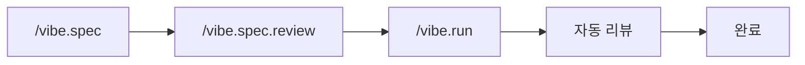
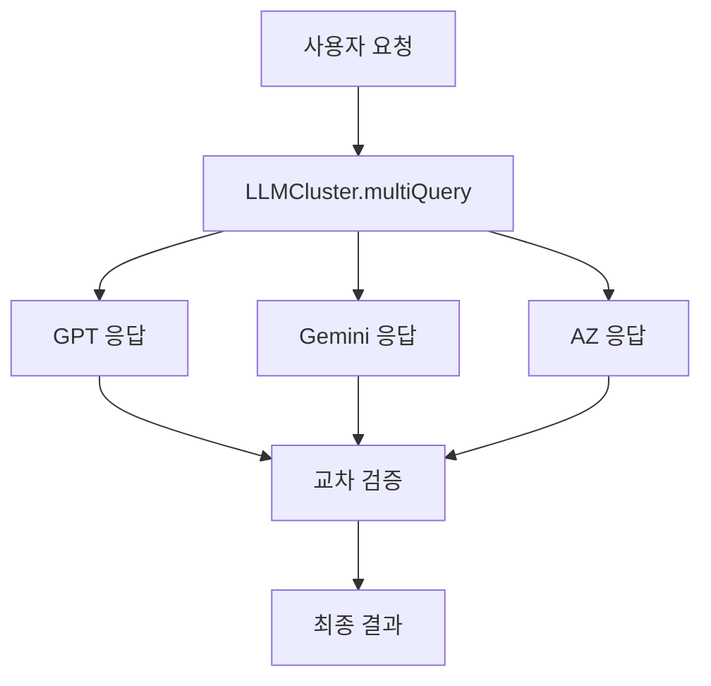
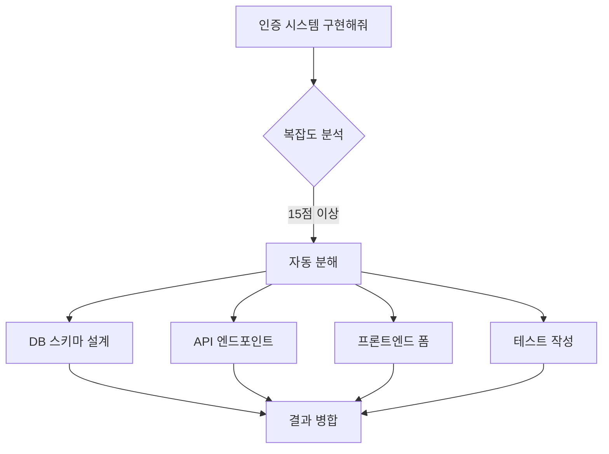
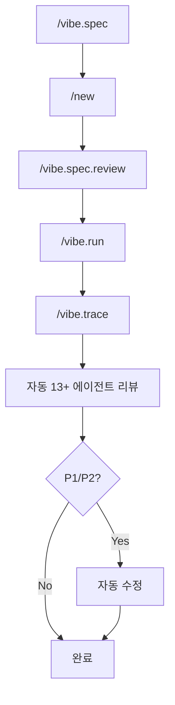
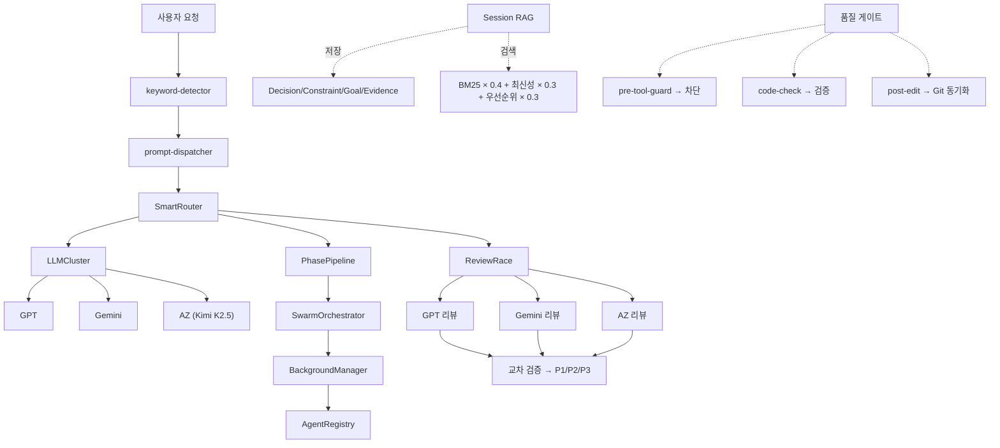

# Vibe

### Personalized AI Agent for Claude Code

[](https://www.npmjs.com/package/@su-record/vibe)
[](https://github.com/su-record/core/packages)
[](https://nodejs.org/)
[](https://www.typescriptlang.org/)
[](https://opensource.org/licenses/MIT)

**설치 한 줄로 Claude Code에 46개 에이전트, 41+ 도구, 4개 LLM을 더합니다.**

46개 에이전트 · 41+ 내장 도구 · 34개 스킬 · 4개 LLM 오케스트레이션 · 25개 프레임워크 지원

---

## Quick Start

```bash
npm install -g @su-record/core
vibe init
```

멀티 LLM 기능을 사용하려면:

```bash
vibe gpt auth            # GPT OAuth (Plus/Pro)
vibe gemini auth         # Gemini OAuth
vibe az key <KEY>        # AZ API 키 (Azure Foundry)
vibe kimi key <KEY>      # Kimi API 키 (Moonshot Direct)
```

새 환경 셋업 (한 줄):
```bash
npm i -g @su-record/core && vibe sync login && vibe sync pull
```

---

## 목차

- [왜 Vibe인가](#왜-vibe인가)
- [동작 원리](#동작-원리)
- [모듈 서브패스 Export](#모듈-서브패스-export)
- [멀티 LLM 오케스트레이션](#멀티-llm-오케스트레이션)
- [에이전트 시스템](#에이전트-시스템)
- [오케스트레이터](#오케스트레이터)
- [Session RAG](#session-rag--세션-간-컨텍스트-유지)
- [훅 시스템](#훅-시스템)
- [슬래시 명령어](#슬래시-명령어)
- [41+ 내장 도구](#41-내장-도구)
- [34개 스킬](#34개-스킬)
- [25개 프레임워크 지원](#25개-프레임워크-지원)
- [품질 보장 시스템](#품질-보장-시스템)
- [CLI 명령어](#cli-명령어)
- [인증 동기화 (vibe sync)](#인증-동기화-vibe-sync)
- [매직 키워드](#매직-키워드)
- [프로젝트 구조](#프로젝트-구조)
- [시스템 아키텍처](#시스템-아키텍처)
- [GitHub Packages 배포](#github-packages-배포)

---

## 왜 Vibe인가

AI에게 "로그인 기능 만들어줘"라고 던지면 동작은 하지만 품질은 운에 맡기게 됩니다.
Vibe는 이 문제를 구조로 해결합니다.

| 문제 | Vibe의 해결 |
|------|-----------|
| AI가 `any` 타입을 남발 | Quality Gate가 `any`/`@ts-ignore` 차단 |
| 한 번에 완성된 코드를 기대 | SPEC → 구현 → 검증 단계별 워크플로우 |
| 코드 리뷰 없이 머지 | 13개 에이전트 병렬 리뷰 (보안, 성능, 아키텍처 등) |
| AI 결과를 그대로 수용 | 4개 LLM 교차 검증 (Claude + GPT + Gemini + AZ) |
| 컨텍스트 소실 | Session RAG로 결정사항/목표 자동 저장 및 복원 |
| 복잡한 작업에서 길을 잃음 | SwarmOrchestrator가 자동 분해 + 병렬 실행 |

### 설계 철학

| 원칙 | 설명 |
|------|------|
| **Easy Vibe Coding** | 빠른 흐름, 직관적 개발, AI와 협업하며 생각하기 |
| **Minimum Quality Guaranteed** | 타입 안전성, 코드 품질, 보안 — 자동으로 하한선 확보 |
| **Iterative Reasoning** | AI에게 답을 맡기지 말고, 문제를 쪼개고 질문하며 함께 추론 |

---

## 동작 원리



1. **`/vibe.spec`** — 요구사항을 SPEC 문서로 정의 (GPT + Gemini + AZ 병렬 리서치)
2. **`/vibe.spec.review`** — GPT/Gemini/AZ 3라운드 교차 리뷰
3. **`/vibe.run`** — SPEC 기반으로 구현 실행 + Race Review (병렬 코드 리뷰)
4. **자동 리뷰** — 13개 전문 에이전트가 병렬 검토
5. **P1/P2 자동 수정** — 심각한 이슈는 자동으로 고침

`ultrawork` 키워드를 붙이면 전 과정이 자동화됩니다:
```bash
/vibe.run "기능" ultrawork
```

---

## 모듈 서브패스 Export

`@su-record/core`는 런타임 모듈을 서브패스 export로 제공합니다. 필요한 모듈만 선택적으로 import할 수 있습니다.

### 사용 가능한 서브패스

| 서브패스 | 설명 | 주요 export |
|---------|------|------------|
| `@su-record/core/interface` | 외부 인터페이스 (Telegram, Web, Slack, Vision) | `BaseInterface`, `TelegramBot`, `WebServer`, `SlackBot`, `VisionInterface` + 타입 |
| `@su-record/core/router` | 라우팅 인프라 (Intent, Task Planning, Browser) | `ModelARouter`, `IntentClassifier`, `TaskPlanner`, `BrowserAgent` 등 14개 클래스 + 16개 타입 |
| `@su-record/core/memory` | 메모리 시스템 (Storage, KnowledgeGraph, Session RAG) | `MemoryStorage`, `KnowledgeGraph`, `SessionRAGStore` 등 7개 클래스 + 18개 타입 |
| `@su-record/core/policy` | 정책 엔진 (Policy, Risk) | `PolicyEngine`, `PolicyStore`, `RiskCalculator` 등 4개 클래스 + 13개 타입 |
| `@su-record/core/orchestrator` | 오케스트레이터 (Swarm, Pipeline, Background) | `SwarmOrchestrator`, `PhasePipeline`, `BackgroundManager` |
| `@su-record/core/tools` | 41+ 내장 도구 | `findSymbol`, `validateCodeQuality`, `saveMemory` 등 |

### 사용 예시

```typescript
// 런타임 인프라 모듈 import
import { ModelARouter, IntentClassifier } from '@su-record/core/router';
import { PolicyEngine, RiskCalculator } from '@su-record/core/policy';
import { TelegramBot, WebServer } from '@su-record/core/interface';

// 메모리 시스템
import { MemoryStorage, SessionRAGStore } from '@su-record/core/memory';
import type { Decision, Goal, Evidence } from '@su-record/core/memory';

// 오케스트레이터
import { SwarmOrchestrator, PhasePipeline } from '@su-record/core/orchestrator';

// 도구
import { findSymbol, validateCodeQuality } from '@su-record/core/tools';
```

> **참고:** `./router`에서는 인프라 클래스만 export됩니다. 애플리케이션 Route (DevRoute, GoogleRoute 등)와 Service (GmailService 등)는 내부 구현이므로 포함되지 않습니다.

### LLM Provider API

```typescript
import gptApi from '@su-record/core/lib/gpt';
import geminiApi from '@su-record/core/lib/gemini';
import azApi from '@su-record/core/lib/az';
```

---

## 멀티 LLM 오케스트레이션

4개 LLM 프로바이더를 통합하여 작업 유형별 최적의 모델에 자동 라우팅합니다.

### 지원 모델

| 프로바이더 | 모델 | 역할 | 인증 |
|-----------|------|------|------|
| **Claude** | Opus / Sonnet / Haiku | 오케스트레이션, 코드 생성 | 내장 |
| **GPT** | GPT (Responses API) | 아키텍처, 디버깅 | OAuth / API 키 |
| **Gemini** | Gemini Flash / Pro | UI/UX, 웹 검색, 음성 | OAuth / API 키 |
| **AZ** | Kimi K2.5 (Azure Foundry) | 코드 분석, 추론, 리뷰 | API 키 |
| **Kimi** | Kimi K2.5 (Moonshot Direct) | AZ 대체 / 백업 | API 키 |

### SmartRouter — 작업 유형별 자동 라우팅

| 작업 유형 | 우선순위 (폴백 체인) |
|----------|---------------------|
| 코드 분석, 리뷰, 추론 | AZ → Kimi → GPT → Gemini → Claude |
| 아키텍처, 디버깅 | AZ → Kimi → GPT → Gemini → Claude |
| UI/UX, 웹 검색 | Gemini → AZ → Kimi → GPT → Claude |
| 코드 생성, 일반 | AZ → Kimi → Claude |

- 프로바이더별 30초 타임아웃, 최대 3회 재시도 (지수 백오프)
- 5분 가용성 캐시 — 실패한 프로바이더는 5분간 스킵

### LLMCluster — 병렬 멀티 LLM 호출

복수의 LLM에 동시에 쿼리하여 교차 검증합니다.



### ReviewRace — 병렬 코드 리뷰

GPT/Gemini/AZ가 동시에 코드를 리뷰하고, 결과를 교차 검증하여 우선순위를 산출합니다.

| 우선순위 | 조건 |
|----------|------|
| **P1 (긴급)** | 신뢰도 >= 0.9 AND 심각도 critical/high |
| **P2 (중요)** | 신뢰도 >= 0.6 OR 심각도 medium |
| **P3 (참고)** | 신뢰도 < 0.6 OR 심각도 low |

P1/P2 이슈는 자동으로 수정됩니다.

### Provider Priority 설정

`.claude/vibe/config.json`에서 프로바이더 우선순위를 관리합니다:

```json
{
  "priority": {
    "embedding": ["az", "gpt"],
    "kimi": ["az", "kimi"]
  }
}
```

```bash
vibe config embedding-priority az,gpt   # 임베딩 우선순위
vibe config kimi-priority kimi,az       # Kimi 채팅 우선순위
vibe config show                        # 현재 설정 확인
```

---

## 에이전트 시스템

46개 전문 에이전트가 각자의 역할에 맞게 작업을 수행합니다.

### 메인 에이전트 (18)

| 에이전트 | 등급 | 역할 |
|----------|------|------|
| **Explorer** | High/Medium/Low | 코드베이스 탐색 |
| **Implementer** | High/Medium/Low | 코드 구현 |
| **Architect** | High/Medium/Low | 아키텍처 설계 |
| **Searcher** | - | 코드 검색 |
| **Tester** | - | 테스트 생성 |
| **Simplifier** | - | 코드 단순화 |
| **Refactor Cleaner** | - | 리팩토링 정리 |
| **Build Error Resolver** | - | 빌드 에러 수정 |
| **Compounder** | - | 복합 작업 처리 |
| **Diagrammer** | - | 다이어그램 생성 |
| **E2E Tester** | - | E2E 테스트 실행 |
| **UI Previewer** | - | UI 미리보기 |
| **Junior Mentor** | - | 주니어 개발자 멘토링 |

### 리뷰 에이전트 (12)

| 에이전트 | 전문 분야 |
|----------|----------|
| Security Reviewer | OWASP Top 10 보안 취약점 |
| Performance Reviewer | 성능 병목 (N+1, 메모리 누수) |
| Architecture Reviewer | 아키텍처 패턴, SOLID 원칙 |
| Complexity Reviewer | 순환 복잡도, 중첩 깊이 |
| Simplicity Reviewer | 과도한 추상화 탐지 |
| Data Integrity Reviewer | 트랜잭션, 데이터 무결성 |
| Test Coverage Reviewer | 누락된 테스트 식별 |
| Git History Reviewer | 커밋 히스토리 위험 패턴 |
| TypeScript/Python/Rails/React | 언어/프레임워크별 전문 리뷰 |

### 리서치 에이전트 (4)

Best Practices, Framework Docs, Codebase Patterns, Security Advisory

### UI/UX 에이전트 (8)

CSV 데이터 기반 디자인 인텔리전스. BM25 검색 엔진으로 24개 CSV에서 산업별 디자인 전략을 자동 생성합니다.

| 단계 | 에이전트 | 역할 |
|------|---------|------|
| SPEC | ui-industry-analyzer | 산업 분석 + 디자인 전략 |
| SPEC | ui-design-system-gen | MASTER.md 디자인 시스템 생성 |
| SPEC | ui-layout-architect | 페이지 구조/섹션/CTA 설계 |
| RUN | ui-stack-implementer | 프레임워크별 컴포넌트 가이드 |
| RUN | ui-dataviz-advisor | 차트/시각화 라이브러리 추천 |
| REVIEW | ux-compliance-reviewer | UX 가이드라인 준수 검증 |
| REVIEW | ui-a11y-auditor | WCAG 2.1 AA 접근성 감사 |
| REVIEW | ui-antipattern-detector | UI 안티패턴 검출 |

### QA & 기획 에이전트 (6)

Requirements Analyst, UX Advisor, Acceptance Tester, Edge Case Finder, API Documenter, Changelog Writer

### 에이전트 팀 (Experimental)

에이전트들이 팀을 구성하여 공유 태스크 리스트로 협업하고 상호 피드백합니다.

| 팀 | 워크플로우 | 역할 |
|-----|-----------|------|
| Research Team | `/vibe.spec` | 리서치 결과 교차 검증 + 통합 |
| Review Debate Team | `/vibe.review` | P1/P2 교차 검증 + 오탐 제거 |
| Implementation Team | `/vibe.run` ULTRAWORK | 실시간 협업 구현 + 즉시 피드백 |

---

## 오케스트레이터

### SwarmOrchestrator — 자동 작업 분해

복잡한 요청을 자동으로 서브태스크로 분해하여 병렬 실행합니다.



- 최대 깊이 2단계, 동시 실행 5개, 기본 타임아웃 5분
- 복잡도 산정: 프롬프트 길이 + 키워드 가중치 + 파일 멘션 수 + 리스트 항목 수

### PhasePipeline — 단계별 실행

각 Phase는 `prepare()` → `execute()` → `cleanup()` 생명주기를 가집니다.

ULTRAWORK 모드에서는 현재 Phase 실행 중에 다음 Phase의 `prepare()`를 백그라운드로 미리 실행하여 Phase 간 대기 시간을 제거합니다.

### BackgroundManager — 비동기 에이전트 실행

- 모델별/프로바이더별 동시 실행 제한
- 바운디드 큐 (오버플로 방지)
- 태스크 생명주기: `pending → running → completed/failed/cancelled`
- 타임아웃 시 kill이 아닌 retry (최대 3회, 지수 백오프)
- 24시간 이상 된 완료 태스크 자동 정리

### AgentRegistry — 실행 추적

SQLite WAL 모드 기반 에이전트 실행 추적. 고아 프로세스 감지, 통계 조회, 24시간 TTL 자동 정리.

---

## Session RAG — 세션 간 컨텍스트 유지

SQLite + FTS5 하이브리드 검색으로 세션 간 결정사항, 목표, 제약조건을 저장하고 복원합니다.

### 4가지 엔티티

| 엔티티 | 설명 | 주요 필드 |
|--------|------|-----------|
| **Decision** | 사용자가 확인한 결정사항 | title, rationale, alternatives, priority |
| **Constraint** | 명시적 제약조건 | title, type(technical/business/resource/quality), severity |
| **Goal** | 현재 목표 (계층 지원) | title, status, priority, progressPercent, parentId |
| **Evidence** | 검증/테스트 결과 | title, type(test/build/lint/coverage), status, metrics |

### 하이브리드 검색 알고리즘

```
최종 점수 = BM25 점수 × 0.4 + 최신성 점수 × 0.3 + 우선순위 점수 × 0.3
```

- **BM25 (40%)** — FTS5 전문 검색, BM25 랭크 정규화
- **최신성 (30%)** — 지수 감쇠: `exp(-age × ln(2) / 7일)` (7일 반감기)
- **우선순위 (30%)** — 엔티티 유형별 가중치

세션 시작 시 활성 Goals, 중요 Constraints, 최근 Decisions가 자동으로 컨텍스트에 주입됩니다.

---

## 훅 시스템

Claude Code의 이벤트에 자동으로 반응하는 훅 스크립트입니다.

| 이벤트 | 스크립트 | 역할 |
|--------|---------|------|
| **SessionStart** | `session-start.js` | 세션 컨텍스트 복원, 메모리 로드 |
| **PreToolUse** | `pre-tool-guard.js` | 파괴적 명령어 차단, 스코프 보호 |
| **PostToolUse** | `code-check.js` | 린트, 타입 체크, 품질 검증 |
| **PostToolUse** | `post-edit.js` | Git 인덱스 업데이트 |
| **UserPromptSubmit** | `prompt-dispatcher.js` | 명령어 라우팅 |
| **UserPromptSubmit** | `skill-injector.js` | 스킬 자동 주입 |
| **UserPromptSubmit** | `keyword-detector.js` | 매직 키워드 감지 |
| **Notification** | `context-save.js` | 컨텍스트 80/90/95% 도달 시 자동 저장 |

추가 훅: `code-review.js`, `llm-orchestrate.js`, `recall.js`, `complexity.js`, `compound.js`

---

## 슬래시 명령어

| 명령어 | 설명 |
|--------|------|
| `/vibe.spec "기능"` | SPEC 작성 + GPT/Gemini/AZ 병렬 리서치 |
| `/vibe.spec.review "기능"` | GPT/Gemini/AZ 3라운드 교차 리뷰 |
| `/vibe.run "기능"` | SPEC 기반 구현 실행 + Race Review |
| `/vibe.verify "기능"` | SPEC 대비 BDD 검증 |
| `/vibe.review` | 13개 에이전트 병렬 코드 리뷰 |
| `/vibe.trace "기능"` | 요구사항 추적성 매트릭스 |
| `/vibe.reason "문제"` | 체계적 추론 프레임워크 |
| `/vibe.analyze` | 프로젝트 분석 |
| `/vibe.voice` | 음성 → 코딩 명령 (Gemini + sox) |
| `/vibe.utils` | 유틸리티 (E2E, 다이어그램, UI, 세션 복원) |

### 권장 워크플로우



### SPEC 문서 구조 (PTCF)

| 섹션 | 설명 |
|------|------|
| `<role>` | AI 역할 정의 |
| `<context>` | 프로젝트 컨텍스트 |
| `<task>` | 구현 작업 |
| `<constraints>` | 제약조건 |
| `<output_format>` | 출력 형식 |
| `<acceptance>` | 인수 기준 |

---

## 41+ 내장 도구

### 메모리 & 세션 (21)

| 도구 | 역할 |
|------|------|
| `save_session_item` | Decision/Constraint/Goal/Evidence 저장 |
| `retrieve_session_context` | 하이브리드 검색 (BM25 + 최신성 + 우선순위) |
| `manage_goals` | Goal 생명주기 관리 |
| `core_save_memory` | 중요 결정사항 메모리 저장 |
| `core_recall_memory` | 저장된 메모리 회상 |
| `core_list_memories` | 전체 메모리 목록 |
| `core_search_memories` | 메모리 검색 |
| `core_search_memories_advanced` | 고급 메모리 검색 |
| `core_link_memories` | 관련 메모리 연결 |
| `core_get_memory_graph` | 메모리 그래프 시각화 |
| `core_create_memory_timeline` | 메모리 타임라인 생성 |
| `core_start_session` | 이전 세션 컨텍스트 복원 |
| `core_auto_save_context` | 현재 상태 자동 저장 |
| `core_restore_session_context` | 세션 컨텍스트 복원 |
| `core_prioritize_memory` | 메모리 우선순위 지정 |
| `core_add_observation` | 관찰 기록 추가 |
| `core_search_observations` | 관찰 기록 검색 |
| `core_update_memory` | 메모리 업데이트 |
| `core_delete_memory` | 메모리 삭제 |
| `core_get_session_context` | 현재 세션 컨텍스트 조회 |
| `core_ask_user` | 사용자 질문 |

### 코드 품질 & 분석 (8)

| 도구 | 역할 |
|------|------|
| `core_find_symbol` | 심볼 정의 검색 |
| `core_find_references` | 참조 검색 |
| `core_analyze_dependency_graph` | 의존성 그래프 분석 |
| `core_analyze_complexity` | 순환 복잡도 분석 |
| `core_validate_code_quality` | 품질 검증 (`any`, `@ts-ignore` 차단) |
| `core_check_coupling_cohesion` | 커플링/응집도 체크 |
| `core_suggest_improvements` | 개선 제안 |
| `core_apply_quality_rules` | 품질 규칙 적용 |

### SPEC & 테스트 (9)

| 도구 | 역할 |
|------|------|
| `core_spec_generator` | SPEC 문서 생성 (PTCF 형식) |
| `core_prd_parser` | PRD 문서 파싱 |
| `core_traceability_matrix` | 추적성 매트릭스 생성 |
| `core_e2e_test_generator` | E2E 테스트 생성 |
| `core_spec_versioning` | SPEC 버전 관리 |
| `core_requirement_id` | 요구사항 ID 생성 |
| `core_preview_ui_ascii` | ASCII UI 미리보기 |
| `core_get_current_time` | 현재 시간 (소요 시간 추적) |
| `core_ask_user` | 사용자 상호작용 |

### UI/UX 도구 (4)

| 도구 | 역할 |
|------|------|
| `core_ui_search` | BM25 기반 UI 데이터 검색 |
| `core_ui_stack_search` | 프레임워크별 UI 패턴 검색 |
| `core_ui_generate_design_system` | 디자인 시스템 자동 생성 |
| `core_ui_persist_design_system` | 디자인 시스템 저장 |

---

## 34개 스킬

에이전트가 특정 도메인 지식을 활용할 수 있는 스킬 모듈입니다.

### 코어 스킬 (18)

Brand Assets, Commerce Patterns, Commit Push PR, Context7 Usage, Core Capabilities, E2E Commerce, Frontend Design, Git Worktree, Handoff, Multi-LLM Orchestration, Parallel Research, Priority Todos, SEO Checklist, Tech Debt, Tool Fallback, TypeScript Advanced Types, Vercel React, Vibe Capabilities

### 도메인별 스킬

| 카테고리 | 스킬 |
|----------|------|
| **핵심 (3)** | Communication Guide, Development Philosophy, Quick Start |
| **언어별 (5)** | TypeScript-Next.js, TypeScript-React, TypeScript-React Native, Python-FastAPI, Dart-Flutter |
| **품질 (2)** | Checklist, Testing Strategy |
| **표준 (4)** | Anti-Patterns, Code Structure, Complexity Metrics, Naming Conventions |
| **도구 (2)** | MCP Hi-AI Guide, MCP Workflow |

---

## 25개 프레임워크 지원

프로젝트의 기술 스택을 자동 감지하고, 해당 프레임워크의 코딩 규칙을 적용합니다.
모노레포도 지원합니다 (pnpm-workspace, npm workspaces, Lerna, Nx, Turborepo).

**TypeScript (12)** — Next.js, React, Angular, Vue, Svelte, Nuxt, NestJS, Node, Electron, Tauri, React Native, Astro

**Python (2)** — Django, FastAPI

**Java/Kotlin (4)** — Spring Boot, Java, Android, Kotlin

**기타 (7)** — Rails, Go, Rust, Swift (iOS), Unity (C#), Flutter (Dart), Godot (GDScript)

### 자동 감지 대상

| 카테고리 | 감지 항목 |
|----------|----------|
| **데이터베이스** | PostgreSQL, MySQL, MongoDB, Redis, SQLite, Prisma, Drizzle, Sequelize, TypeORM |
| **상태 관리** | Redux, Zustand, Jotai, Recoil, MobX, React Query, SWR, Pinia, Vuex, Riverpod, BLoC |
| **CI/CD** | GitHub Actions, GitLab CI, Jenkins, CircleCI |
| **호스팅** | Vercel, Netlify, Google Cloud, Docker, Fly.io, Railway |

---

## 품질 보장 시스템

| 가드레일 | 메커니즘 |
|----------|---------|
| **타입 안전성** | Quality Gate — `any`, `@ts-ignore` 차단 |
| **코드 리뷰** | ReviewRace — GPT + Gemini + AZ 병렬 교차 검증 |
| **완성도** | Ralph Loop — 100%까지 반복 (범위 축소 없음) |
| **멀티 LLM** | LLMCluster — 4개 관점 교차 검증 |
| **스코프 보호** | pre-tool-guard — 요청 범위 외 수정 방지 |
| **컨텍스트 보호** | context-save — 80/90/95%에서 자동 저장 |
| **합리화 방지** | Anti-Rationalization — AI 변명 패턴 6개 카테고리 차단 |
| **증거 게이트** | Evidence Gate — 증거 없는 완료 주장 금지 |
| **3-수정 규칙** | 동일 실패 3회 → 아키텍처 질문 전환 |

### 코드 복잡도 제한

| 메트릭 | 제한 |
|--------|------|
| 함수 길이 | ≤30줄 (권장), ≤50줄 (허용) |
| 중첩 깊이 | ≤3단계 |
| 매개변수 | ≤5개 |
| 순환 복잡도 | ≤10 |

---

## CLI 명령어

```bash
# 셋업
vibe setup                # 셋업 위자드 (인증, 채널, 설정 한번에)
vibe init [project]       # 프로젝트 초기화
vibe update               # 설정 업데이트
vibe status               # 상태 확인
vibe remove               # 제거

# 데몬
vibe start                # 데몬 시작
vibe stop                 # 데몬 중지

# LLM 인증
vibe gpt auth / key / status / logout
vibe gemini auth / key / status / logout
vibe az key / status / logout
vibe kimi key / status / logout

# Provider 우선순위
vibe config embedding-priority az,gpt
vibe config kimi-priority az,kimi
vibe config show

# 인증 동기화
vibe sync login / push / pull / status / logout

# 외부 채널
vibe telegram setup / chat / status
vibe slack setup / channel / status

# 정보
vibe help                 # 도움말
vibe version              # 버전
```

### 인증 우선순위

| 프로바이더 | 우선순위 |
|-----------|---------|
| **GPT** | OAuth → API Key → Azure OpenAI |
| **Gemini** | gemini-cli 자동감지 → OAuth → API Key |
| **AZ** | API Key (AZ_API_KEY) |
| **Kimi** | API Key (KIMI_API_KEY) |

---

## 인증 동기화 (vibe sync)

작업 환경이 바뀔 때마다 인증을 반복하는 문제를 해결합니다.
Google Drive AppData에 암호화된 인증 정보를 저장하고, 새 환경에서 한 줄로 복원합니다.

```bash
vibe sync login          # Google 계정 연결 (1회)
vibe sync push           # 인증/메모리 업로드
vibe sync pull           # 새 환경에서 복원
```

### 동기화 대상

| 카테고리 | 내용 |
|----------|------|
| **인증** | GPT/Gemini/AZ/Kimi 토큰 및 API 키 |
| **메모리** | Session RAG DB, 저장된 메모리 |

### 보안

- AES-256-GCM 암호화 (Drive에 암호문만 저장)
- Google Drive AppData 스코프만 사용 (사용자 Drive 파일 접근 불가)
- PKCE + localhost 콜백 OAuth 플로우
- 파일 권한 0o600

---

## 매직 키워드

| 키워드 | 효과 |
|--------|------|
| `ultrawork` / `ulw` | 병렬 처리 + Phase 파이프라이닝 + 자동 계속 + Ralph Loop |
| `ralph` | 100% 완성까지 반복 (범위 축소 없음) |
| `ralplan` | 반복적 계획 수립 + 영속화 |
| `verify` | 엄격 검증 모드 |
| `quick` | 빠른 모드, 최소 검증 |

---

## 프로젝트 구조

```
your-project/
├── .claude/
│   └── vibe/
│       ├── config.json        # 모델 설정, 스택 감지 결과
│       ├── constitution.md    # 프로젝트 원칙
│       ├── specs/             # SPEC 문서
│       ├── features/          # 기능 추적
│       ├── todos/             # 이슈 추적 (P1/P2/P3)
│       ├── reports/           # 리뷰 및 분석 리포트
│       └── agents/
│           └── registry.db    # 에이전트 실행 추적
├── CLAUDE.md                  # 프로젝트 가이드 (자동 생성)
└── ...
```

전역 설정:
```
~/.config/vibe/                # LLM 인증 토큰/키
~/.claude/vibe/
│   ├── rules/                 # 코딩 규칙
│   ├── session-rag.db         # Session RAG (SQLite + FTS5)
│   └── memories.json          # 저장된 메모리
~/.claude/commands/            # 슬래시 명령어 (10개)
~/.claude/agents/              # 에이전트 정의 (46개)
~/.claude/skills/              # 스킬 정의 (34개)
```

---

## 시스템 아키텍처



---

## GitHub Packages 배포

패키지는 **GitHub Packages**로 배포됩니다. Release 발행 시 자동 배포되며, 설치 시 인증(PAT, `read:packages`)이 필요합니다.

---

## 요구사항

- **Node.js** >= 18.0.0
- **Claude Code** (필수)
- GPT, Gemini, AZ, Kimi는 선택사항 (멀티 LLM 기능용)
- sox는 선택사항 (`/vibe.voice` 음성 입력용)

### 주요 의존성

| 패키지 | 용도 |
|--------|------|
| `@anthropic-ai/claude-agent-sdk` | Claude Agent SDK |
| `better-sqlite3` | Session RAG, AgentRegistry |
| `ts-morph` | TypeScript AST 조작 |
| `zod` | 스키마 검증 |
| `playwright` | E2E 테스트, 브라우저 자동화 |
| `chalk` | 터미널 색상 |
| `glob` | 파일 패턴 매칭 |

## 라이선스

MIT License - Copyright (c) 2025 Su
