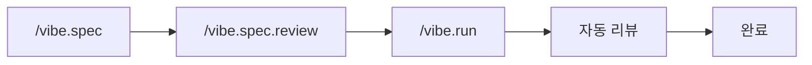
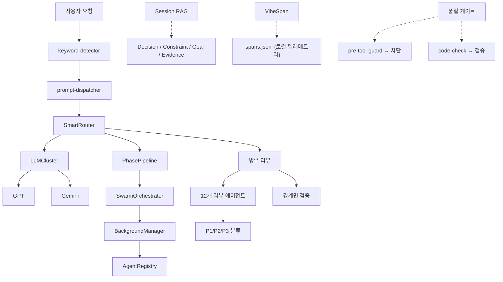

# VIBE — AI Coding Framework

[](https://www.npmjs.com/package/@su-record/vibe)
[](https://www.npmjs.com/package/@su-record/vibe)
[](https://nodejs.org/)
[](https://www.typescriptlang.org/)
[](https://opensource.org/licenses/MIT)

**설치 한 줄로 56개 에이전트, 43+ 도구, 멀티 LLM 오케스트레이션을 더합니다.**

Claude Code, Codex, Cursor, Gemini CLI 모두 지원.

```bash
npm install -g @su-record/vibe
vibe init
```

---

## 왜 Vibe인가

AI에게 "로그인 기능 만들어줘"라고 던지면 동작은 하지만 품질은 운에 맡기게 됩니다.
Vibe는 구조로 해결합니다.

| 문제 | 해결 |
|------|------|
| AI가 `any` 타입 남발 | Quality Gate가 `any`/`@ts-ignore` 차단 |
| 한 번에 완성 기대 | SPEC → 구현 → 검증 단계별 워크플로우 |
| 리뷰 없이 머지 | 12개 에이전트 병렬 리뷰 + 경계면 불일치 감지 |
| AI 결과를 그대로 수용 | GPT + Gemini 교차 검증 |
| 컨텍스트 소실 | Session RAG로 자동 저장/복원 |
| 복잡한 작업에서 길을 잃음 | SwarmOrchestrator 자동 분해 + 병렬 실행 |

### 설계 철학

| 원칙 | 설명 |
|------|------|
| **Easy Vibe Coding** | 빠른 흐름, AI와 협업하며 생각하기 |
| **Minimum Quality Guaranteed** | 타입 안전성, 코드 품질, 보안 — 자동 하한선 |
| **Iterative Reasoning** | 문제를 쪼개고 질문하며 함께 추론 |

---

## 멀티 CLI 지원

| CLI | 설치 방식 | 에이전트 | 스킬 | 지시사항 |
|-----|----------|---------|------|---------|
| **Claude Code** | `~/.claude/agents/` (YAML frontmatter) | 56개 | `~/.claude/skills/` | `CLAUDE.md` |
| **Codex** | `~/.codex/plugins/vibe/` (Plugin) | 56개 | 플러그인 내장 | `AGENTS.md` |
| **Cursor** | `~/.cursor/agents/` | 56개 | `~/.cursor/skills/` | `.cursorrules` |
| **Gemini CLI** | `~/.gemini/agents/` | 56개 | `~/.gemini/skills/` | `GEMINI.md` |

### Codex 플러그인

Codex v0.117.0+ 플러그인 시스템을 지원합니다. `vibe init` 시 자동 생성:

```
~/.codex/plugins/vibe/
├── .codex-plugin/plugin.json   # 플러그인 매니페스트
├── agents/                     # 56개 에이전트 (순수 마크다운)
├── skills/                     # 전역 스킬
└── AGENTS.md                   # VIBE 지시사항
```

---

## 워크플로우



1. **`/vibe.spec`** — 요구사항을 SPEC 문서로 정의 (GPT + Gemini 병렬 리서치)
2. **`/vibe.spec.review`** — SPEC 품질 리뷰
3. **`/vibe.run`** — SPEC 기반 구현 + 병렬 코드 리뷰
4. **자동 리뷰** — 12개 전문 에이전트 병렬 검토, 경계면 불일치 감지, P1/P2 자동 수정

`ultrawork` 키워드를 붙이면 전 과정이 자동화됩니다:

```bash
/vibe.run "기능" ultrawork
```

---

## 에이전트 (56개)

### 메인 에이전트 (19)

| 카테고리 | 에이전트 |
|----------|---------|
| **탐색** | Explorer (High/Medium/Low) |
| **구현** | Implementer (High/Medium/Low) |
| **설계** | Architect (High/Medium/Low) |
| **유틸** | Searcher, Tester, Simplifier, Refactor Cleaner, Build Error Resolver, Compounder, Diagrammer, E2E Tester, UI Previewer, Junior Mentor |

### 리뷰 에이전트 (12)

Security, Performance, Architecture, Complexity, Simplicity, Data Integrity, Test Coverage, Git History, TypeScript, Python, Rails, React

### UI/UX 에이전트 (8)

24개 CSV 기반 디자인 인텔리전스. 산업 분석 → 디자인 시스템 생성 → 구현 가이드 → 접근성 감사.

| 단계 | 에이전트 |
|------|---------|
| SPEC | ui-industry-analyzer, ui-design-system-gen, ui-layout-architect |
| RUN | ui-stack-implementer, ui-dataviz-advisor |
| REVIEW | ux-compliance-reviewer, ui-a11y-auditor, ui-antipattern-detector |

### QA & 리서치 (11)

| 카테고리 | 에이전트 |
|----------|---------|
| **QA** | QA Coordinator, Edge Case Finder, Acceptance Tester |
| **리서치** | Best Practices, Framework Docs, Codebase Patterns, Security Advisory |
| **분석** | Requirements Analyst, UX Advisor, API Documenter, Changelog Writer |

QA Coordinator는 변경된 코드를 분석하여 적절한 QA 에이전트를 병렬 디스패치하고, 통합 QA 리포트를 생성합니다.

### 이벤트 에이전트 (6)

Event Content, Event Image, Event Speaker, Event Ops, Event Comms, Event Scheduler

---

## 멀티 LLM 오케스트레이션

| 프로바이더 | 역할 | 인증 |
|-----------|------|------|
| **Claude** | 오케스트레이션, 코드 생성 | 내장 (Claude Code) |
| **GPT** | 아키텍처, 디버깅, 교차 리뷰 | Codex CLI / API Key |
| **Gemini** | UI/UX, 웹 검색, 음성, 리서치 | gemini-cli / API Key |

### SmartRouter

작업 유형별 자동 라우팅. 각 프로바이더는 CLI 위임 방식으로 호출합니다 (Codex CLI, gemini-cli).

| 작업 유형 | 우선순위 |
|----------|---------|
| 코드 분석, 리뷰, 추론, 아키텍처 | GPT → Gemini → Claude |
| UI/UX, 웹 검색 | Gemini → GPT → Claude |

---

## 오케스트레이터

### SwarmOrchestrator

복잡도 15점 이상인 작업을 자동 분해하여 병렬 실행합니다.
최대 깊이 2단계, 동시 실행 5개, 기본 타임아웃 5분.

### PhasePipeline

`prepare()` → `execute()` → `cleanup()` 생명주기.
ULTRAWORK 모드에서 다음 Phase의 `prepare()`를 병렬 실행.

### BackgroundManager

모델별/프로바이더별 동시 실행 제한. 타임아웃 시 retry (최대 3회, 지수 백오프). 24시간 TTL 자동 정리.

---

## 인프라 패턴

Agent-Lightning(Microsoft Research)의 핵심 아키텍처 패턴을 적용합니다.

### Store Interface

`IMemoryStorage` 인터페이스로 스토어를 추상화합니다. 테스트에서 SQLite 없이 `InMemoryStorage`로 교체 가능.

```typescript
import { InMemoryStorage } from '@su-record/vibe/tools';
const store = new InMemoryStorage(); // DB 없이 테스트
```

### Structured Telemetry Spans

8종의 타입화된 스팬으로 모든 작업을 추적합니다.

| 스팬 타입 | 용도 |
|----------|------|
| `skill_run` | 스킬 실행 |
| `agent_run` | 에이전트 실행 |
| `edit` | 파일 수정 |
| `build` | 빌드/컴파일 |
| `review` | 코드 리뷰 |
| `hook` | 훅 실행 |
| `llm_call` | LLM 호출 |
| `decision` | 의사결정 |

```typescript
import { createSpan, completeSpan } from '@su-record/vibe/tools';

const span = createSpan('agent_run', 'explorer-low', { model: 'haiku' });
// ... 작업 수행
const done = completeSpan(span, 'ok', 1500);
```

부모-자식 계층 추적을 지원합니다 (`parent_id`). 모든 데이터는 로컬 JSONL에만 저장됩니다.

### Component Registry

런타임 컴포넌트 등록/해제를 지원하는 범용 레지스트리입니다.

```typescript
import { ComponentRegistry } from '@su-record/vibe/tools';

const skills = new ComponentRegistry<SkillRunner>();
skills.register('review', () => new ReviewRunner(), { version: '2.0' });
const runner = skills.resolve('review');
```

---

## Session RAG

SQLite + FTS5 하이브리드 검색으로 세션 간 컨텍스트를 유지합니다.

**4가지 엔티티**: Decision, Constraint, Goal, Evidence

```
최종 점수 = BM25 × 0.4 + 최신성 × 0.3 + 우선순위 × 0.3
```

세션 시작 시 활성 Goals, 중요 Constraints, 최근 Decisions 자동 주입.

---

## 스킬

### 내장 스킬 (26개)

에이전트가 활용하는 도메인별 스킬 모듈입니다. 스택 감지 결과에 따라 자동 설치됩니다.

**코어**: Core Capabilities, Parallel Research, Commit Push PR, Git Worktree, Handoff, Priority Todos, Tool Fallback, Context7, Tech Debt, Characterization Test, Agents MD, Exec Plan, Arch Guard, Capability Loop

**프론트엔드**: Frontend Design, UI/UX Pro Max, Brand Assets, SEO Checklist

**도메인**: Commerce Patterns, E2E Commerce, Video Production

### 외부 스킬 (skills.sh)

[skills.sh](https://skills.sh) 에코시스템의 외부 스킬을 설치할 수 있습니다.

```bash
vibe skills add vercel-labs/next-skills
```

`vibe init`/`vibe update` 시 감지된 스택에 맞는 외부 스킬이 자동 설치됩니다.

| 스택 | 자동 설치 패키지 |
|------|-----------------|
| `typescript-react` | `vercel-labs/agent-skills` |
| `typescript-nextjs` | `vercel-labs/agent-skills`, `vercel-labs/next-skills` |

---

## 25개 프레임워크 지원

프로젝트의 기술 스택을 자동 감지하고 프레임워크별 코딩 규칙을 적용합니다.
모노레포 지원 (pnpm-workspace, npm workspaces, Lerna, Nx, Turborepo).

- **TypeScript (12)** — Next.js, React, Angular, Vue, Svelte, Nuxt, NestJS, Node, Electron, Tauri, React Native, Astro
- **Python (2)** — Django, FastAPI
- **Java/Kotlin (2)** — Spring Boot, Android
- **기타** — Rails, Go, Rust, Swift (iOS), Unity (C#), Flutter (Dart), Godot (GDScript)

자동 감지: DB (PostgreSQL, MySQL, MongoDB, Redis, Prisma, Drizzle 등), 상태 관리 (Redux, Zustand, Jotai 등), CI/CD, 호스팅

---

## 43+ 내장 도구

### 메모리 & 세션 (21)

`save_session_item`, `retrieve_session_context`, `manage_goals`, `core_save_memory`, `core_recall_memory`, `core_search_memories`, `core_start_session`, `core_auto_save_context` 등

### 코드 품질 & 분석 (8)

`core_find_symbol`, `core_find_references`, `core_analyze_dependency_graph`, `core_analyze_complexity`, `core_validate_code_quality`, `core_check_coupling_cohesion`, `core_suggest_improvements`, `core_apply_quality_rules`

### SPEC & 테스트 (7)

`core_spec_generator`, `core_prd_parser`, `core_traceability_matrix`, `core_preview_ui_ascii` 등

### UI/UX (4)

`core_ui_search`, `core_ui_stack_search`, `core_ui_generate_design_system`, `core_ui_persist_design_system`

### 반복 제어 (3+)

`LoopBreaker`, `VerificationLoop`, `DecisionTracer`, `InteractiveCheckpoint`, `AutomationLevel`

---

## 품질 보장

| 가드레일 | 메커니즘 |
|----------|---------|
| **타입 안전성** | Quality Gate — `any`, `@ts-ignore` 차단 |
| **코드 리뷰** | 12개 전문 에이전트 병렬 리뷰 |
| **경계면 검증** | API↔프론트엔드 타입/라우팅/상태 정합성 자동 검증 |
| **완성도** | Ralph Loop — 100%까지 반복 (범위 축소 없음) |
| **수렴 보장** | Convergence — P1=0이면 완료, 반복 시 범위 축소 |
| **스코프 보호** | pre-tool-guard — 요청 범위 외 수정 방지 |
| **컨텍스트 보호** | context-save — 80/90/95% 자동 저장 |
| **증거 게이트** | Evidence Gate — 증거 없는 완료 주장 금지 |

**복잡도 제한**: 함수 ≤50줄 | 중첩 ≤3단계 | 매개변수 ≤5 | 순환 복잡도 ≤10

---

## 훅 시스템

| 이벤트 | 스크립트 | 역할 |
|--------|---------|------|
| SessionStart | `session-start.js` | 세션 컨텍스트 복원, 메모리 로드 |
| PreToolUse | `pre-tool-guard.js` | 파괴적 명령어 차단, 스코프 보호 |
| PostToolUse | `code-check.js` | 타입 안전성/복잡도 검증 |
| PostToolUse | `post-edit.js` | Git 인덱스 업데이트 |
| UserPromptSubmit | `prompt-dispatcher.js` | 명령어 라우팅 |
| UserPromptSubmit | `keyword-detector.js` | 매직 키워드 감지 |
| Notification | `context-save.js` | 컨텍스트 80/90/95% 자동 저장 |

추가: `llm-orchestrate.js`, `code-review.js`, `recall.js`, `complexity.js`, `compound.js`, `stop-notify.js`

---

## 슬래시 명령어

| 명령어 | 설명 |
|--------|------|
| `/vibe.spec "기능"` | SPEC 작성 + GPT/Gemini 병렬 리서치 |
| `/vibe.spec.review` | SPEC 품질 리뷰 |
| `/vibe.run "기능"` | SPEC 기반 구현 + 병렬 코드 리뷰 |
| `/vibe.verify "기능"` | SPEC 대비 BDD 검증 |
| `/vibe.review` | 12개 에이전트 병렬 코드 리뷰 |
| `/vibe.trace "기능"` | 요구사항 추적성 매트릭스 |
| `/vibe.reason "문제"` | 체계적 추론 프레임워크 |
| `/vibe.analyze` | 프로젝트 분석 |
| `/vibe.event` | 이벤트 자동화 |
| `/vibe.utils` | 유틸리티 (E2E, 다이어그램, UI, 세션 복원) |

---

## CLI

```bash
# 프로젝트
vibe init [project]       # 프로젝트 초기화
vibe update               # 설정 업데이트 (스택 재감지)
vibe upgrade              # 최신 버전으로 업그레이드
vibe setup                # 셋업 위자드
vibe status               # 상태 확인
vibe remove               # 제거

# LLM 인증
vibe gpt auth|key|status|logout
vibe gemini auth|key|status|logout
vibe claude key|status|logout

# 외부 스킬
vibe skills add <owner/repo>   # skills.sh 스킬 설치

# 채널
vibe telegram setup|chat|status
vibe slack setup|channel|status

# 기타
vibe env import [path]    # .env → config.json 마이그레이션
vibe help / version
```

### 인증 우선순위

| 프로바이더 | 우선순위 |
|-----------|---------|
| **GPT** | Codex CLI → API Key |
| **Gemini** | gemini-cli 자동감지 → API Key |

---

## 매직 키워드

| 키워드 | 효과 |
|--------|------|
| `ultrawork` / `ulw` | 병렬 처리 + Phase 파이프라이닝 + 자동 계속 + Ralph Loop |
| `ralph` | 100% 완성까지 반복 (범위 축소 없음) |
| `ralplan` | 반복적 계획 수립 + 영속화 |
| `verify` | 엄격 검증 모드 |
| `quick` | 빠른 모드, 최소 검증 |

---

## 설정

### 전역: `~/.vibe/config.json`

인증, 채널, 모델 설정 통합 관리 (파일 권한 0o600).

```json
{
  "credentials": {
    "gpt": { "apiKey": "..." },
    "gemini": { "apiKey": "..." }
  },
  "channels": {
    "telegram": { "botToken": "...", "allowedChatIds": ["..."] },
    "slack": { "botToken": "...", "appToken": "...", "allowedChannelIds": ["..."] }
  },
  "models": { "gpt": "gpt-5.4", "gemini": "gemini-3.1-pro-preview" }
}
```

### 프로젝트: `.claude/vibe/config.json`

프로젝트별 설정 — language, quality, stacks, details, references, installedExternalSkills.

---

## 모듈 서브패스 Export

런타임 모듈을 서브패스 export로 제공합니다.

```typescript
import { MemoryStorage, SessionRAGStore } from '@su-record/vibe/memory';
import { SwarmOrchestrator, PhasePipeline } from '@su-record/vibe/orchestrator';
import { findSymbol, validateCodeQuality } from '@su-record/vibe/tools';

// Agent-Lightning 패턴
import { InMemoryStorage, ComponentRegistry, createSpan } from '@su-record/vibe/tools';
```

| 서브패스 | 주요 export |
|---------|------------|
| `@su-record/vibe/memory` | `MemoryStorage`, `IMemoryStorage`, `InMemoryStorage`, `KnowledgeGraph`, `SessionRAGStore` |
| `@su-record/vibe/orchestrator` | `SwarmOrchestrator`, `PhasePipeline`, `BackgroundManager` |
| `@su-record/vibe/tools` | `findSymbol`, `validateCodeQuality`, `createSpan`, `ComponentRegistry` 등 |
| `@su-record/vibe/tools/memory` | 메모리 도구 |
| `@su-record/vibe/tools/convention` | 코드 품질 도구 |
| `@su-record/vibe/tools/semantic` | 시맨틱 분석 도구 |
| `@su-record/vibe/tools/ui` | UI/UX 도구 |
| `@su-record/vibe/tools/interaction` | 사용자 상호작용 도구 |
| `@su-record/vibe/tools/time` | 시간 도구 |

---

## 프로젝트 구조

```
your-project/
├── .claude/
│   ├── vibe/
│   │   ├── config.json        # 프로젝트 설정
│   │   ├── constitution.md    # 프로젝트 원칙
│   │   ├── specs/             # SPEC 문서
│   │   ├── features/          # 기능 추적
│   │   ├── todos/             # P1/P2/P3 이슈
│   │   └── reports/           # 리뷰 리포트
│   └── skills/                # 로컬 + 외부 스킬
├── CLAUDE.md                  # 프로젝트 가이드 (자동 생성)
├── AGENTS.md                  # Codex CLI 가이드 (자동 생성)
└── ...

~/.vibe/config.json            # 전역 설정 (인증, 채널, 모델)
~/.vibe/analytics/             # 텔레메트리 (로컬 JSONL)
│   ├── skill-usage.jsonl      # 스킬 사용 기록
│   ├── spans.jsonl            # 구조화된 스팬
│   └── decisions.jsonl        # 의사결정 추적
~/.claude/
├── vibe/
│   ├── rules/                 # 코딩 규칙
│   ├── skills/                # 전역 스킬
│   └── ui-ux-data/            # UI/UX CSV 데이터
├── commands/                  # 슬래시 명령어
└── agents/                    # 에이전트 정의 (56개)
~/.codex/
└── plugins/vibe/              # Codex 플러그인
    ├── .codex-plugin/plugin.json
    ├── agents/
    ├── skills/
    └── AGENTS.md
```

---

## 시스템 아키텍처



---

## 요구사항

- **Node.js** >= 18.0.0
- **Claude Code** (필수)
- GPT, Gemini (선택 — 멀티 LLM 기능용)

## 라이선스

MIT License - Copyright (c) 2025 Su
