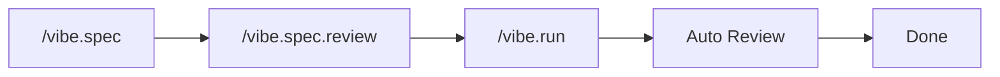

# VIBE

**AI writes code. Vibe makes sure it's good.**

[](https://www.npmjs.com/package/@su-record/vibe)
[](https://nodejs.org/)
[](LICENSE)

> One install. 56 agents, 45 skills, multi-LLM orchestration, and automated quality gates — added to your existing AI coding workflow.

```bash
npm install -g @su-record/vibe
vibe init
```

Works with **Claude Code**, **Codex**, **Cursor**, and **Gemini CLI**.

---

## The Problem

AI coding tools generate working code, but:

- Types are `any`, reviews are skipped, tests are forgotten
- You catch issues manually — after the damage is done
- Context vanishes between sessions
- Complex tasks spiral without structure

**Vibe is a harness.** It wraps around your AI coding tool and enforces quality automatically — before, during, and after code generation.

---

## How It Works

```
Agent = Model + Harness
```

| | Role | What's Inside |
|---|------|--------------|
| **Guides** (feedforward) | Set direction *before* action | CLAUDE.md, 56 agents, 45 skills, coding rules |
| **Sensors** (feedback) | Observe and correct *after* action | 21 hooks, quality gates, evolution engine |

### Workflow



1. **Define** — `/vibe.spec` writes requirements with GPT + Gemini parallel research
2. **Review** — `/vibe.spec.review` runs triple cross-validation (Claude + GPT + Gemini)
3. **Implement** — `/vibe.run` builds from SPEC with parallel code review
4. **Verify** — 12 agents review in parallel, P1/P2 issues auto-fixed

Add `ultrawork` to run the entire pipeline hands-free:

```bash
/vibe.run "add user authentication" ultrawork
```

---

## Key Features

**Quality Gates** — Blocks `any` types, `@ts-ignore`, functions > 50 lines. Three-layer defense: sentinel guard → pre-tool guard → code check.

**56 Specialized Agents** — Exploration, implementation, architecture, 12 parallel reviewers, 8 UI/UX agents, QA coordination. Each agent is purpose-built, not a generic wrapper.

**Multi-LLM Orchestration** — Claude for orchestration, GPT for reasoning, Gemini for research. Auto-routes based on available models. Works Claude-only by default.

**Session RAG** — SQLite + FTS5 hybrid search persists decisions, constraints, and goals across sessions. Context is restored automatically on session start.

**24 Framework Detection** — Auto-detects your stack (Next.js, React, Django, Spring Boot, Rails, Go, Rust, and 17 more) and applies framework-specific rules. Monorepo-aware.

**Self-Improvement** — Evolution engine analyzes hook execution patterns, detects skill gaps, and generates new rules. Circuit breaker rolls back on regression.

---

## What's Included

| Category | Count | Examples |
|----------|-------|---------|
| **Agents** | 56 | Explorer, Implementer, Architect (3 depth levels each), 12 review specialists, 8 UI/UX, QA coordinator |
| **Skills** | 45 | 3-tier system (core/standard/optional) to prevent context overload |
| **Hooks** | 21 | Session restore, destructive command blocking, auto-format, quality check, context auto-save |
| **Frameworks** | 24 | TypeScript (12), Python (2), Java/Kotlin (2), Rails, Go, Rust, Swift, Flutter, Unity, Godot |
| **Slash Commands** | 11 | `/vibe.spec`, `/vibe.run`, `/vibe.review`, `/vibe.trace`, `/vibe.figma`, and more |

---

## Multi-CLI Support

| CLI | Agents | Skills | Instructions |
|-----|--------|--------|-------------|
| Claude Code | `~/.claude/agents/` | `~/.claude/skills/` | `CLAUDE.md` |
| Codex | `~/.codex/plugins/vibe/` | Plugin built-in | `AGENTS.md` |
| Cursor | `~/.cursor/agents/` | `~/.cursor/skills/` | `.cursorrules` |
| Gemini CLI | `~/.gemini/agents/` | `~/.gemini/skills/` | `GEMINI.md` |

---

## Multi-LLM Routing

| Provider | Role | Required |
|----------|------|----------|
| **Claude** | Orchestration, SPEC, review | Yes (via Claude Code) |
| **GPT** | Reasoning, architecture, edge cases | Optional (Codex CLI or API key) |
| **Gemini** | Research, cross-validation, UI/UX | Optional (gemini-cli or API key) |

Auto-switches based on model availability. Claude-only is the default — GPT and Gemini enhance but aren't required.

Codex CLI or gemini-cli are auto-detected if installed. To set API keys manually:

```bash
vibe gpt key <your-api-key>
vibe gemini key <your-api-key>
```

---

## Figma → Code

Design-to-code pipeline with tree-based structural mapping (not screenshot guessing).

```bash
/vibe.figma "https://figma.com/design/ABC/Project?node-id=1-2"

# Responsive (mobile + desktop)
/vibe.figma "mobile-url" "desktop-url"
```

Extracts via Figma REST API → generates stack-aware code (React/Vue/Svelte/SCSS/Tailwind) → maps to your existing design system.

---

## CLI Reference

```bash
vibe init                      # Initialize project (detect stack, install harness)
vibe update                    # Re-detect stacks, refresh config
vibe upgrade                   # Upgrade to latest version
vibe status                    # Show current status
vibe config show               # Unified config view
vibe stats [--week|--quality]  # Usage telemetry

vibe gpt key|status            # GPT API key setup
vibe gemini key|status         # Gemini API key setup
vibe figma breakpoints         # Responsive breakpoints
vibe skills add <owner/repo>   # Install skills from skills.sh
```

---

## Configuration

| File | Purpose |
|------|---------|
| `~/.vibe/config.json` | Global — credentials, channels, models (0o600) |
| `.claude/vibe/config.json` | Project — stacks, capabilities, quality settings |

---

## Magic Keywords

| Keyword | Effect |
|---------|--------|
| `ultrawork` | Full automation — parallel agents + auto-continue + quality loop |
| `ralph` | Iterate until 100% complete (no scope reduction) |
| `quick` | Fast mode, minimal verification |

---

## Requirements

- Node.js >= 18.0.0
- Claude Code (required)
- GPT, Gemini (optional — for multi-LLM features)

## Documentation

- [README (Korean)](README.ko.md)
- [Release Notes](RELEASE_NOTES.md)

## License

MIT — Copyright (c) 2025 Su
