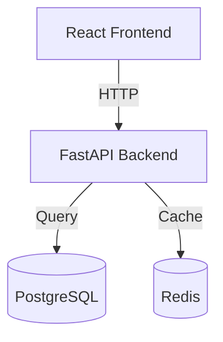
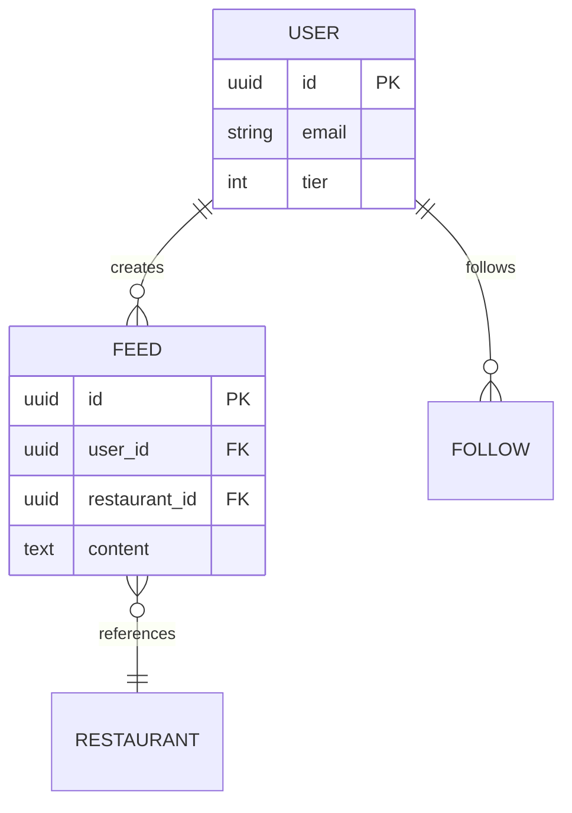
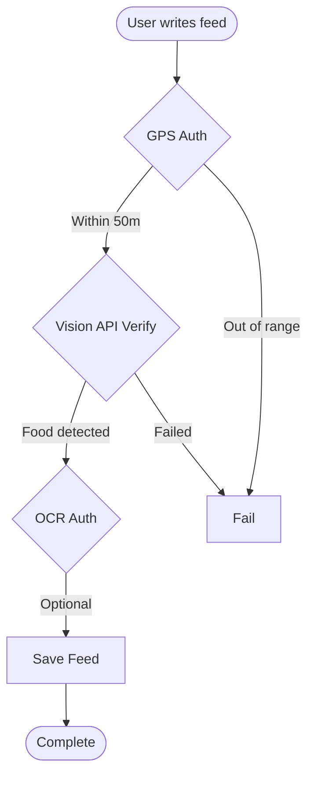
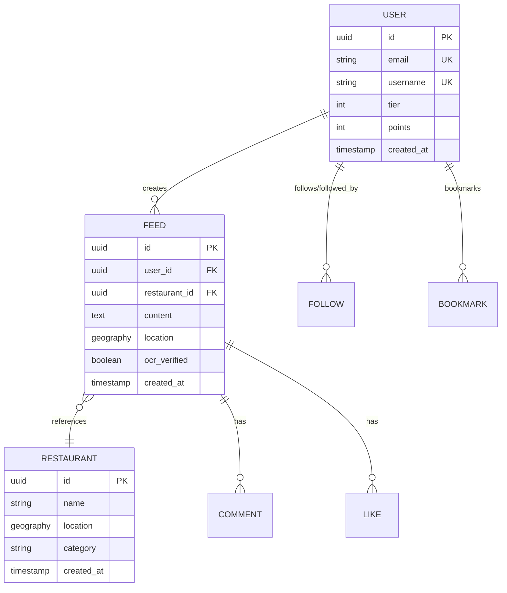

# /vibe.diagram

Generate diagrams (architecture, ERD, flowchart).

## Usage

```
/vibe.diagram
/vibe.diagram --er
/vibe.diagram --flow
```

## Process

### 1. Determine Diagram Type

- **Default** (`/vibe.diagram`): Architecture diagram
- **--er**: ERD (Entity-Relationship Diagram)
- **--flow**: Flowchart (main processes)

### 2. Project Analysis

#### Architecture Diagram
- Understand project structure (folder structure)
- Identify major modules and layers
- Analyze dependency relationships

#### ERD
- Find database schema files
  - `backend/models/`
  - `migrations/`
  - `schema.sql`
- Identify table relationships

#### Flowchart
- Main business logic flows
- User action → System response

### 3. Generate Mermaid Code

Generate diagram as ASCII art or Mermaid code:

#### Architecture Diagram (Mermaid)



#### ERD (Mermaid)



#### Flowchart (Mermaid)



### 4. Rendering Guide

Guide on how to render generated Mermaid code:

- **GitHub**: Paste in `.md` file (auto-renders)
- **VSCode**: Install Mermaid extension
- **Online**: https://mermaid.live/

## Example

```
User: /vibe.diagram --er

Claude: Generating ERD...

Analyzing project...
- Database schema found: backend/models/
- Tables: 15
- Key relationships: USER, FEED, RESTAURANT

✅ ERD generation complete!



**Diagram save location:**
  .claude/vibe/diagrams/erd-2025-11-17.md

**Rendering options:**
  1. Push to GitHub (auto-renders)
  2. Use Mermaid extension in VSCode
  3. View at https://mermaid.live/
```

## Notes

- Mermaid is supported in GitHub, GitLab, VSCode, etc.
- Complex diagrams may need manual adjustments
- Generated diagrams are saved in `.claude/vibe/diagrams/` folder

---

ARGUMENTS: $ARGUMENTS
