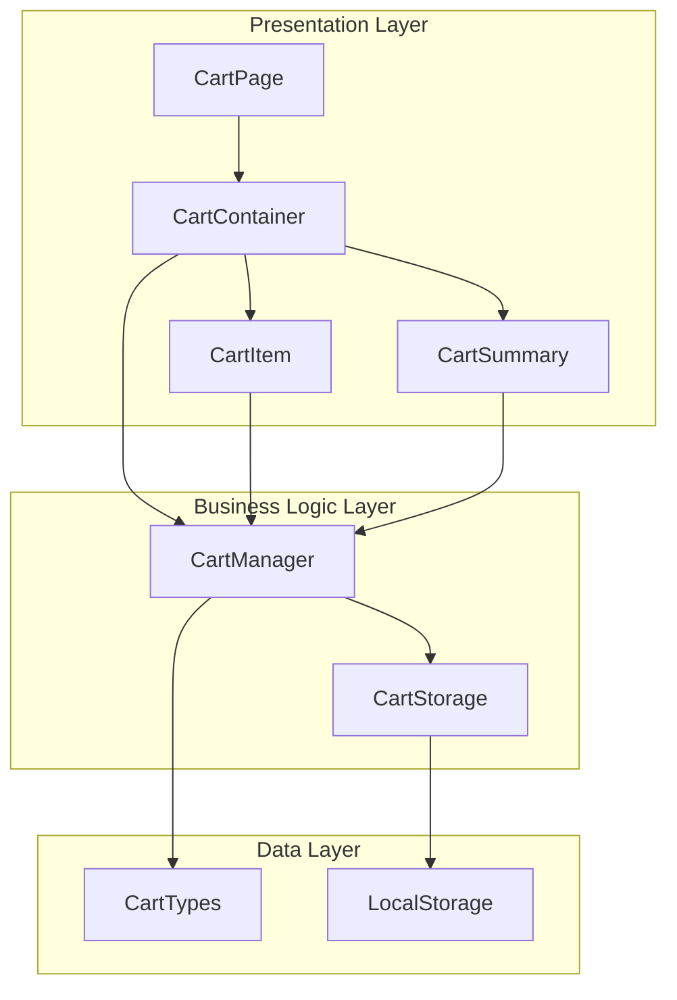

# 장바구니 페이지 모듈화 설계

## 개요

| 모듈 | 위치 | 설명 |
|------|------|------|
| **CartPage** | `app/cart/page.tsx` | 메인 페이지 컴포넌트 (presentation) |
| **CartContainer** | `components/cart/CartContainer.tsx` | 장바구니 전체 컨테이너 (presentation) |
| **CartItem** | `components/cart/CartItem.tsx` | 개별 상품 아이템 (presentation) |
| **CartSummary** | `components/cart/CartSummary.tsx` | 결제 정보 요약 (presentation) |
| **CartManager** | `lib/cart/cartManager.ts` | 장바구니 비즈니스 로직 |
| **CartStorage** | `lib/cart/cartStorage.ts` | localStorage 관리 |
| **CartTypes** | `types/cart.ts` | 타입 정의 |

## Diagram



## Implementation Plan

### 1. CartTypes (types/cart.ts)
**목적**: 장바구니 관련 타입 정의

```typescript
interface CartItem {
  id: string
  name: string
  price: number
  quantity: number
  thumbnail: string
  selected: boolean
}

interface CartState {
  items: CartItem[]
  selectedAll: boolean
}

interface CartSummary {
  subtotal: number
  shipping: number
  total: number
}
```

**Unit Tests**:
- 타입 정의 검증
- 인터페이스 호환성 테스트

### 2. CartStorage (lib/cart/cartStorage.ts)
**목적**: localStorage 데이터 관리

```typescript
class CartStorage {
  static getItems(): CartItem[]
  static saveItems(items: CartItem[]): void
  static initializeDummyData(): CartItem[]
}
```

**Unit Tests**:
- `getItems()` - 빈 데이터시 더미데이터 반환 테스트
- `saveItems()` - localStorage 저장 테스트
- `initializeDummyData()` - 최소 5개 아이템 생성 테스트

### 3. CartManager (lib/cart/cartManager.ts)
**목적**: 장바구니 비즈니스 로직

```typescript
class CartManager {
  static calculateSummary(items: CartItem[]): CartSummary
  static updateQuantity(items: CartItem[], id: string, quantity: number): CartItem[]
  static toggleSelection(items: CartItem[], id: string): CartItem[]
  static toggleSelectAll(items: CartItem[]): CartItem[]
}
```

**Unit Tests**:
- `calculateSummary()` - 5만원 미만시 배송비 3000원 테스트
- `calculateSummary()` - 5만원 이상시 배송비 0원 테스트
- `updateQuantity()` - 수량 변경 테스트
- `toggleSelection()` - 개별 선택/해제 테스트
- `toggleSelectAll()` - 전체 선택/해제 테스트

### 4. CartItem (components/cart/CartItem.tsx)
**목적**: 개별 상품 아이템 표시

**QA Sheet**:
- [ ] 썸네일 이미지가 정상 표시되는가?
- [ ] 상품명과 가격이 정확히 표시되는가?
- [ ] 수량 증감 버튼이 정상 동작하는가?
- [ ] 선택 체크박스가 정상 동작하는가?
- [ ] 모바일에서 터치 인터랙션이 원활한가?
- [ ] 반응형 레이아웃이 올바르게 적용되는가?

### 5. CartSummary (components/cart/CartSummary.tsx)
**목적**: 결제 정보 요약 표시

**QA Sheet**:
- [ ] 선택된 상품 금액이 정확히 계산되는가?
- [ ] 5만원 미만시 배송비 3000원이 표시되는가?
- [ ] 5만원 이상시 배송비가 0원으로 표시되는가?
- [ ] 총 결제금액이 정확히 계산되는가?
- [ ] 금액 포맷팅이 올바르게 적용되는가?
- [ ] 반응형 디자인이 적용되는가?

### 6. CartContainer (components/cart/CartContainer.tsx)
**목적**: 장바구니 전체 컨테이너

**QA Sheet**:
- [ ] 전체 선택/해제 기능이 정상 동작하는가?
- [ ] 개별 아이템들이 정상 렌더링되는가?
- [ ] 결제 요약이 실시간으로 업데이트되는가?
- [ ] 데스크톱/모바일 반응형이 올바른가?
- [ ] localStorage 동기화가 정상인가?

### 7. CartPage (app/cart/page.tsx)
**목적**: 메인 페이지 컴포넌트

**QA Sheet**:
- [ ] 페이지 라우팅이 정상인가?
- [ ] 초기 로딩시 데이터가 정상 표시되는가?
- [ ] 메타데이터가 올바르게 설정되는가?
- [ ] SEO 최적화가 적용되는가?