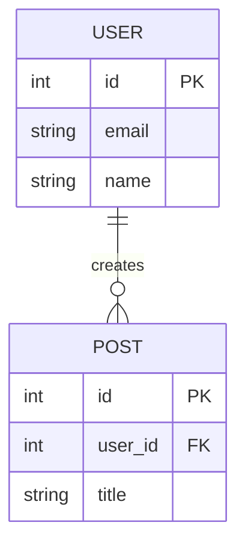
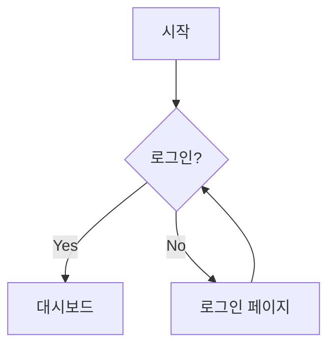
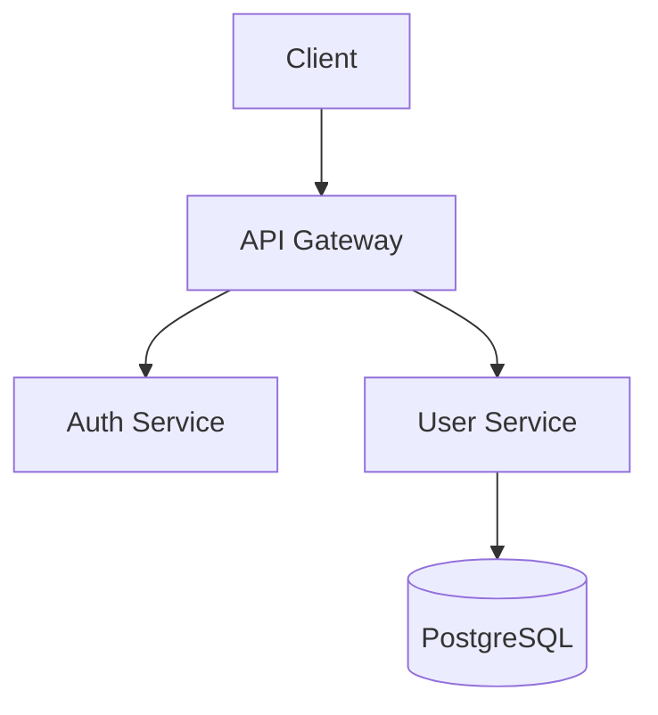
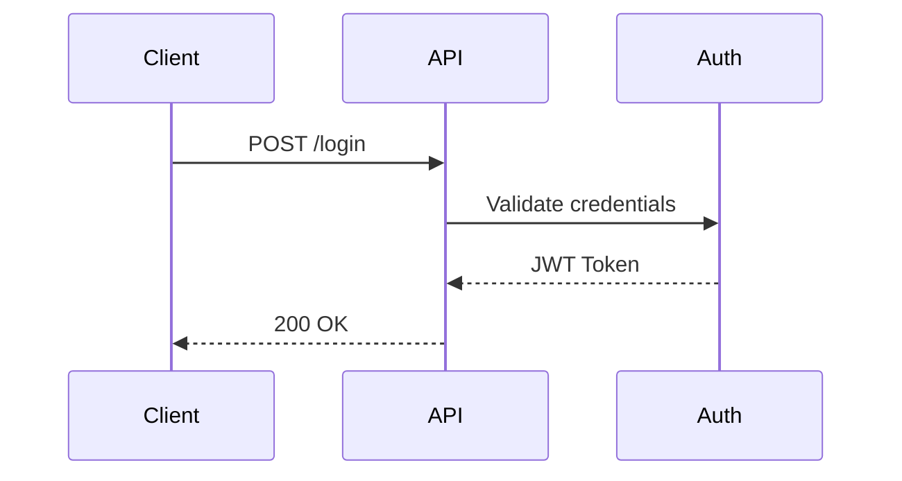

# Diagram Generator

아키텍처, ERD, 플로우차트를 Mermaid 다이어그램으로 생성합니다.

## 사용법

```
# ERD 생성
/vibe.diagram --er

# 플로우차트 생성
/vibe.diagram --flow

# 아키텍처 다이어그램
/vibe.diagram --arch
```

## 다이어그램 유형

### 1. ERD (Entity Relationship Diagram)



### 2. 플로우차트



### 3. 아키텍처 다이어그램



### 4. 시퀀스 다이어그램



## 입력

- `.vibe/specs/{기능명}.md` (SPEC 문서)
- `.vibe/plans/{기능명}.md` (PLAN 문서)
- 프로젝트 코드 구조

## 출력

- Mermaid 마크다운 코드
- GitHub/GitLab에서 바로 렌더링 가능
