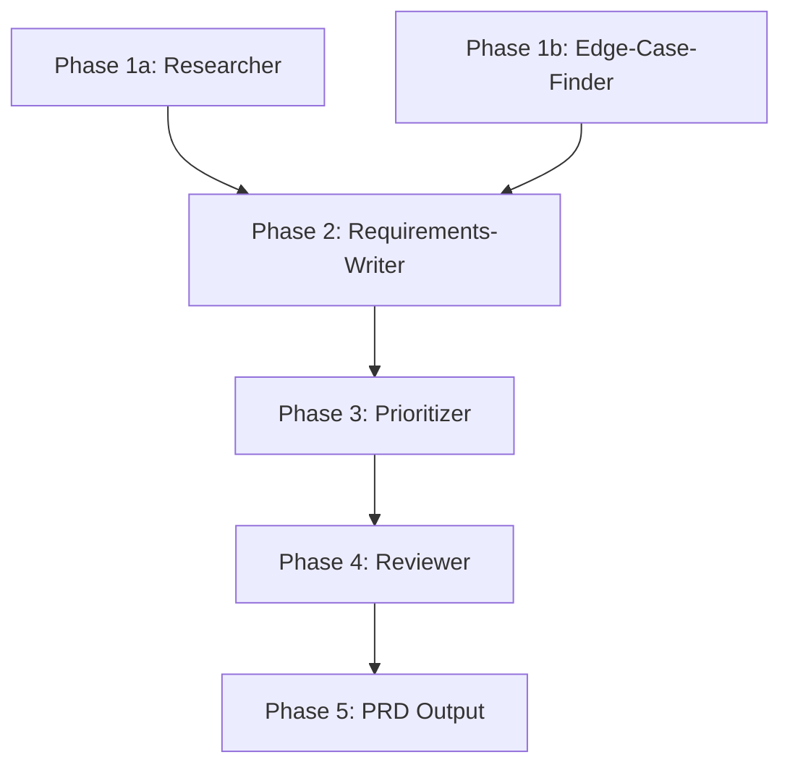

# Create-PRD Orchestrator

## Workflow

### Phase 1: Gather Context
- **Agent**: researcher, edge-case-finder
- **Input**: Feature idea or problem statement + codebase context
- **Output**: researcher → existing patterns, prior art, constraints; edge-case-finder → edge cases, failure modes, user scenarios
- **Parallel**: yes — researcher and edge-case-finder run simultaneously

### Phase 2: Draft User Stories
- **Agent**: requirements-writer
- **Input**: Context and edge cases from Phase 1
- **Output**: User stories in `As a / I want / So that` format with acceptance criteria
- **Parallel**: no — sequential synthesis of Phase 1 outputs

### Phase 3: Prioritize
- **Agent**: prioritizer
- **Input**: User stories from Phase 2
- **Output**: RICE-scored stories with recommended MoSCoW classification (Must/Should/Could/Won't)
- **Parallel**: no — requires full story set for relative scoring

### Phase 4: Review
- **Agent**: reviewer
- **Input**: Prioritized stories + RICE scores from Phase 3
- **Output**: Completeness verdict — missing sections, ambiguous requirements, scope concerns
- **Parallel**: no

### Phase 5: Output PRD
- **Agent**: orchestrator (self)
- **Input**: All phase outputs
- **Output**: Structured PRD document using `templates/prd.md` format
- **Parallel**: no

## DAG (Dependency Graph)

## Error Handling

| Phase | Failure Mode | Strategy |
|-------|-------------|----------|
| Phase 1 | researcher returns no prior art | Proceed — note "greenfield feature" in PRD |
| Phase 1 | edge-case-finder times out | Continue with researcher output only, flag limited edge-case coverage |
| Phase 2 | Problem statement too vague | Pause, prompt user with clarifying questions before continuing |
| Phase 3 | RICE data unavailable (no metrics) | Use relative scoring (High/Medium/Low), note data gaps |
| Phase 4 | Reviewer finds critical gaps | Return to Phase 2 with gap list (max 1 retry) |
| Phase 4 | Retry still incomplete after 1 pass | Flag gaps as `needs-clarification`, output partial PRD |
| Phase 5 | PRD template missing | Output raw structured markdown without template |

## Scalability Modes

| Mode | When | Agents Used |
|------|------|-------------|
| Full | Normal operation | All 5 agents |
| Reduced | Time pressure | researcher + requirements-writer + reviewer only |
| Single | Quick story draft | requirements-writer only — draft without research or scoring |
