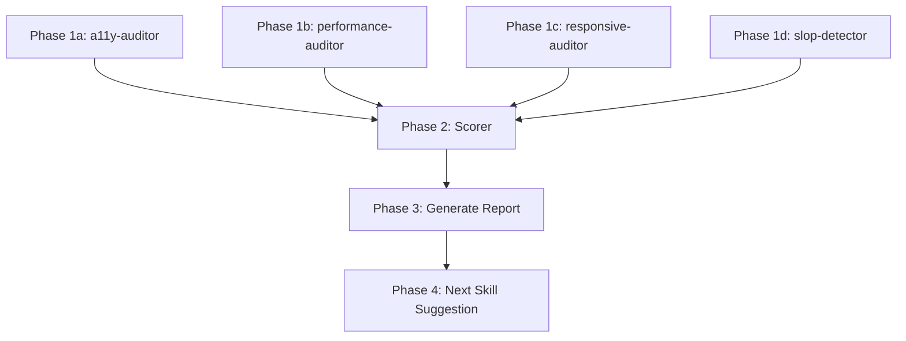

# Design Audit Orchestrator

## Workflow

### Phase 1: Launch Dimension Auditors
- **Agent**: a11y-auditor, performance-auditor, responsive-auditor, slop-detector
- **Input**: Target files or component paths + optional design-context.json
- **Output**: Per-dimension findings `{dimension, findings[], severity}` scored 0–4
- **Parallel**: yes — all 4 auditors run simultaneously

### Phase 2: Aggregate Scores
- **Agent**: scorer
- **Input**: All 4 dimension results from Phase 1
- **Output**: Score table (per-dimension + overall), severity-tagged finding list (P0–P3)
- **Parallel**: no — requires all dimension results

### Phase 3: Generate Report
- **Agent**: orchestrator (self)
- **Input**: Scored results from Phase 2
- **Output**: Prioritized report with P0→P3 sections and per-dimension summaries
- **Parallel**: no

### Phase 4: Suggest Next Skill
- **Agent**: orchestrator (self)
- **Input**: Overall score and dominant failure dimension from Phase 3
- **Output**: Recommended next skill (`/design-normalize`, `/design-critique`, `/design-polish`)
- **Parallel**: no

## DAG (Dependency Graph)

## Error Handling

| Phase | Failure Mode | Strategy |
|-------|-------------|----------|
| Phase 1 | Auditor finds no applicable items (e.g., no images for perf) | Return score 4 (N/A treated as pass) |
| Phase 1 | Target file unreadable | Skip file, log warning, continue with others |
| Phase 1 | design-context.json missing | Proceed with defaults, note missing context |
| Phase 2 | <2 dimension scores returned | Warn user, compute partial overall score |
| Phase 3 | 0 findings across all dimensions | Output "No issues found" report — do not suppress |
| Phase 4 | Score at boundary of multiple next-skill suggestions | Present all applicable options ranked by score |

## Scalability Modes

| Mode | When | Agents Used |
|------|------|-------------|
| Full | Normal operation | All 4 auditors + scorer |
| Reduced | Single-concern audit | Target auditor only (e.g., a11y-auditor alone) |
| Single | Quick slop check | slop-detector only — fast AI-pattern scan |
