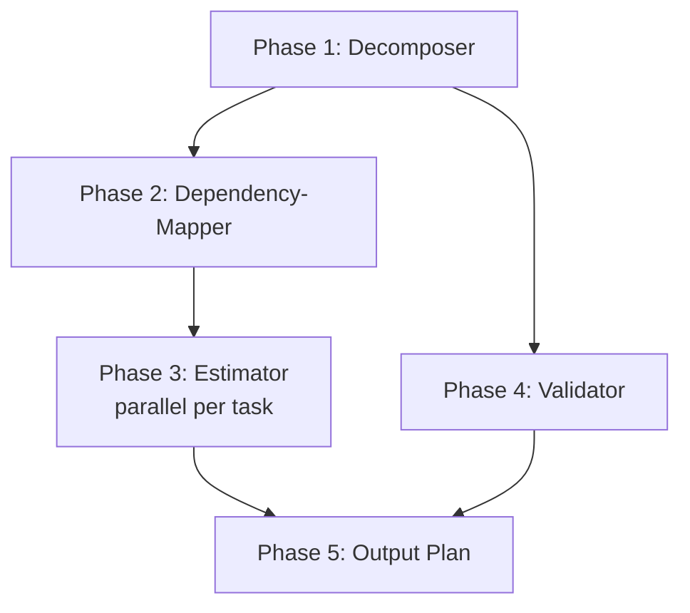

# Exec-Plan Orchestrator

## Workflow

### Phase 1: Decompose
- **Agent**: decomposer
- **Input**: SPEC document (phases, requirements, acceptance criteria)
- **Output**: Flat task list `[{taskId, title, phase, files[], description}]`
- **Parallel**: no — sequential read of SPEC structure

### Phase 2: Map Dependencies
- **Agent**: dependency-mapper
- **Input**: Task list from Phase 1
- **Output**: DAG as adjacency list `{taskId: [dependsOn[]]}` + critical path
- **Parallel**: no — requires complete task list to resolve cross-task deps

### Phase 3: Estimate
- **Agent**: estimator
- **Input**: Task list + DAG from Phases 1–2
- **Output**: Per-task complexity score, parallelization opportunities, estimated effort tiers (S/M/L)
- **Parallel**: yes — each task scored independently

### Phase 4: Validate
- **Agent**: validator
- **Input**: Task list + SPEC requirements + acceptance criteria
- **Output**: Coverage report — uncovered requirements flagged, missing tasks identified
- **Parallel**: no — cross-references full SPEC against task list

### Phase 5: Output Plan
- **Agent**: orchestrator (self)
- **Input**: All outputs from Phases 1–4
- **Output**: Execution plan with DAG visualization, effort summary, parallelization batches
- **Parallel**: no

## DAG (Dependency Graph)

## Error Handling

| Phase | Failure Mode | Strategy |
|-------|-------------|----------|
| Phase 1 | SPEC missing or malformed | Escalate — cannot proceed without SPEC |
| Phase 1 | SPEC has no phases defined | Treat entire SPEC as single phase, continue |
| Phase 2 | Circular dependency detected | Flag cycle, escalate to user for resolution |
| Phase 2 | Isolated task (no deps, no dependents) | Include as standalone, note in plan |
| Phase 3 | Estimator cannot classify complexity | Default to M (medium), flag for manual review |
| Phase 4 | Uncovered requirements found | Add placeholder tasks, mark as `needs-spec-clarification` |
| Phase 5 | DAG too large to render (>20 nodes) | Render phase-level DAG only, link to task list |

## Scalability Modes

| Mode | When | Agents Used |
|------|------|-------------|
| Full | Normal operation | decomposer + dependency-mapper + estimator + validator |
| Reduced | Small SPEC (<5 tasks) | decomposer + dependency-mapper only |
| Single | Quick task list | decomposer only — flat list without DAG or estimates |
