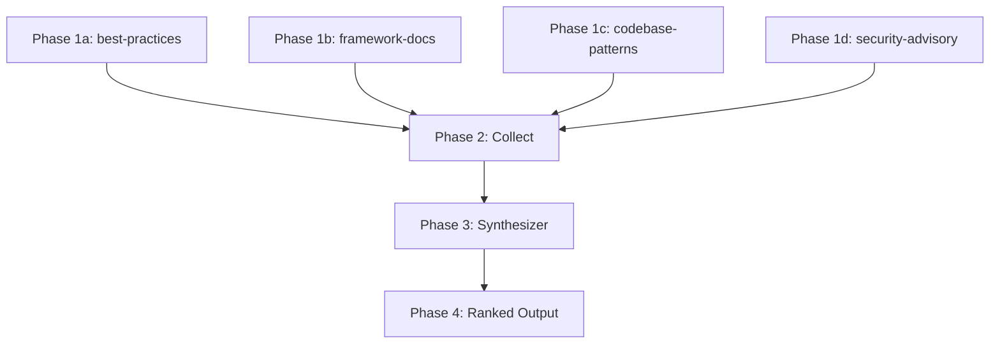

# Parallel Research Orchestrator

## Workflow

### Phase 1: Launch Research Agents
- **Agent**: best-practices, framework-docs, codebase-patterns, security-advisory
- **Input**: Research topic + technology context (stack, framework versions)
- **Output**: Per-agent findings `{source, findings[], confidence}`
- **Parallel**: yes — all 4 agents run simultaneously
- **Timeout**: 60s per agent (agents that exceed timeout are marked `timed-out`)

### Phase 2: Wait and Collect
- **Agent**: orchestrator (self)
- **Input**: Streams from all 4 agents
- **Output**: Collected results map `{agentName: result | "timed-out"}`
- **Parallel**: no — barrier synchronization point

### Phase 3: Synthesize
- **Agent**: synthesizer
- **Input**: All collected results from Phase 2
- **Output**: Merged, deduplicated findings with source attribution and conflict flags
- **Parallel**: no — sequential merge and deduplication

### Phase 4: Rank and Output
- **Agent**: orchestrator (self)
- **Input**: Synthesized findings from Phase 3
- **Output**: Ranked recommendations ordered by confidence and relevance
- **Parallel**: no

## DAG (Dependency Graph)

## Error Handling

| Phase | Failure Mode | Strategy |
|-------|-------------|----------|
| Phase 1 | Agent times out (>60s) | Mark as `timed-out`, continue with remaining results |
| Phase 1 | Agent returns empty results | Mark as `no-findings`, note in output |
| Phase 1 | All 4 agents fail | Escalate — prompt user to retry or narrow topic |
| Phase 2 | <2 agents return results | Warn user, proceed with partial synthesis |
| Phase 3 | Conflicting recommendations | Flag conflict explicitly, present both sides |
| Phase 4 | 0 actionable recommendations | Fallback — return raw findings without ranking |

## Scalability Modes

| Mode | When | Agents Used |
|------|------|-------------|
| Full | Normal operation | All 4 research agents + synthesizer |
| Reduced | Time pressure | best-practices + codebase-patterns only |
| Single | Quick lookup | codebase-patterns only — check existing patterns first |
