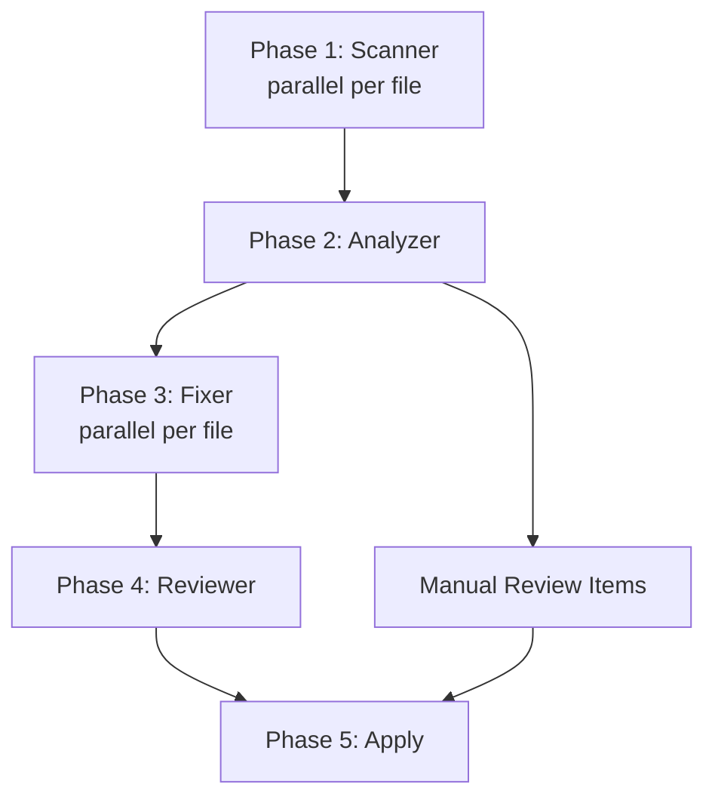

# Techdebt Orchestrator

## Workflow

### Phase 1: Scan
- **Agent**: scanner
- **Input**: Changed file paths (or root dir + glob filter)
- **Output**: Raw findings list `[{category, file, line, snippet}]`
- **Parallel**: yes — each file scanned independently

### Phase 2: Analyze
- **Agent**: analyzer
- **Input**: Raw findings list from Phase 1
- **Output**: Scored findings with severity (P0–P3) and auto-fix eligibility flag
- **Parallel**: no — requires full findings set for deduplication

### Phase 3: Fix
- **Agent**: fixer
- **Input**: Findings flagged `auto-fixable: true` from Phase 2
- **Output**: Patch set (file edits) for each auto-fixable item
- **Parallel**: yes — patches per file are independent

### Phase 4: Review
- **Agent**: reviewer
- **Input**: Patch set from Phase 3
- **Output**: Approved patches + rejected patches with rejection reason
- **Parallel**: no — needs holistic view to catch patch conflicts

### Phase 5: Apply
- **Agent**: orchestrator (self)
- **Input**: Approved patches from Phase 4 + manual-review items from Phase 2
- **Output**: Applied fixes + final report with manual-review list
- **Parallel**: no — sequential file writes to avoid conflicts

## DAG (Dependency Graph)

## Error Handling

| Phase | Failure Mode | Strategy |
|-------|-------------|----------|
| Phase 1 | File unreadable / binary file | Skip file, log warning, continue |
| Phase 1 | Glob returns 0 files | Escalate — prompt user to verify path |
| Phase 2 | Analyzer returns 0 findings | Skip phases 3–4, output clean report |
| Phase 3 | Patch generation fails for a file | Skip that file, flag for manual review |
| Phase 4 | Reviewer rejects all patches | Fallback to manual-review-only report |
| Phase 5 | Write conflict detected | Abort apply, show diff for manual resolution |

## Scalability Modes

| Mode | When | Agents Used |
|------|------|-------------|
| Full | Normal operation | scanner + analyzer + fixer + reviewer |
| Reduced | Time pressure / large repo | scanner + analyzer only (no auto-fix) |
| Single | Quick scan / pre-commit check | scanner only — raw findings, no scoring |
